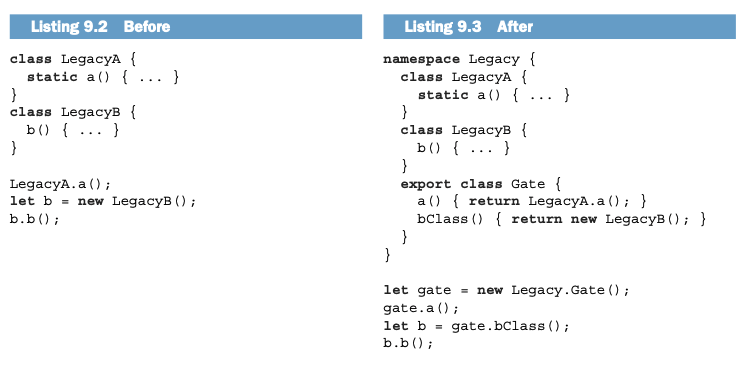
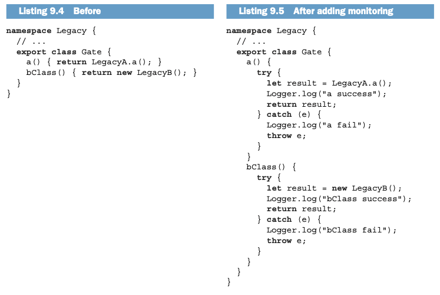
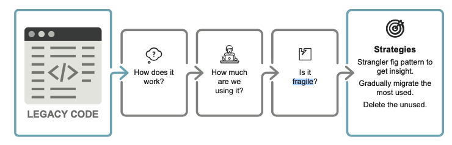
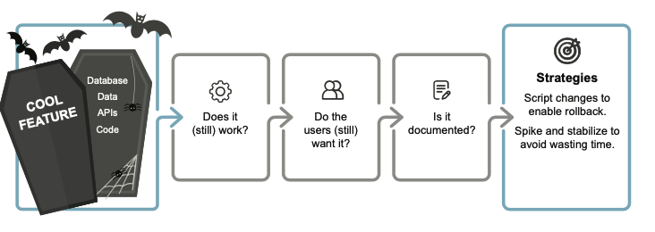
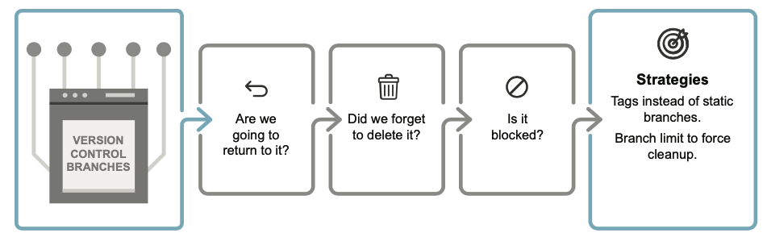
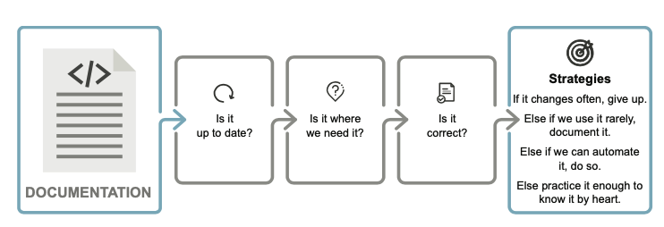
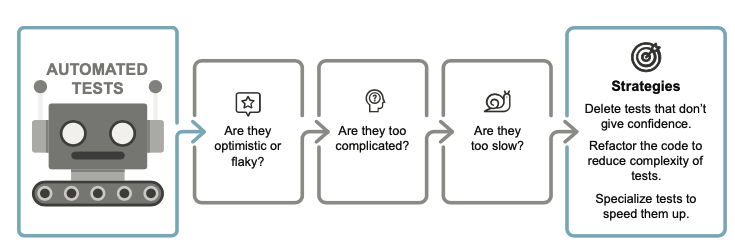
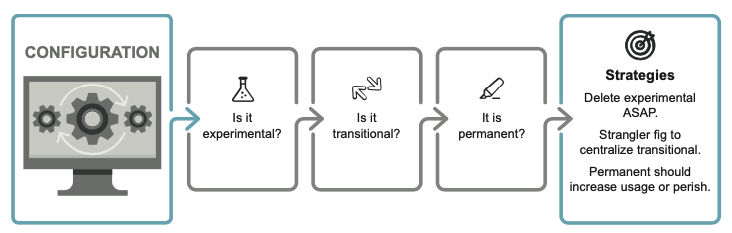
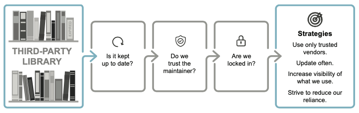
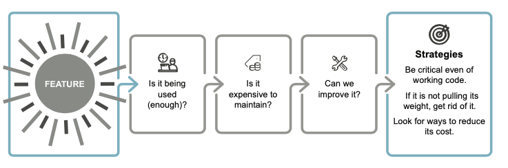

### 觀念：   

The functionality comes from code, so it is easy to think that code is implicitly valuable—but this is not the case.  
(功能來自程式碼，因此很容易認為程式碼具有隱含的價值，但事實並非如此)  

Code is a liability. It is a necessary evil that we have to live with to get the functionality we need.  
(代碼是一種責任。 為了獲得我們需要的功能，我們必須忍受這種不可避免的罪惡。)  

We tend to feel that code is valuable is that it is expensive to produce.  
(我們傾向於認為程式碼有價值的另一個原因是它的生產成本很高。 )  

Writing code requires skilled workers to spend lots of time .   
(編寫程式碼需要熟練工人花費大量時間 )  

Attributing value to something because we have spent time or effort on it is called the sunk-cost fallacy.  
(因為我們在某件事上花了時間或精力而賦予它價值，這被稱為沉沒成本謬誤。)  

But the code itself is an expense for as long as we keep it.  
(因為無論程式碼是否有價值，我們都必須不斷地努力維護程式碼。)

## 9.1. 刪除程式碼可能是下一個重要議題

The biggest leaps mainstream programming has taken:
:::info
1944:  
Computers were used to perform calculations without any abstractions.

1952:  
Grace Hopper invented the first linker, 
allowing computers to work with symbols instead of pure calculations.

1957:  
The previous leap led to the invention of the compiler, specifically, fortran. 
We could now code using high-level control operators like loops.

1972:
The next big issue to solve was data abstractions. 
Enter a new generation of languages: programming languages like C—and later C++ and Java
***work with data indirectly, through pointers and references.***

1994:  
Another big leap forward came from the Gang of Four (Erich Gamma,Richard Helm, Ralph Johnson, John Vlissides), 
who created a set of reusable design patterns. 
***Design patterns function as high-level building blocks when we are designing software to be built.***
  
1999:  
Next, Martin Fowler compiled a catalogue of ***standard refactoring patterns***.  
Unlike design patterns, 
these do not require up-front design but let us improve the design of existing code.
    
2011:  
The most recent big leap forward in programming, 
in my opinion, was the microservices architectures popularized by Sam Newman. 
A microservices architecture is based on the old principle of ***loose coupling***, 
but it solves a modern scaling issue. 
It also allows emerging architecture through indirect communication; 
we can improve the design of running systems.
:::

＊註：(Loose Coupling):  
    是由許多小巧的、自給自足的程式模組（連同其資料）組合起來的，  
    好的微服務（microservices）設計也應該以此為設計原則。   
    這些自給自足的程式模組可以隨時加入系統或者從系統中移除，不會造成系統太大的漣漪。

## 9.2 刪除程式碼以消除附帶的複雜性
    更大的程式碼庫意味著更複雜的模型，以及需要追蹤的更大的實用程式庫。
    這種複雜性有兩種類型：領域複雜性(Domain complexity)和附帶複雜性(Incidental complexity)
    領域複雜性是指該領域的複雜程度 
    例如，無論我們做什麼，計算稅的系統都會很複雜，因為稅法很複雜。
    
    * Incidental complexity: 
        * technical ignorance (技術無知)  
        * technical waste (技術浪費)  
        * technical debt (技術債)  
        * technical drag (技術阻力)

    technical ignorance: 
    錯誤的決定，從而導致了糟糕的架構 (缺乏足夠的技能來解決問題而增加不必要的耦合)

    technical waste : 
    技術浪費源自於某種形式的時間壓力。 我們對問題或模型的理解不夠深入，而且太忙而無暇弄清楚。 
    或者我們因為沒有時間而跳過測試或重構, 或者規避某個流程以按時完成任務。(通常由於外部壓力)

    technical debt:
    技術債是指我們暫時選擇次優解決方案以獲得一些收益。 這也是一個深思熟慮的決定，但是暫時的。
    (如果我們選擇的解決方案不是暫時的，那就是技術浪費)

    technical drag:
    技術阻力是指任何導致開發速度變慢的因素。 它包括所有其他類別以及文件、測試，甚至所有程式碼。
    EX: 自動化測試使更改程式碼變得更加困難，因為還需要更改測試
    
    技術阻力不一定是壞事, 通常是指建構某些東西的副作用。
    它本身並不壞，但在我們維護很少使用的文件、功能或程式碼的情況下就很糟糕了。 
    在這種情況下，刪除該功能以消除阻力可能在經濟上是有利的。

## 9.3 根據親密程度對代碼進行分類

    Dan North 在 GOTO 2016 將程式碼的親密程度份成以下三類：

    Intimate Code: 
    這是最親密的層次，通常是由單一的開發者或一個小團隊負責的程式碼。
    這種程式碼往往非常體現應用程式的細節和內部實現，因為只有少數人參與其中。

    Friendly Code: 
    這是中等程度的親密度，可能是由一個較大的團隊負責的程式碼。
    程式碼仍然應該是易讀的，但可能不需要深入了解每個細節。團隊成員之間需要有合作和協同工作的能力。

    Formal Code: 
    這是最不親密的層次，通常是指由不同組織、團隊或廣泛的開發者社群負責的程式碼。
    在這個層次上，程式碼應該非常清晰、易讀，並且有良好的文件。
    開發者不需要深入了解應用程式的所有細節，而是能夠快速理解和使用程式碼。

    註：作為某些程式碼的作者, 自然會讓我們在理解它方面具有優勢； 
    但重要的是，這種優勢會減弱 (大約兩個月後, 有可能開發人員忘記或是有新功能加入)

## 9.4 刪除遺留系統中的程式碼 
    
    Circus factor (馬戲團因素, 出自 Dan North文章 "Embrace Uncertainty")
    這個術語強調了在軟體開發中，特別是在面對複雜或不熟悉的系統部分時，
    團隊成員之間的溝通和透明度的重要性。如果整個團隊都過度依賴某個人或某些人對特定領域的知識，
    而其他人則缺乏理解，那麼整個開發過程可能會受到阻礙，彷彿一場馬戲團表演。

    遺留程式碼(Legacy code)的常見定義是「我們害怕修改的程式碼」, 通常就是在Circus factor的情境下所產生

### 9.4.1 用Strangler Fig Pattern 來識別Legacy code

    Strangler Fig Pattern:  是一種軟體重構的模式，用於逐步取代或重建一個現有的應用程式
    (Strangler Fig:絞殺植物 用類似他們的方式繁殖，繞過現有的樹木，最終將其取代。)

    當我們深入了解Legacy code時
    1.我們需要知道每個部分被呼叫了多少?
    2.我們還需要知道其中有多少呼叫是成功的? (有些程式碼被呼叫但失敗，因此結果從未被使用)
    3.我們需要知道遺留程式碼與軟體其餘部分的耦合程度。(作者建議從這點開始)

    為了理解一段程式碼的耦合程度，我們可以將其隔離，使所有存取都通過虛擬閘
    (將class封裝在新package/namespace中來實現這一點)

    將新namespace中的所有public改為package-private , 增加public function來修改錯誤
    便可知道legacy code有多少個接觸點，因為它們都是Class: Gate中的function。

    記錄每個呼叫以及它是否成功。 (這只是最低限度)
    legacy code投入正式環境一段時間後，我們知道有多少部分被使用，以及某些呼叫是否總是失敗。

### 9.4.2 用 strangler fig pattern 來改良程式碼
    
    呈上一小節：
    1. 呼叫的頻率通常可以很好地顯示它失敗後的嚴重程度
    2. 最常調用的部分幾乎肯定應該被migrated
    3. 最少調用的部分幾乎肯定可以被刪除
    4. 如果某些legacy code至關重要或具有戰略意義，我們應該先確認呼叫的頻率反映了這一事實。 
   
    一旦程式碼的用法反映了其重要性，我們就需要熟悉這些程式碼。 
    我們有兩個選擇：
    1.refactor那部分的legacy code，從而消除耦合性和脆弱性，將程式碼移至「最接近」的category； 
    2.or rebuild the part and switch to the new version by changing the gate once the rebuilt code is ready.

## 9.5從凍結的項目中刪除程式碼

    凍結的項目不僅限於程式碼； 它們可以包括Database、integrations、services以及程式碼以外的許多東西。 
    (一旦原作者忘記了該項目，幾乎不可能發現它的存在 , 尤其是user training)
    例如：
    主分支上可能有未使用的程式碼, 沒有任何跡象表明它有被使用，所以每當我們進行更改時都必須考慮它，並且必須維護它。 
    凍結項目的另一個問題是，當障礙被移除時，無法保證功能仍然正常。

### 9.5.1 將desired 設為 default
    * 如果專案在程式碼庫之外沒有任何影響(沒有opensource?)
        我們可以將專案從主分支恢復並將其放入單獨的分支中。 
        然後我們需要對其進行標記，並在未來六週後進行記錄以刪除該標記。
        (如果我們在六週內不開始使用該項目，它將被刪除。)
    * 如果專案包含程式碼外部的更改
        我們應該在專案管理工具中製作一張ticket，註明要刪除的所有組件，並將ticket安排在六週後。

### 9.5.2 透過 spike and stabilize 減少浪費

    Spike 階段:
        Spike 是一個短暫的、實驗性的研究階段，旨在評估新技術或解決方案的可行性。
        目的： 在這個階段，團隊會深入探索和評估新技術，通常包括建立原型、進行實驗、進行測試，以了解新技術是否能夠解決問題或滿足需求。
        時間框架： Spike 階段通常是一個短期的努力，其目標是迅速獲取足夠的知識，以便做出是否採用該技術的決策。

    Stabilize 階段:
        Stabilize 階段是在確定新技術可行後，將其整合到實際開發流程中的階段。
        目的： 在這個階段，團隊將學到的知識應用到實際的開發項目中，建立穩定的、可擴展的解決方案。
        時間框架： Stabilize 階段是一個長期的過程，要確保新技術被成功地整合到團隊的工作流程中，並且能夠在長期內保持穩定性。
    
    作者建議此時應該要將frozen project視為一個Spike
    => 沒有自動化測試，也沒有重構 (但是要進行監控，以便我們知道程式碼的使用量)
    六週後，查看它是否已被使用(有,就要進行重構!沒有就要刪除)

## 9.6 刪除版本控制中的分支

    我們出於多種目的創建分支機構。 主要原因分為以下幾類：
    1.進行hotfix
    2.為了tag commits，我們可能需要稍後再返回，例如release
    3.在不干擾同事工作的情況下做某事

    一旦我們合併到main 中，第一類和第三類就應該被刪除
    (在第二類中，我們應該使用Git的內建方法進行Tag)

    為什麼分支會堆積?
    * 有時這只是一個疏忽，例如當我們在合併拉取請求時忘記勾選「刪除分支」選項，或是在完成後忘記刪除實驗分支
    * A more difficult type of branch is one that is pending but blocked because it cannot pass the gate to get onto main.

    我們應該只有一個主分支和可能的發布分支
    任何其他分支最好只能存活幾天。 
    對於長期存在的分支，我們將自己暴露在昂貴的、令人心碎的、容易出錯的合併衝突中。 混亂會導致更多混亂。

### 9.6.1 實施分支機構限制來減少浪費

    為了解決這個問題，我們可以採用看板開發方法中的一個元素。 看板使用work in progress (WIP) 限制的概念，
    這意味著我們對團隊可以擁有的正在進行的ticket數量設定了上限。

## 9.7 Deleting code documentation

    Documentation is invaluable when exactly three conditions：

    1.Relevant:It needs to answer the right question.(提出有價值的問題)
    2.Accurate:The answer needs to be correct.(答案必須正確)
    3.Discoverable:We need to be able to find the answer.(我們可以找到答案)

    保留過時文件的危險取決於它違反了三個屬性中的哪一個。 

    1.文件是否不可發現:
        浪費了研究時間和寫作時間。 
    2.更糟的是保留不相關的文件：
        浪費了寫作時間，但每次我們尋找答案時也必須略過不相關的部分——最後，我們仍然必須進行研究。 
    3.最糟糕的是文件不準確：
        在最好的情況下，它可能會導致混亂和懷疑；
        在最壞的情況下，它可能會導致錯誤。

### 9.7.1 如何建立規則來編輯文件
    *文件可能會失去其相關性或準確性，並非所有內容都需要記錄下來。 
    *文件似乎可以讓您免於重複先前的研究，但只有當文件沒有過時才是這種情況。 
    *當需要確定記錄某些資訊是否有意義時，會經歷以下過程：
        1.如果主題經常改變，那麼記錄它就沒有什麼好處。
        2.否則，如果我們很少使用它，則將其記錄下來。
        3.否則，如果我們可以自動化它，那就自動化它。
        4.將其背下來

## 9.8 刪除測試程式碼
    Kent Beck 在([Test Desiderata](http://mng.bz/BKW2))中描述了測試的 12 個屬性。
    本文關注那些損害開發的測試。

### 9.8.1 刪除樂觀測試
    測試的一個必要特性是它們能夠激發信心,不能失敗的測試是沒有價值的。
    “Never trust a test you have not seen fail.”

### 9.8.2 刪除悲觀測試
    如果我們的測試始終為紅色，那麼即使測試發現了錯誤，我們也會面臨警報疲勞和錯過嚴重錯誤的風險。

### 9.8.3 修復或刪除不穩定的測試
    Flaky tests（不穩定測試）:
    是指在每次執行時，其結果可能不一致或不可靠的測試案例。
    這種不穩定性可能導致測試有時通過，有時失敗，
    而不是由於程式碼本身的問題，而是由於測試本身的問題或測試執行的環境條件

### 9.8.4 重構程式碼以擺脫複雜的測試
    需要重構測試也表明正在測試的程式碼沒有適當的架構
    任何重構工作都應該在程式碼中，而不是在測試中。

### 9.8.5 專門化測試來加快速度
    在某些地方，我們使用end-to-end測試來檢查某些功能是否有效。 
    但這些測試可能會很慢，而且測試次數過多會影響我們運行它們的頻率。
    
    如果某些測試導致我們減少執行其他測試的頻率，那麼它們就會損害開發，我們需要解決這種情況

    有兩種方法可以達成目標：
    * 慢速測試與快速測試分開，並盡可能頻繁地執行快速測試； 
    * 觀察導致緩慢測試失敗的原因，如果答案為空，則將其刪除（樂觀測試）。

## 9.9 刪除configuration code
    大多數程式設計師都知道hard code是不好的。
    我們學會處理這個問題的第一個解決方案是將hard code值提取到constant
    於是有了以下的名言：
    "If you can’t make it perfect, at least make it configurable."

    當可配置性以功能的形式出現時，它使我們能夠將deploy和release分開
    提高deploy頻率，並使發布成為業務決策而不是技術決策。
    然而，它確實是有代價的：我們每增加一個可配置性，就會增加程式碼的複雜性。

### 9.9.1 確定臨時配置
    對於處理由於配置而導致的複雜性增加，考慮盡可能多的臨時配置。 
    根據配置的預期壽命對其進行分類。建議的類別是:
        *EXPERIMENTAL CONFIGURATION
        *TRANSITIONAL CONFIGURATION
        *PERMANENT CONFIGURATION
    
    EXPERIMENTAL CONFIGURATION:
    實驗配置往往是看程式碼經過測試變更是否變得優越 (EX: beta 測試或 A/B 測試)
    但是測試的配置往往會從實驗階段洩漏出來並成為永久性的，
    將用戶群分為打開標誌的用戶群和關閉標誌的用戶群，從而僅增加複雜性而不增加使用率。
    所以為了避免這種情況，我們應該從一開始就確定某件事是否是實驗性的？並在完成後創建一個提醒

    TRANSITIONAL CONFIGURATION:
    當邏輯或程式碼庫正在經歷重大變化時，過渡配置非常有用(Ex: 從Legacy系統遷移到新系統)
    可以將配置作為程式碼的一部分將其放在程式碼中
    意味著我們可以在一個中心位置收集與轉換相關的所有配置(應該被視為一個集合)
    其次，通常有一個時間點，過渡完成，舊的部分可以被刪除。 
    利用這一點，我們可以避免花時間修改程式碼和刪除小部分，只需等待整個事情立即完成即可。

    PERMANENT CONFIGURATION:
    永久配置應該會導致使用量的增加或維護起來很簡單
    但應該對永久類別中的內容持非常批判的態度。 
    如果它不會導致使用量增加並且維護起來也很困難，那麼它可能不值得花費成本，應該將其刪除。

## 9.10 刪除來自Library的程式碼
    用第三方函式庫的其中一個議題是安全性，我們的安全性品質很容易對我們軟體的可行性產生直接影響。 
    如果我們的軟體發生重大安全事件，可能會破壞使用者的信任，進而破壞軟體。
    不幸的是，使用函式庫是一把雙面刃，因為雖然我們不需要維護它們的程式碼，
    
    但我們確實必須更新它們，這有時意味著調整我們的程式碼。
    這樣做可能非常耗時且容易出錯。 使用庫也會增加團隊的有限認知負擔，因為團隊成員必須至少掌握庫的實用知識。

    有時會引入錯誤，我們需要實施臨時解決方法以使我們的軟體正常運作。 
    最後，當library中的錯誤被修復時，我們必須撤銷我們的解決方法，這樣它們就不會在程式碼中惡化。

:::caution A famous thought experiment
在一篇部落格文章中，
David Gilbertson 提出了一個發人深省的虛構場景，他發布了一個小型 JavaScript 庫，為控制台中的日誌訊息添加顏色。
他報告說：“人們喜歡漂亮的顏色”和“我們生活在一個人們安裝 npm 包就像服用止痛藥一樣的時代。” 
透過最少的社會工程（一些拉取請求），他將他的庫注入到其他庫中。 
該庫每月開始獲得數十萬次下載。 然而，用戶不知道的是，該程式庫包含惡意程式碼，可從使用該程式庫的網站竊取資料。
:::

### 9.10.1 限制我們對外部函式庫的依賴
    解決上述難題的一種方法是從高品質供應商那裡選擇庫，這樣我們就可以相信他們的內部品質和安全要求。
    建議是讓您的dependencies可見，然後對每個函式庫是增強還是關鍵進行分類。
    如果程式碼庫中潛藏著未使用的庫，請將其刪除。 
    使用這種方法可以降低您的依賴性，並最終減少您對庫的依賴。

    Critical Libraries（關鍵程式庫）:
        這些是在應用程式中扮演著核心、必不可少角色的程式庫或依賴項。
        這些程式庫通常包括核心的功能或基本的工具，是應用程式正常運作所必需的。
        如果這些程式庫中的某一個失敗或遇到問題，可能會導致整個應用程式無法運行。
    
    Enhancing Libraries（擴充程式庫）:
        這些是提供額外功能或增強應用程式某些方面的程式庫。
        雖然這些程式庫對於應用程式的某些功能可能很重要，
        但它們並不是應用程式的核心要素，而是用來擴充或增強應用程式的能力。
        失敗或問題可能會影響特定功能，但通常不會導致整個應用程式的崩潰。

## 9.11 從功能中刪除程式碼
    一個常見的誤解是，功能與使用相關，因此添加更多功能會增加更多價值。 
    不幸的是，事情並沒有那麼簡單。
    在平衡程式碼成本與功能優勢時，許多因素都在發揮作用：
    1.我們接受複雜性增加的時間有多長，
    2.我們如何重視可預測性
    3.我們如何測試新功能
    4.我們的能力如何？

    在任何成本/效益關係中，有兩種​​方法可以增加價值
    1.建立複雜的新功能
    2.透過重構或更好的是刪除程式碼來尋找降低成本的方法(通常更容易)

