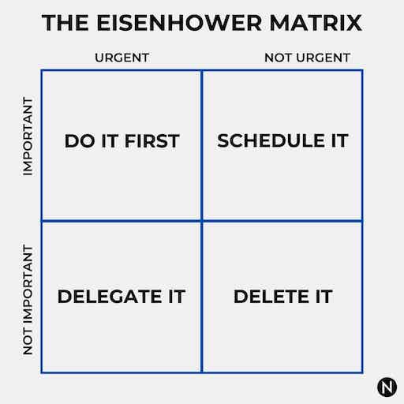
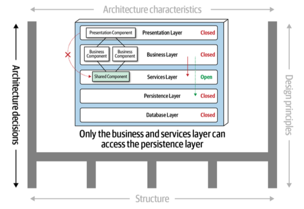

## 「架構」的定義

> Software architecture is about making fundamental structural choices that are costly to change once implemented
> 軟體架構是關於做出基本結構的選擇，一旦實施，這些選擇的改變成本很高

* 作者認為[Wiki](https://en.wikipedia.org/wiki/Software_architecture)這段敘述是過時的，微服務架構的其中一個目的，就是為了降低架構改變的成本
* 認清軟體架構的動態本質 - 包括定義本身都是動態的

:::info
「架構就是跟重要的東西有關的事，不管他是什麼」 - [Ralph Johnson](https://en.wikipedia.org/wiki/Ralph_Johnson_(computer_scientist)) ([Design Patterns](https://en.wikipedia.org/wiki/Design_Patterns)的作者)
:::

* Recap: 軟體架構屬於艾斯豪爾矩陣的哪個維度？

Image from: [The Eisenhower Matrix](https://nextlevelgents.com/eisenhower-matrix/)

## 軟體架構的四個面向

* 當架構師在分析「架構」時，具體而言在分析什麼？

1. 架構特性
2. 架構結構
3. 架構決策
4. 設計原理

## 軟體架構師

* 做出決定
    * 指導，而非指定技術
        * 偶爾可能還是得決定某些程度的技術
* 持續分析
* 跟上趨勢
* 確保決策的實行
* 工作經驗的多樣性
* 擁有業務領域知識
* 處理人際關係
* 駕馭政治

## 架構的法則

* 一切都是取捨
    * [Johari Window](https://www.communicationtheory.org/the-johari-window-model/)
* Why比How重要
