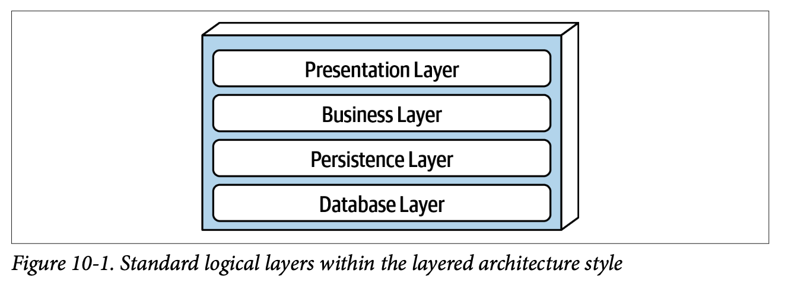
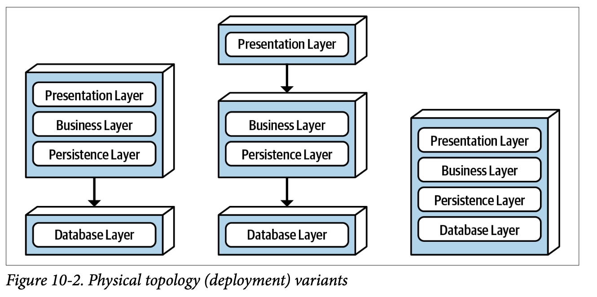
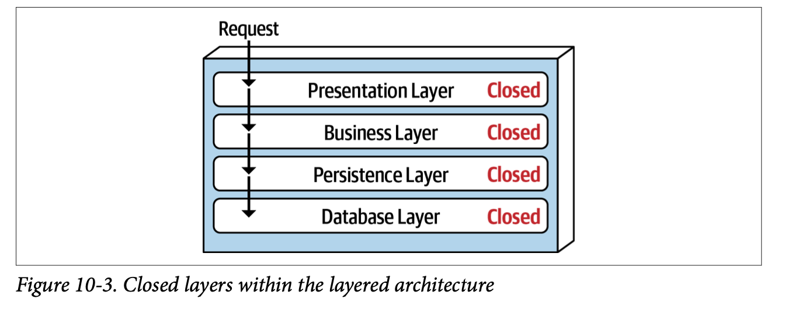
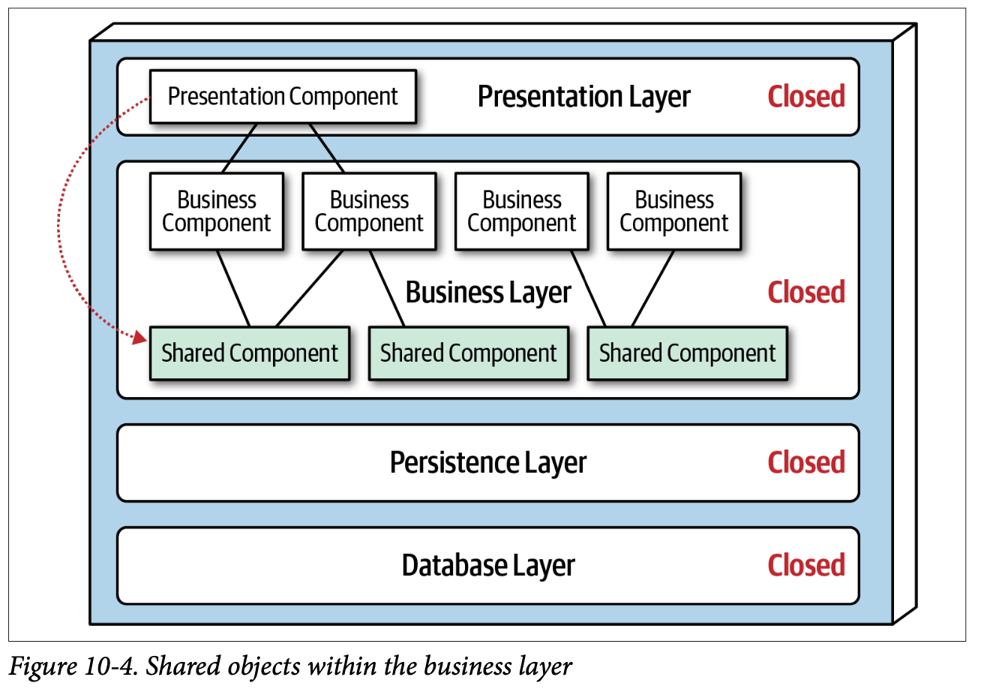
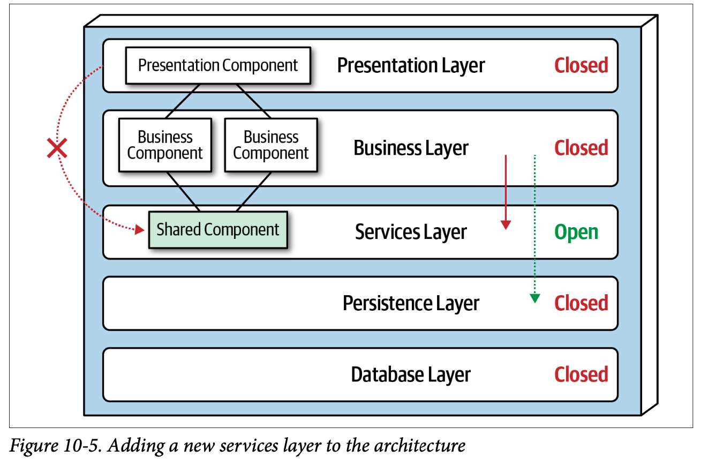
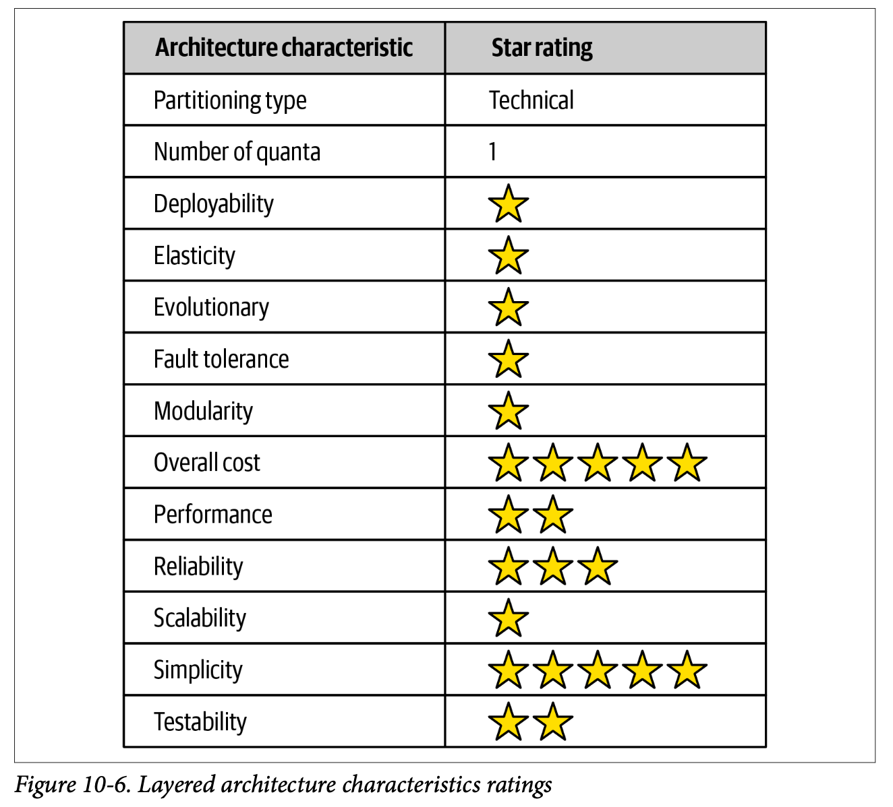

---
title: "Ch10: 分層式架構風格"
tsidebar_label: "Ch10: 分層式架構風格"
sidebar_position: 10
--- 

分層式架構又稱**n曾架構風格**，被大部分的應用採取，開發應用時通常隨著Conway法則，系統的結構類似於開發該系統的組織結構。

## 拓墣架構
基本架構 (一個區塊為一個部署):
 - 展示層 (Presentation Layer): UI顯示資訊
 - 業務層 (Business Layer): 利用資料進行業務上的邏輯處理 ex: 計算年報酬率多少、漏洞數量多少、漏洞影響值多少....
 - 持久層 (Persistence Layer): 對資料做CRUD，固定使用的SQL會寫在這一層
 - 資料庫層 (Database Layer): 從放資料的地方 ex: 資料庫、S3、檔案系統(EFS)

變形架構
分層架構有時候會依據專案上的需求而有各種不同的變化

 - 第一種: 分離實體的資料庫或檔案系統為一個部署 ex: 客戶想使用系統，但資料想放自己家
 - 第二種: 分離展示層與資料庫層各為一個部署 ex: 客戶只想使用邏輯或計算方式，UI想自己設計呈現的方式，資料想放自己家
 - 第三種: On-Premises(辦公室運行)，直接買斷跑在機器的服務 ex: Adobe非CC系列 各種單機遊戲 

這種架構有以下優缺點:

優點:
 - 每一層只需專注於該層的技術與責任
 - 架構上更容易安排的角色與責任

缺點:
 - 整體更動的敏捷性會變慢(需要一層一層的溝通)

## 隔離層
隔離層有以下重點:
 - 一層通過一層，每層都封閉，不會跳層
 - 某一層內部的改變，不會影響其他層
 - 某一層可以直接被替換

## 增加層數
架設業務層內有共享元件開放給其他業務元件，但因為展示層可以存取業務層，所以展示層的元件可以存取業務元件，也可以存取業務層的共享元件，

但為了避免這樣的場景發生，所以增加一個服務層專門放置共享元件，而這個服務層是開放的，因為有些業務員元件不一定會使用到共享元件而直接存取持久層。

層與層間不一定都是封閉，也有開放，需要定義好分層與請求的流程，還有個層存取的限制。

## 其他考量
 - 維持良好的模組化，才可以搬遷到另一種架構上。
 - 盡量避免架構污水池，例如一個請求從展示層經過業務層到持久層，業務層只做轉傳的動作，但會消耗資源。

## 為何使用此架構？
 - 適合小型而簡單的應用或是網站
 - 預算或時間有限的案子
 - 成本低，開發及建構容易
 - 還不確定適合哪種架構風格時

## 架構特性的等級

## Recap
1. 開放與封閉分層的區別是什麼？
2. 描述隔離層的概念及其好處？
3. 什麼事架構污水反模式？
4. 驅使你使用分層架構的主要特性有哪些？
5. 為什麼可測試性不佳？
6. 為什麼敏捷性不佳？