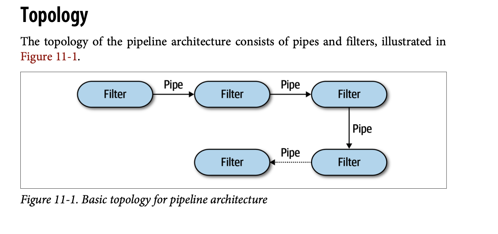
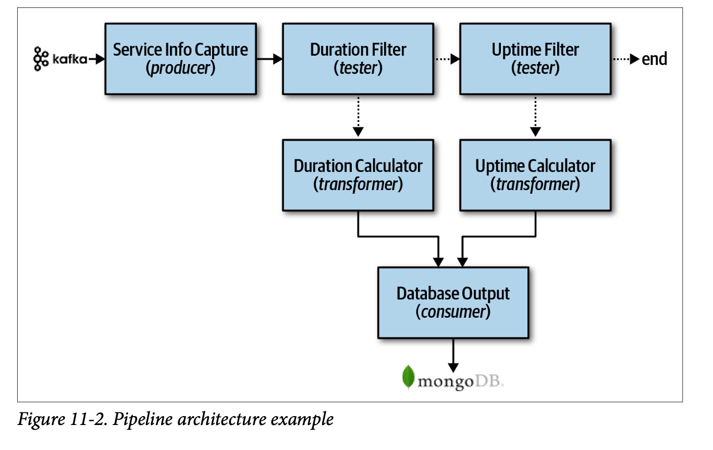
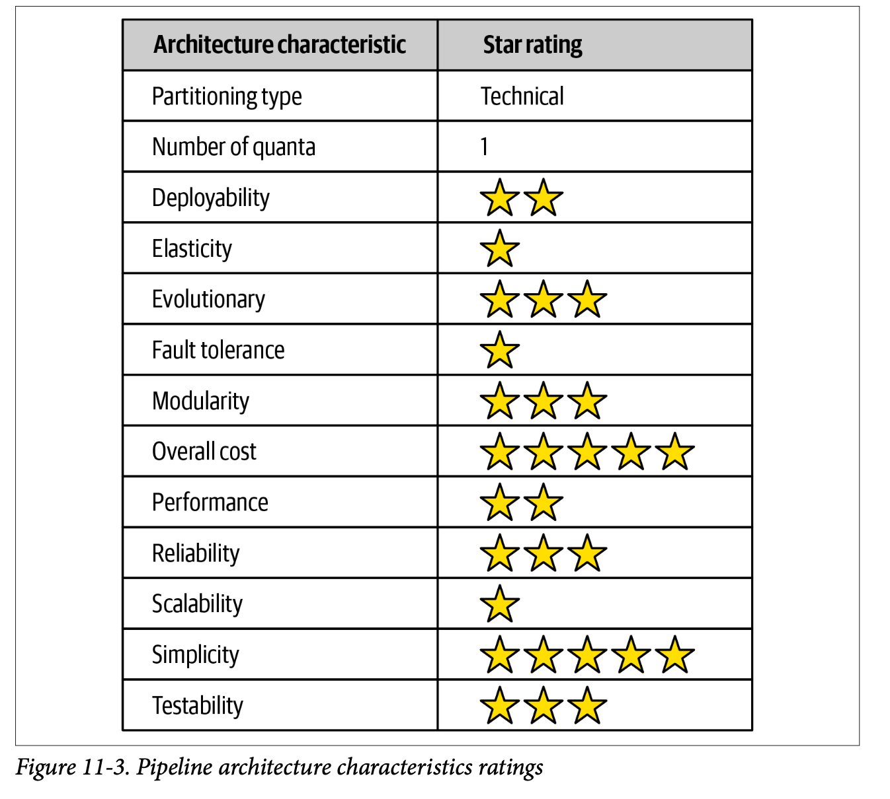

---
title: "Ch11: 管道架構風格"
tsidebar_label: "Ch11: 管道架構風格"
sidebar_position: 11
--- 

## 拓墣結構
組成元件:
 - 管道
 - 篩選器


### 管道
篩選器間的通信通道。
特性:
 - 單向
 - 點對點
 - 運送的資料是任何格式
 - 運送的每筆資料小


### 篩選器
執行單一項工作的單位。
特性:
 - 各個篩篩選器都是獨立的
 - 只會執行一項工作

#### 各種篩選器:
 - 生產者: 程序的起點
 - 轉換者(map): 對資料作轉換然後送出到對應的管道
 - 測試者(reduce): 接收輸入，依測試結果選擇性產生輸出
 - 消費者: 管道流程的終點，把結果存到資料庫或是顯示在使用者介面上

[ReduceMap](https://ithelp.ithome.com.tw/articles/10194296)

下列的termianl command如果以管道架構來看的話，顯示出他的管道的單向性以及篩選器的簡易性
```bash
            tr -cs A-Za-z '\n' |
            tr A-Z a-z |
            sort |
            uniq -c |
            sort -rn |
            sed ${1}q
```

## 範例
管道架構常出現在簡單、單向工作的處理，例如[EDI](https://zh.wikipedia.org/zh-tw/%E7%94%B5%E5%AD%90%E6%95%B0%E6%8D%AE%E4%BA%A4%E6%8D%A2)、[ETL](https://www.oracle.com/tw/integration/what-is-etl/)，類似於管道架構的動作，將資料從一個步驟傳到另一個步驟。
下圖為Kafka的應用場景，主要是處理串流至Kafka的不同種類資料:
服務資訊紀錄(生產者)訂閱Kafka主題，對應到篩選器的，資料經過持續時間篩選器(測試者)判斷資料使否符合服務請求的持續時間，並選擇性傳給下一個管道，
如果符合持續時間，則選擇性傳給持續時間計算篩選器(轉換者)，否則傳給上線時間篩選器(測試者)，如果符合上線條件，則傳給上線時間計算器(轉換者)，反之結束，
最後再給資料輸出(消費者)。


## 架構特性的等級


## Recap
1. 管道架構有可能是雙向的嗎？
2. 列舉四中篩選器及目的？
3. 篩選器可以透過多個管道送出資料嗎？
4. 管道架構是技術或領域分割？
5. 管道架構以何種方式支援模組化？
6. 給出管道架構的兩個例子？
