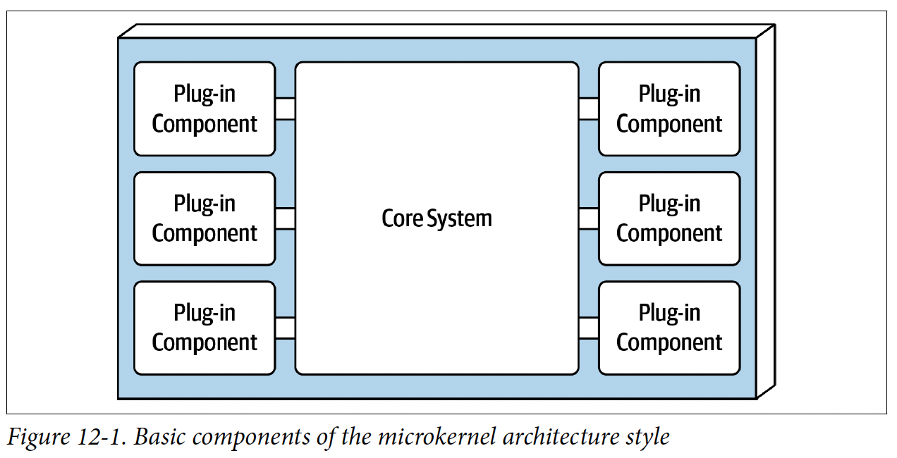
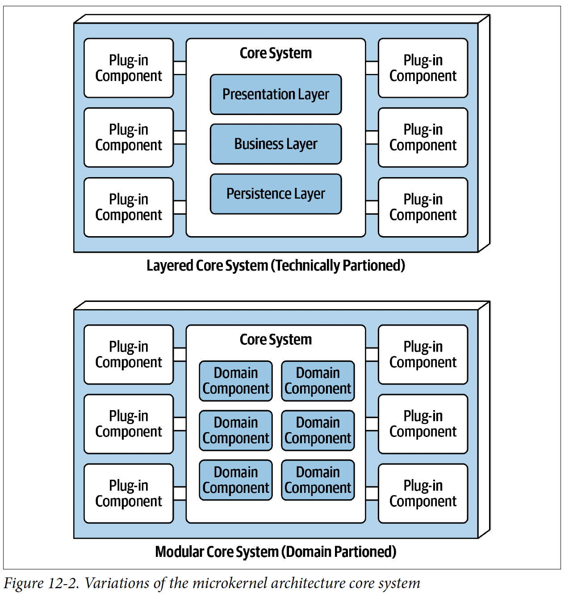
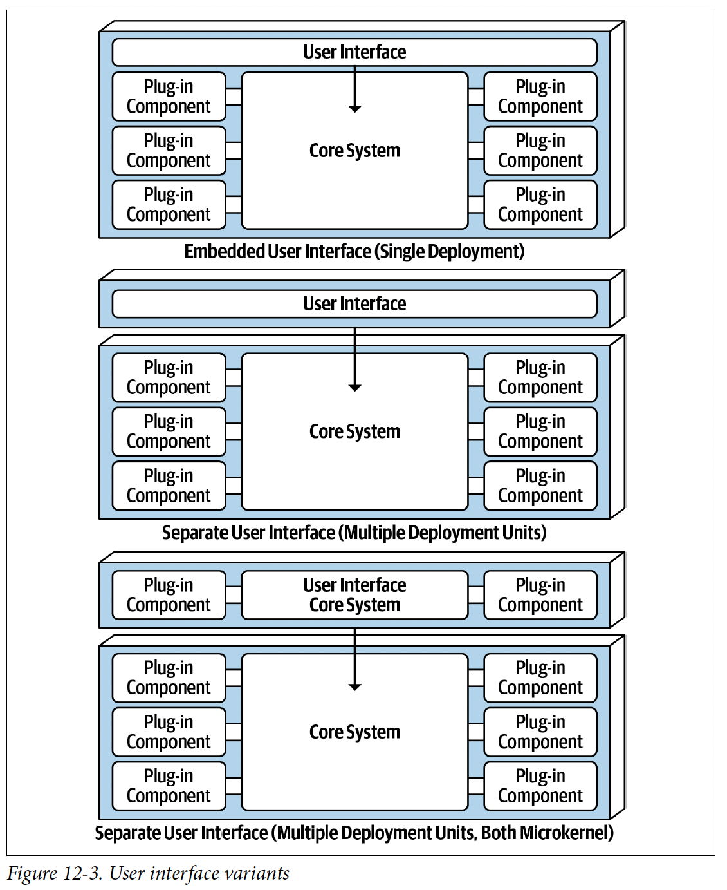
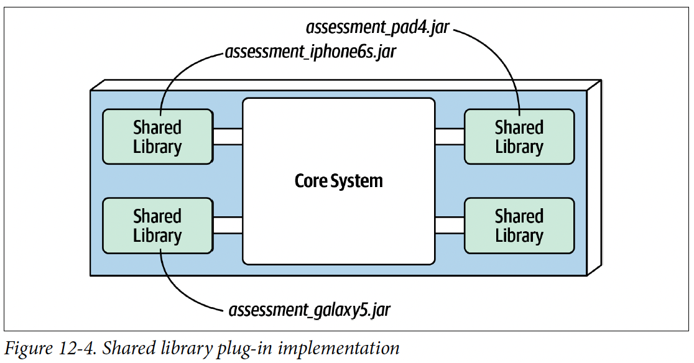
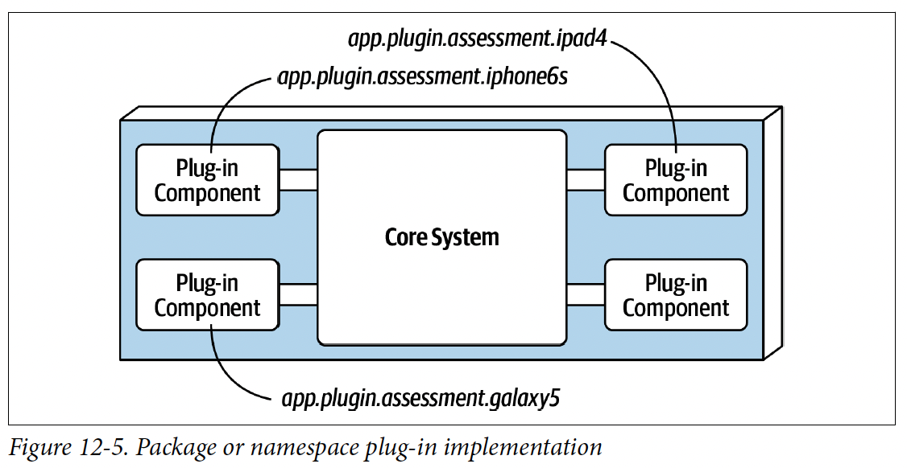
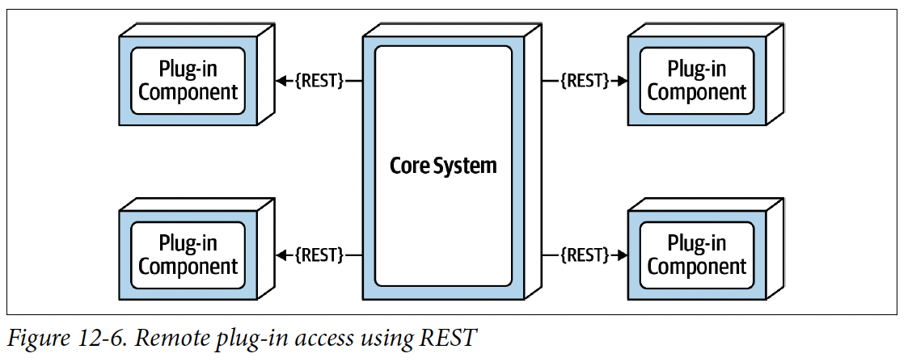
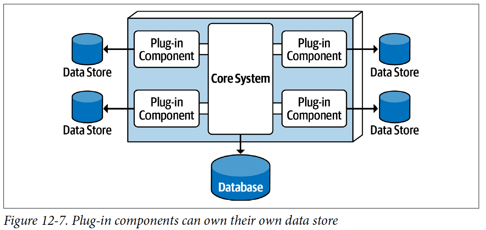
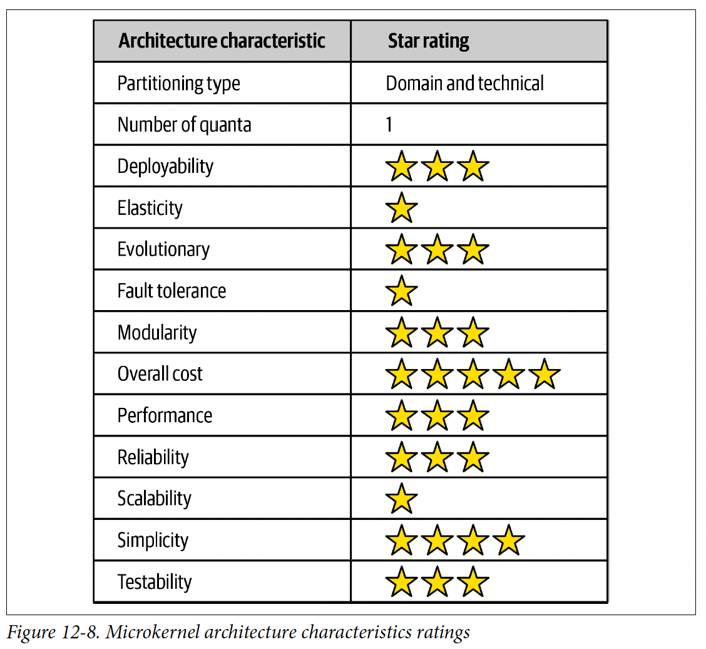

*microkernel* architecture style (也被叫做 *plug-in* architecture), 這種架構很適合產品類應用(包裝成一個單體式的部屬，通常作為第三方產品讓客戶下載、安裝在其電腦)
# Topology
微核心架構是相對簡單的單體式架構，由兩個組件構成
* A Core System
* Plug-in components

應用邏輯分散到以上兩個組件以提供應用功能與客製化處理邏輯上的擴充性、適應性、以及隔離。



# 核心系統(Core System)
定義: 執行系統所需要的最少功能

例子: Eclipse的核心系統為基本的文字編輯器: 開啟檔案、修改內容、儲存檔案，直到加入plug-ins才能讓Eclipse成為一個產品

不過有另外一種核心系統的定義: 穿越應用的happy path(通常是processing flow)，途中沒有或只有很少的客製化處理。

將循環複雜度從核心系統移除，並放置到個別的plug-in可以使擴展性、可維護性還有可測試性變得更好。
:::info
Recap Ch6

循環複雜度(CC, Cyclomatic Complexity)
簡單講就是執行分支太多，條件寫太多啦
:::

Example:
某個電子回收裝置的應用，必須針對收到的每個電子裝置，執行特定的評估規則

**Before**
```java
public void assessDevice(String deviceID) {
    if (deviceID.equals("iPhone6s")) {
        assessiPhone6s();
    } else if (deviceID.equals("iPad1")) {
        assessiPad1();
    } else if (deviceI D.equals("Galaxy5")) {
        assessGalaxy5();
    } else { ...
        ...
    }
}
```
**After**

擴展性更好，每次新增一個外掛元件，只要更新註冊表就好
```java
public void assessDevice(String deviceID) {
    String plugin = pluginRegistry.get(deviceID);
    Class<?> theClass = Class.forName(plugin);
    Constructor<?> constructor = theClass.getConstructor();
    DevicePlugin devicePlugin = (DevicePlugin)constructor.newInstance();
    DevicePlugin.assess();
}
```

核心系統可以是
* 分層架構(Layered architecture)
* 模組化單體(Modular Monolith)

(Recap Fig 8-3)


有一些情況下，核心系統可以拆分成分開部屬的領域服務。每種付款方式(信用卡、PayPal、商店性用點數、禮品卡、採購訂單)都有付款領域所特有、個別的外掛元件。
在這類情況下，通常整個單體應用會共享一個資料庫。


展示層也有可能內嵌到核心系統，或實作分開的使用者介面


# 外掛元件(Plug-In Components)
用來強化或延伸核心系統的單獨且獨立的元件，可用來隔離很常變動的程式碼
- [x] 可維護性
- [x] 可測試性

理想情況下，Plug-in 應該互相獨立，彼此互不依賴。

外掛元件跟核心系統的溝通通常透過
* method invocation
* function call to the entry-point class of the plug-in component


外掛管理分兩階段
* 編譯期
    * 就重編
* 執行期
    * 工具(OSGi, Penrose, Jigsaaw, Prism)

點對點的外掛元件可實作成共享程式庫(e.g., JAR, DLL, Gem), Java的套件名稱，或C#的密名空間



或者用下列更簡單作法
`app.plug-in.<domain>.<context>`
* plug-in清楚表示這是外掛元件
* app.plugin.assessment.ipad4




Plugin用REST也可以唷!

其他plugin甚至可以用container service，雖然看起來是一個增加saclability的好方法，
但下圖還是只有一個架構量子，因為每個request都會經過核心系統


使用REST好處
* 元件獨立性更好
* 不需動用其他框架工具來做執行時期的整合
* 可以利用非同步與外掛元件通信，可以增加回應速度
壞處
* 會讓微核心架構變成分散式
* thrid-party on-prem product 不好實作跟佈署
* 複雜度++，費用++
* 元件掛掉，就完了

外掛元件通常不直接連到共享的中央資料庫，這個責任由核心系統承擔，將需要的資料傳給外掛元件，主要是為了去耦合。

但外掛元件可以有供自己存取的資料儲存





# Registry
```java
Map<String, String> registry = new HashMap<String, String>();
static {
    //point-to-point access example
    registry.put("iPhone6s", "Iphone6sPlugin");

    //messaging example
    registry.put("iPhone6s", "iphone6s.queue");

    //restful example
    registry.put("iPhone6s", "https://atlas:443/assess/iphone6s");
}

```
# Contracts

```java
public interface AssessmentPlugin {
    public AssessmentOutput assess();
    public String register();
    public String deregister();
}
public class AssessmentOutput {
    public String assessmentReport;
    public Boolean resell;
    public Double value;
    public Double resellPrice;
}
```
# Example and Use Cases
* Eclipse
* Jenkins
* Chrome


# Architecture Characteristics Ratings


