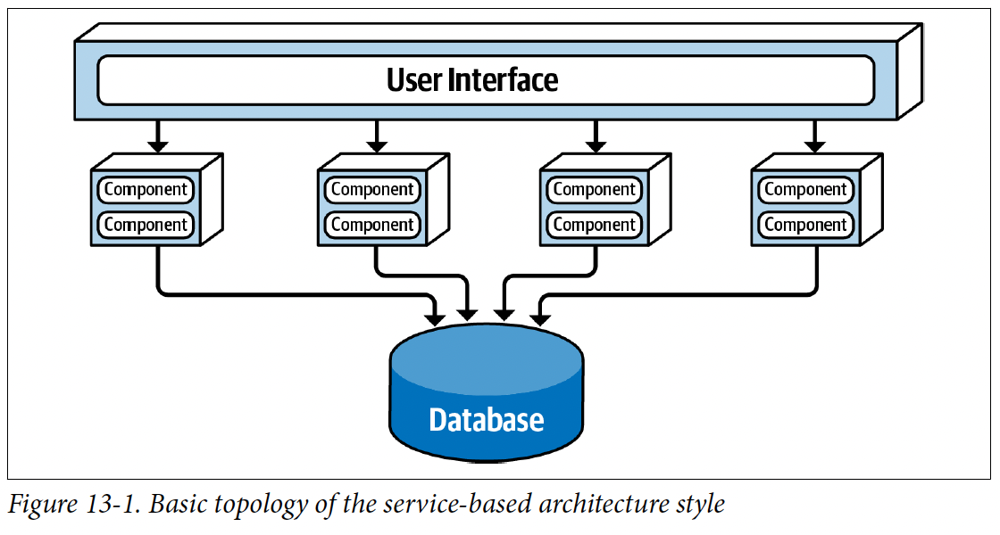
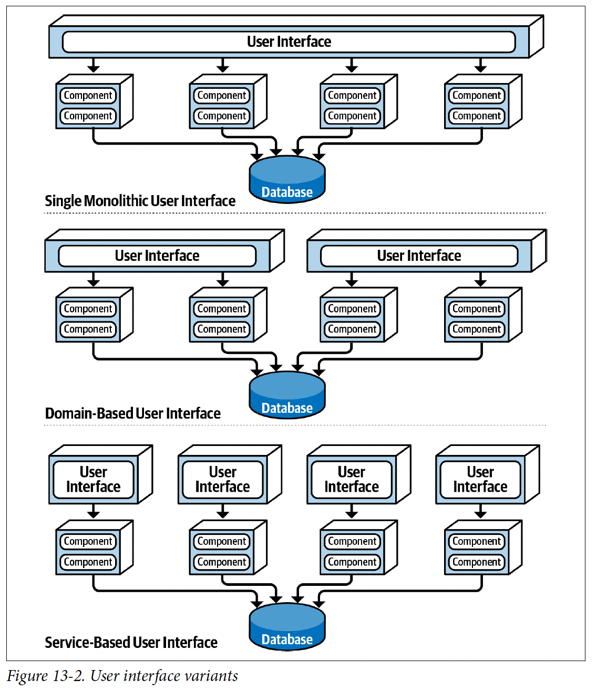
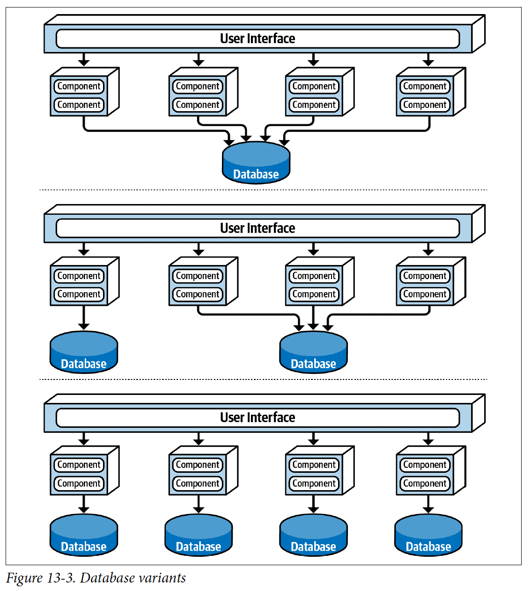
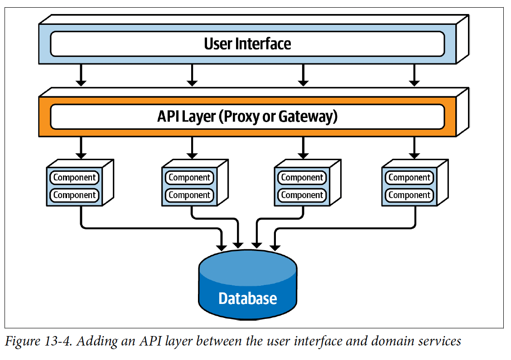
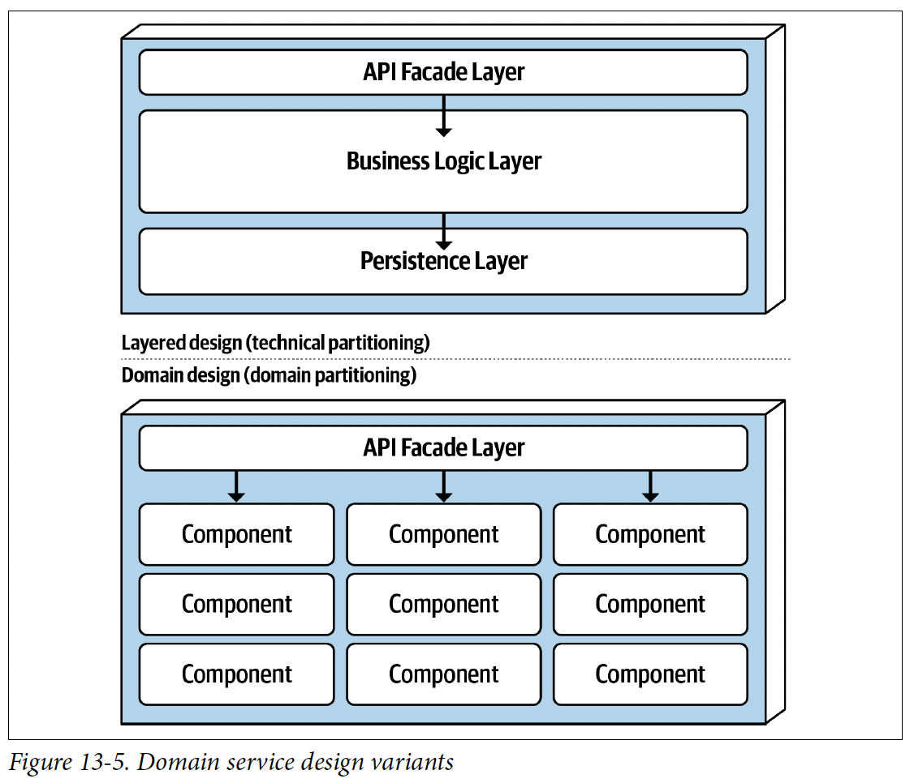
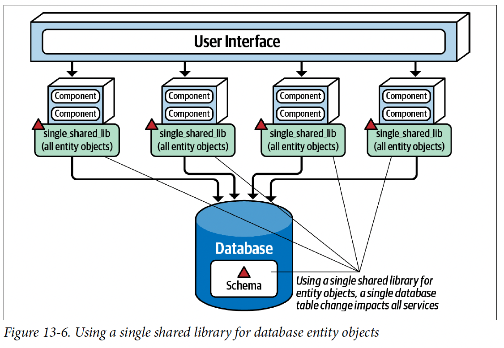
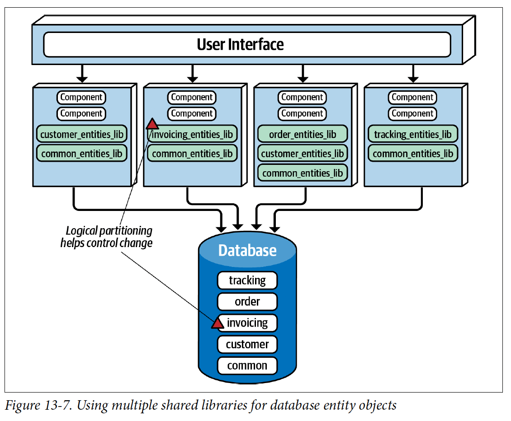
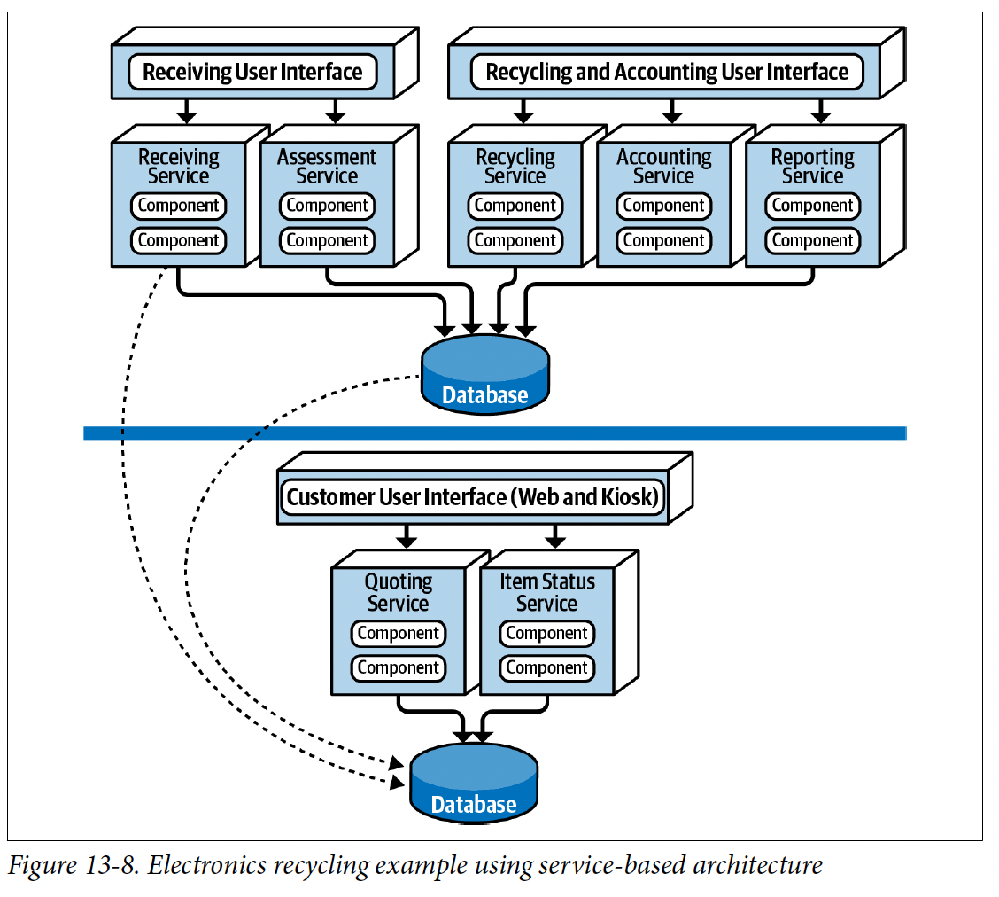
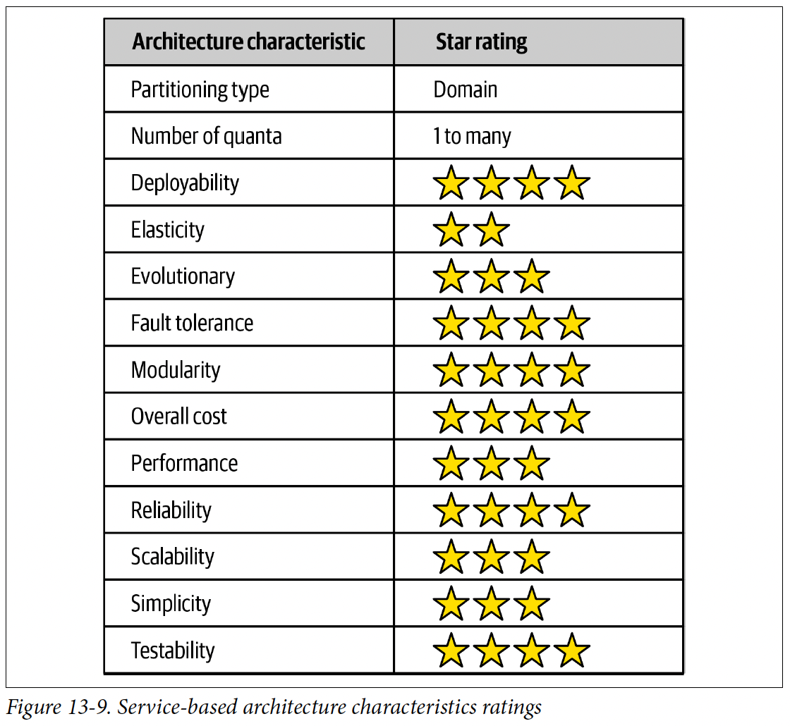
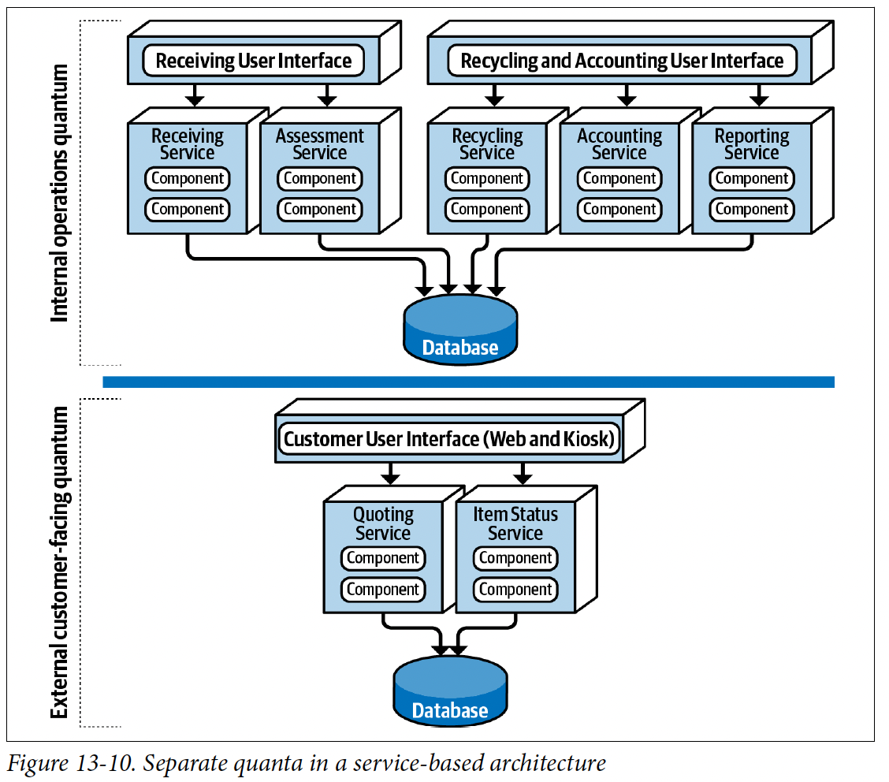

混合了微服務架構，也因為架構上的靈活性，被認為是最實用的架構之一，而且沒有分散式架構的複雜度與高費用，所以很受歡迎
# Topology
* 分開佈署的使用者介面
* 遠端粗顆粒服務
* 單體資料庫

* 通常4-12個服務
* 每個領域服務可以擴展
* 使用者介面可以利用REST, RPC, SOAP存取服務
* 可以用proxy + gateway存取服務 或[Service Locator Pattern](https://en.wikipedia.org/wiki/Service_locator_pattern)
* 通常會有中央共享的資料庫

# Topology Variants

* 要確定服務拆分的時候，不會用到另一個服務的資料，避免跨服務通信，及資料複製

在使用者介面與服務之間，增加一層反向代理伺服器或Gateway，將指標、安全性、稽核需求及服務發現移出使用者介面，是一種良好的實務作法

# Service Design and Granularity

服務式架構的領域服務通常顆粒較粗，這是跟微服務架構的許多重大差別之一，例如服務式架構的一個API可能叫做OrderService，可能牽扯到許多分開佈署，或跟遠端協做

* 服務式架構通常會確保ACID
* 微服務因為架構較分散，通常只會確保[BASE](https://en.wikipedia.org/wiki/Eventual_consistency)(基本可用性，軟性狀態，最終一致性)

為什麼會這樣呢？
舉例：假設微服務下，會有OrderPlacement跟PaymentService，萬一收了order，但是呼叫payment的時候因為信用卡過期導致失敗該怎麼辦
要收訂單嗎，要減庫存嗎，萬一其他人想買怎麼辦

反觀，服務式架構就只需要確保OrderService運作正常就ok

但是壞處就是佈署的程式更多，一個東西故障可能整個Service都壞。

# Database Partitioning
BAD! 嘗試打造一個單一個實體物件共享程式庫
這樣改任何東西，都要重新在所有服務編譯，就算有指定版本好了，改動也都要考慮到所有服務的使用情況。

解決方法
* 分割資料庫
* 把lib分成common跟客製化的，common的只能由資料庫團隊進行修改

# Example Architecture
電子回收系統 Flow:

客戶問公司能回收多少錢(報價)->如果滿意，客戶把電子產品送到公司(接收)->公司評估(評估)

->如果正常，公司把錢給客戶(會計)->客戶能隨時檢視物品狀態(物品狀態)->最後裝置要嗎被回收，要嗎拿去賣(回收)

->最後公司會定期做報表(報表)

* 兩個分開的實體資料庫
* 防火牆單向存取

* 敏捷
* 可測
* 可佈署
* 可擴展
* 容錯
* 安全性

# Architecture Characteristics Ratings
* 服務式架構是領域分割架構
* 每個服務都是分開佈署的軟體單元，更改只影響該服務的使用者介面及資料庫
* 分散式架構，量子數目 >= 1，即使可能有4-12個分開佈署的服務，如果共用資料庫或使用者介面，那整個系統還是只有一個量子，
* 電子回收範例中有2個量子，就算內部維運有兩個分開佈署的服務，但因為共享資料庫所以還是只有一個量子

# When to Use This Architecture Style
* 最務實的架構，當然有其他強大的多的分散式架構--但有些公司發現這種強大是以高漲的費用為代價，還有些公司不需要這麼強的系統。
* 就像買法拉利上下班，但因為塞車只能開50公里--看起來很酷！！但我沒錢阿！
* 服務式架構很適合領域驅動開發
* 分散式系統常遇到的一致性問題，服務式架構可以很大的程度保留ACID
* 細顆粒->多協調, 服務式架構屬於粗顆粒->少協調

# Recap
1. 一個典型的服務式架構會有多少個服務
2. 在服務式架構中必須把資料庫拆分嗎
3. 什麼情況下你會把資料庫拆分
4. 有什麼技巧可以在服務式架構中管理資料庫變更
5. 領域服務需要跑在container上嗎
6. 哪些架構特性在服務式架構中得到良好的支援
7. 為何彈性在服務式架構的支援不佳
8. 如何在服務式架構中增加量子的數目