# 事件驅動式架構

- 事件驅動架構是分散非同步架構，具高擴展性、高效能、高可適性。
- 以非同步方式接收與處理事件去耦合元件。
- 可以當作獨立架構或內嵌至其他架構風格。

## 請求式模型 Request-Model

大部分的系統都遵循請求式模型

- 發送系統要求執行某種請求，會被送給**請求協作者**
- 請求協作者通常是一個使用者介面、API 層或企業服務匯流排
- 確切、同步地把請求導向各種**請求處理器**
- **請求處理器**透過**提取**或**更新**資料庫資訊來處理各項請求

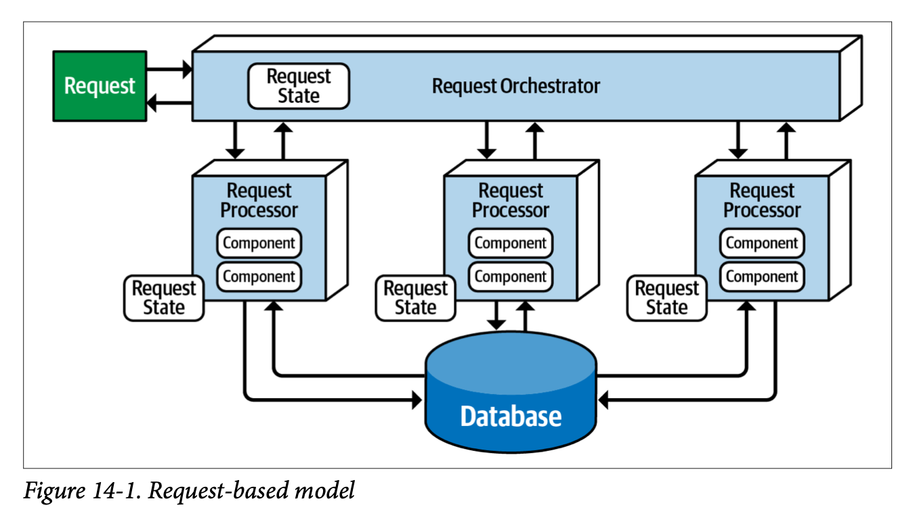

:::info 請求式模型範例：

客戶篩選過去六個月之訂單請求。

篩選訂單歷史資訊發送給系統 -> 資料驅動性請求。
:::

事件式模型則對特定情況反應，並針對事件採取行動。

:::info 事件式模型範例：
在線上拍賣針對特定物品出價。

系統必須對同時收到的其他出價比較，來回應事件，決定最高出價者。
:::

## 拓撲結構

- **代理者拓撲**：要求更高程度的反應性與動態控制
- **調停者拓撲**：需要控制工作程序的工作流程

## 代理者拓撲

- 沒有中心化的事件調停者。
- 訊息流透過輕量級的代理者（像是 RabbitMQ、ActiveMQ、HornetQ 等等的 Message Queue）
- 適合事件處理流程相對簡單，也不需要中心化的事件協作與協調。

主要架構元件與傳遞方式：

1. 初始事件：啟動流程的最初事件
2. 事件代理者：事件通道
3. 事件處理器：從代理者接到事件後，開始處理初始事件，執行事件相關的特定任務後，建立處理事件。
4. 處理事件：非同步的告訴系統其他部分，已經採取行動。再將事件傳送到 事件代理者 然後 迴圈 直到沒有事件處理器需處理為止。

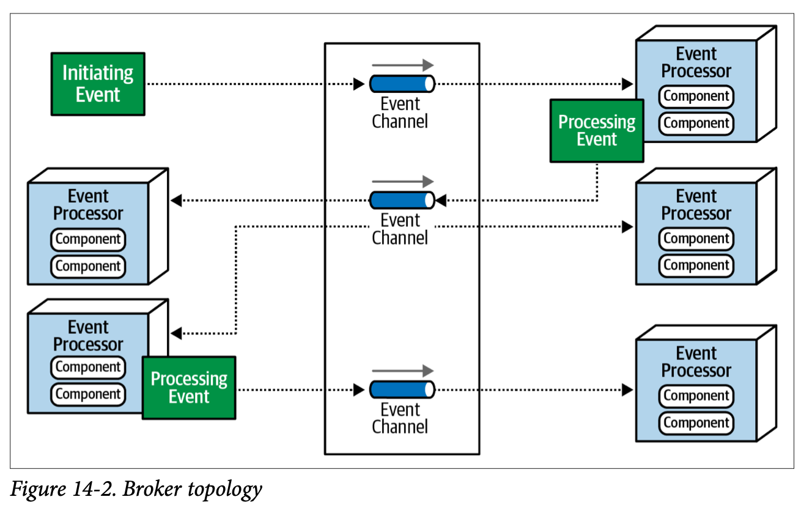

事件代理者常以聯合形式，多個領域式群集實例(multiple domain-based clustered instances)，傳遞特定領域的事件。

事件代理者具備獨立、非同步、射後不理的廣播特性（？！）。通常以主題的發佈-訂閱傳訊模式。

Because of the **decoupled asynchronous fire-and-forget broadcasting** nature of the broker topology, topics (or topic exchanges in the case of AMQP) are usually used in the broker topology using a publish-and-subscribe messaging model.

架構擴充性：

- 代理者拓撲的優點在於新的事件處理器可以輕鬆地添加到系統中，無需對其他部分進行修改。
- 在代理者拓撲中，發送被忽略的消息並不是浪費資源，因為它提供了架構的擴展性和靈活性。

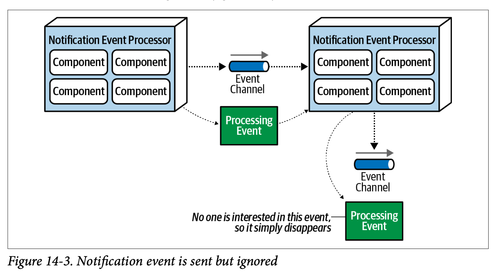

:::info 範例：
生成一封電子郵件並發送給客戶，通知他們有特定的操作被執行了。

通知事件處理器會負責生成並發送該郵件，然後透過將一個新的處理事件發送到主題中，向整個系統通告這個動作。

後續沒有其他事件處理器在該主題上監聽事件，訊息就被忽略掉了。

想要分析已發送給客戶的電子郵件？這時候只需加入一個新的事件處理器作為分析器到整個系統中。

這樣的設計能夠節省時間和資源，並提高系統的靈活性和可擴展性。
:::

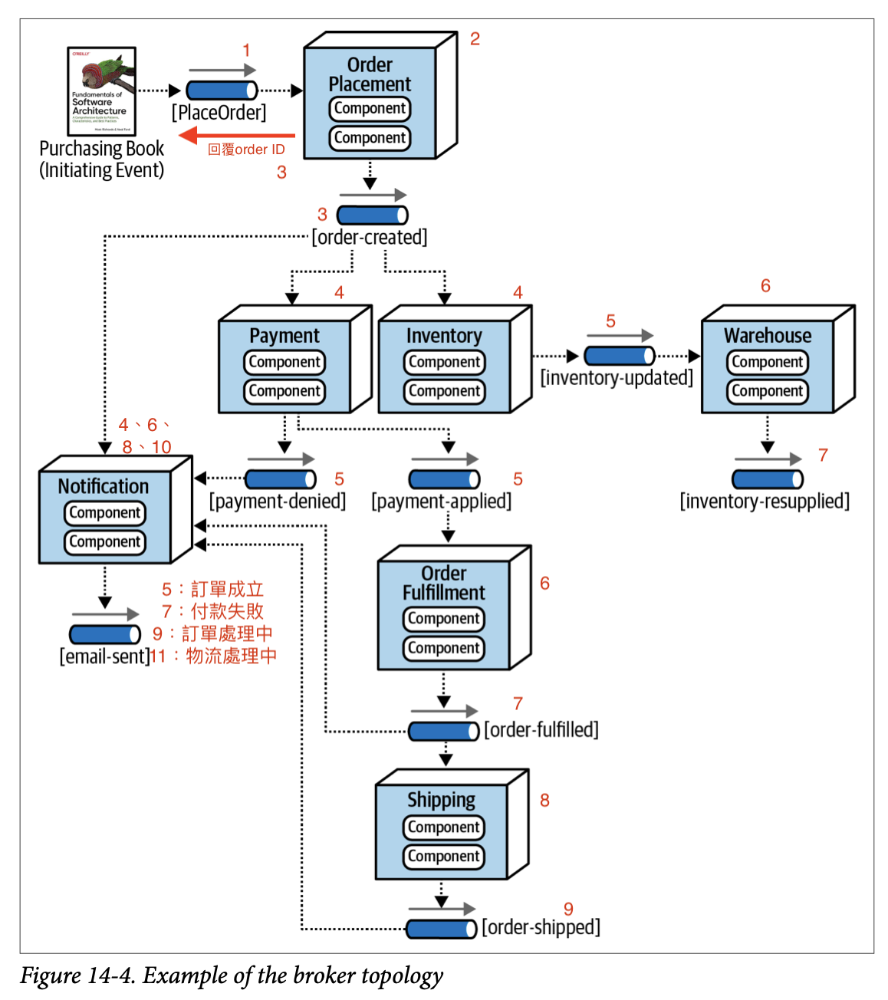

事件處理器之間皆高度去耦合、互相獨立。像是接力賽跑，事件交出後就不干我的事了。

事件處理器當掉或變慢，可以透過主題提供背（備？）壓點(back pressure point)來應對。

優點：

1. 效能
2. 回應性
3. 可擴展性

缺點：

1. 沒有辦法控制與初始事件相關整個工作流程。
2. 沒有調停者監督或控制交易。處理失敗無法得知，其他事件則繼續處理。
3. 不支援重啟交易。沒有元件清楚事件處理狀態、不清楚進度。

| 好處                   | 壞處         |
| ---------------------- | ------------ |
| 高度去耦合的事件處理器 | 工作流程控制 |
| 高可擴展性             | 錯誤處理     |
| 高回應性               | 可恢復性     |
| 高效能                 | 重啟能力     |
| 高容錯                 | 資料不一致   |

## 調停者拓撲

解決了代理者拓撲的一些缺點。

事件調停者：協調多個事件處理器的初始事件，管理及控制工作流程。

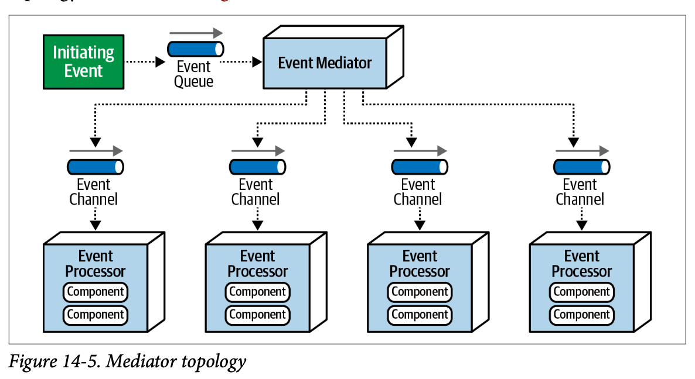

主要架構元件與傳遞方式：

1. 初始事件：啟動流程的最初事件
2. 初始事件佇列
3. 事件調停者：知道事件處理的步驟，產生相對應的處理事件。
4. 事件代理者：事件通道
5. 事件處理器：從代理者接到事件後，開始處理初始事件，執行事件相關的特定任務後，回應事件調停者處理結果。

拓樸中，調停者大多會有多個特定領域、或特定一組事件相關。（減少單點故障的問題。）

ex: 客戶調停者（新客戶註冊、個資更新）、訂單調停者（新增購物車、結帳）

調停者的實作方法，視處理事件之本質與複雜性而定

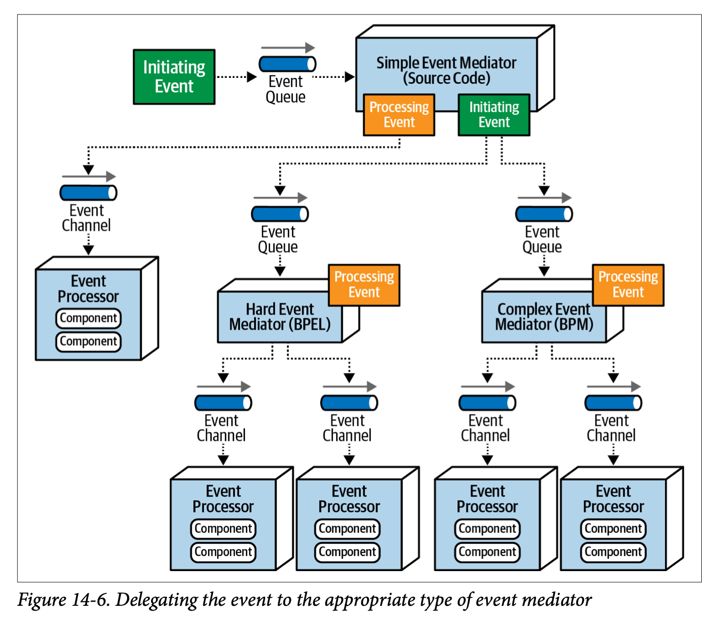

1. 簡單事件調停者：簡單錯誤處理與協作，以原始碼(JAVA 或 C# 客製化)來控制工作流程。Apache Camel、Mule ESB、Spring Integration
2. 困難事件調停者：工作流程需要多條件式處理、擁有複雜錯誤處理指令的多重動態路徑，以業務流程執行語言(BPEL)，通常利用 GUI 操作。 (像是 XML 的結構)。Apache ODE、Oracle BPEL Process Manager
3. 複雜事件調停者：事件程序需人為介入核准、交易執行期長。BPM(業務程序管理)。jBPM、Bonita BPM

### 範例：使用者下單，調停者在事件中的運作方式

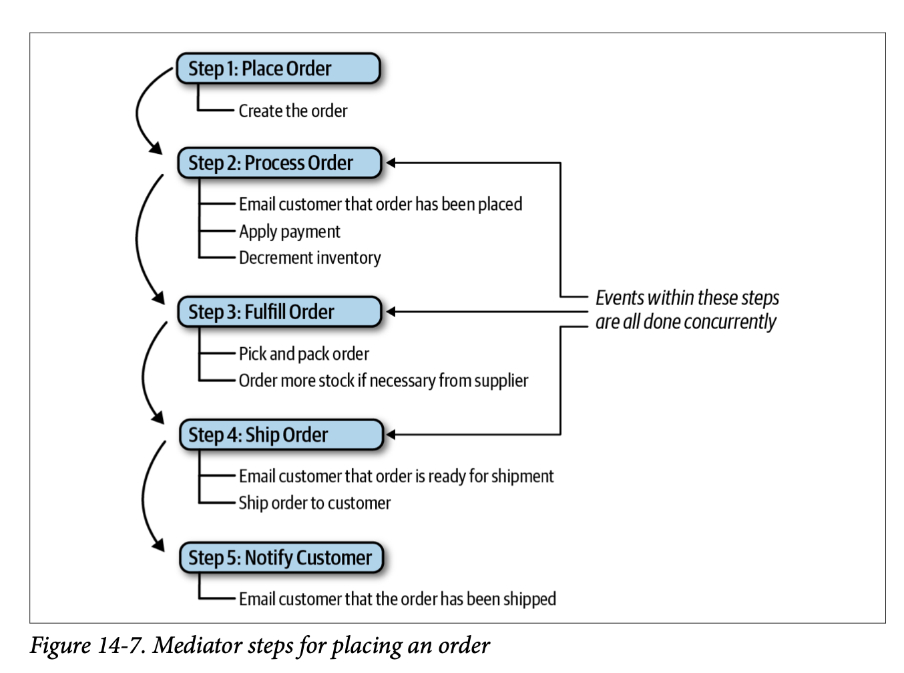

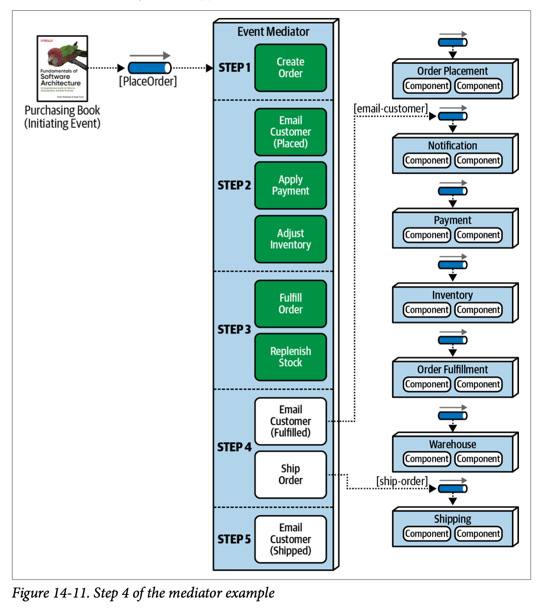

代理者與調停者拓撲的差異：

|          | 代理者   | 調停者                                   |
| -------- | -------- | ---------------------------------------- |
| 工作流程 | 缺乏控制 | 有控制權                                 |
| 事件狀態 | X        | 記錄請求狀態，可暫停、恢復、重啟工作流程 |

調停者拓撲的缺點：

1. 複雜事件裡，建立動態處理的模型很難
2. 事件處理器擴大規模，調停者也須同時擴大規模（否則會讓處理流程產生瓶頸）
3. 調停者拓撲事件處理器之間的去耦合程度，不比代理者好。

| 好處           | 壞處                       |
| -------------- | -------------------------- |
| 工作流程控制   | 事件處理器之間的耦合性較強 |
| 錯誤處理       | 可擴展性較低               |
| 可恢復性       | 效能較低                   |
| 重啟能力       | 容錯效能較低               |
| 資料一致性較佳 | 為複雜的工作流程建模       |

如何選擇？工作流程控制、錯誤處理能力，或是高效能、高可擴展性之間的取捨。

## 非同步能力

事件驅動架構的獨特性：不管是射後不理（無需等待任何回應）、請求/回覆處理都仰賴非同步通訊。

增加系統整體反應性

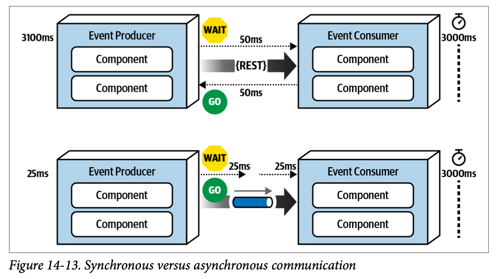

上面展示回應性與效能差異

同步：上面同步需要等待系統回應，使用者得到保證評論已經被貼出。

非同步：下面不需要任何系統回應，使用者收到系統評論張貼請求，承諾未來會發布

如果使用者不需要任何回傳資訊，為什麼要讓使用者空等？

非同步通訊大幅改善回應性，但考慮產生錯誤情況，會增加事件驅動系統的複雜度。

非同步通訊的主要問題是錯誤處理。

## 錯誤處理

反應式架構的工作流程事件模式

系統在錯誤處理上具備彈性，卻又不至於影響回應性。

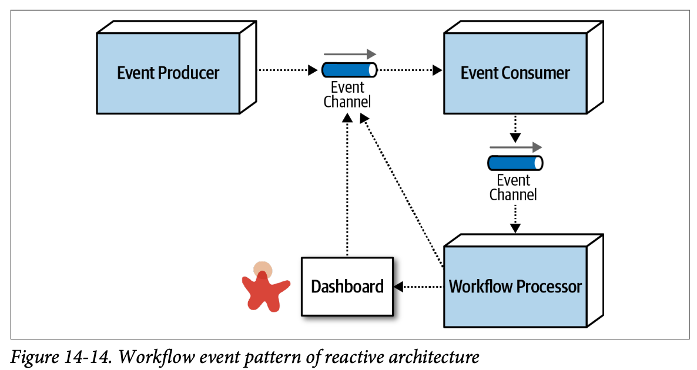

事件消費者處理資料發生錯誤時，把錯誤委託給工作流程處理器。

嘗試修改及修復原始資料，再送到最初的佇列。

無法修復就會送到儀表板，由人工判斷。

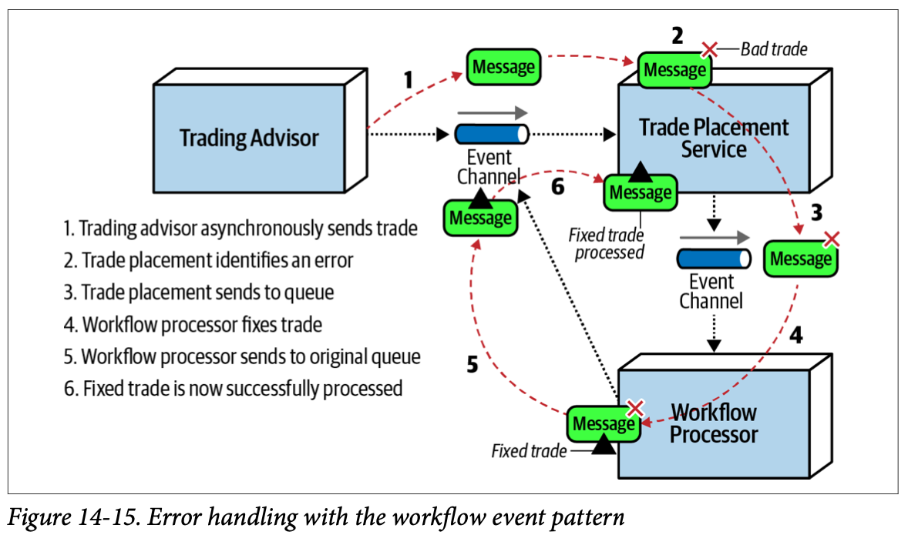

錯誤訊息被重新提交後，處理不照順序。

:::info 範例：交易下單
服務把出錯交易的帳號放進佇列，相同帳號的交易都放在一個暫時的佇列，出錯的地方處理完後再繼續剩餘的交易。
:::

## 避免資料遺失

資料遺失是處理非同步通訊一個重要的問題。

事件驅動架構可能發生資料遺失的地方很多。

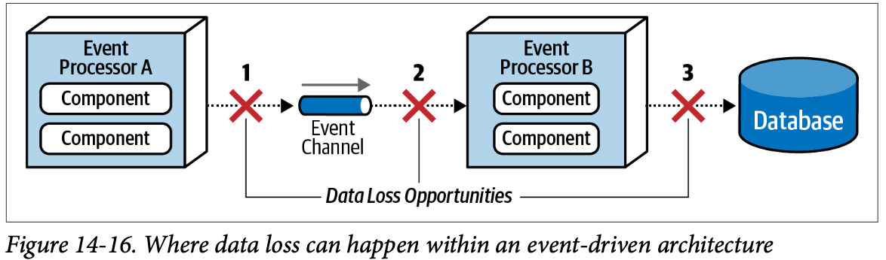

1. 訊息未到達佇列：透過持久性訊息佇列、同步傳送機制解決。
   - 持久性訊息佇列：不只將訊息存在記憶體，更將訊息存在實體資料儲存。如果事件通道錯誤可以重新處理。
   - 同步傳送：讓產生者傳送訊息處於阻擋狀態(blocking wait)，直到代理者確認放好訊息。
2. 訊息處理前當掉：
   - 預設模式：從佇列取出資訊，會立刻從佇列中移除。
   - 客戶確認模式：訊息留在佇列，傳送處理時給編號，使其他消費者無法讀取訊息。
3. 無法存進資料庫：
   - 透過 ACID 交易的 Commit 來處理。資料已經保證儲存到資料庫。利用最後參與者支持(LPS)，確保處理已經結束，並且存到資料庫。

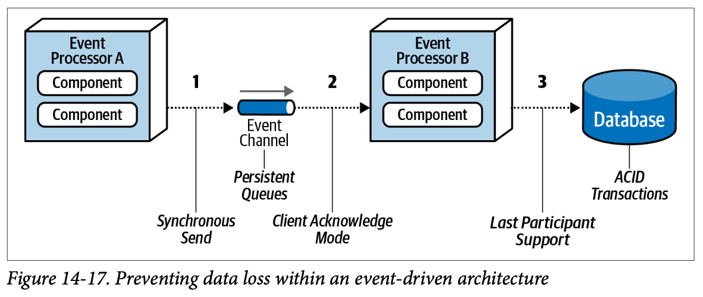

## 廣播能力

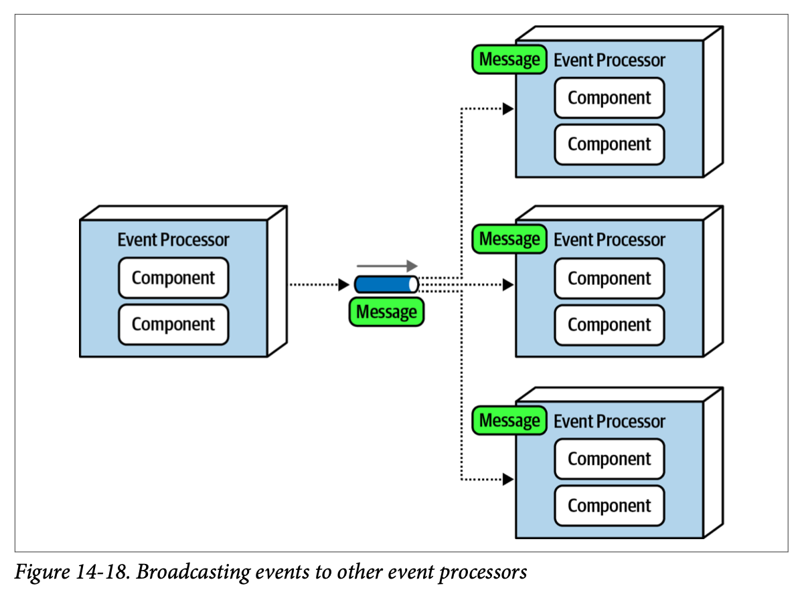

- 生產者發送消息，多個訂閱者也能接收到相同的訊息。
- 生產者不知道有哪些訂閱者，也不知道訂閱者對訊息會做出哪些回應。
- 廣播是事件處理之間最高程度的去耦合。
- 廣播功能是最終一致性模式、複雜事件處理（CEP）、以及其他情況，不可或缺的一部分。

## 請求與回覆

- 在事件驅動架構中，同步通訊透過**請求/回覆**傳訊（準同步通訊）來完成。
- 由兩個佇列構成：請求佇列、回覆佇列。

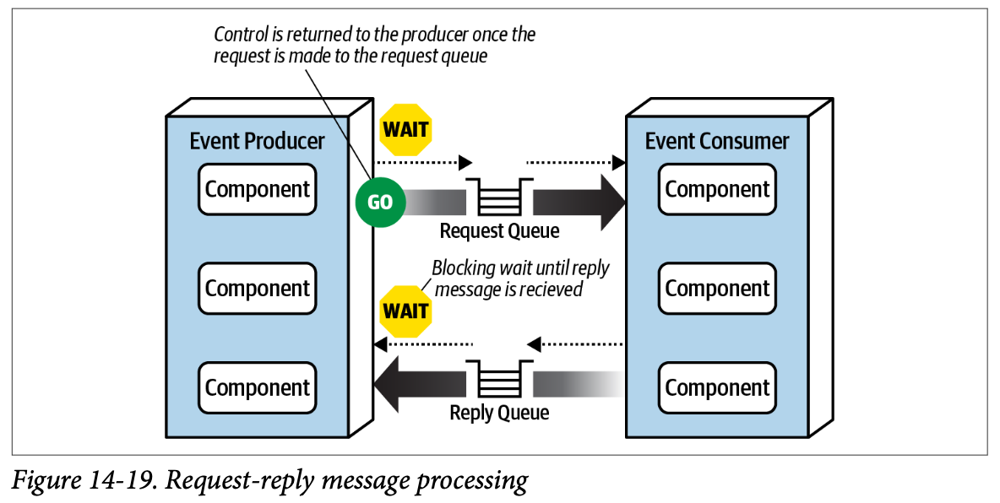

傳遞方式：

1. 請求非同步的傳送到請求佇列
2. 控制權回到訊息生產者手上
3. 訊息生產者針對回應佇列阻擋性等待，等待回應產生
4. 訊息消費者收到並處理訊息，傳送回應
5. 訊息生產者接收回應資料

實作方式：

1. 相關性編號：通常紀錄原始請求訊息的編號，等待回覆佇列傳送的訊息內的相關訊息編號與原始請求訊息編號相符。
   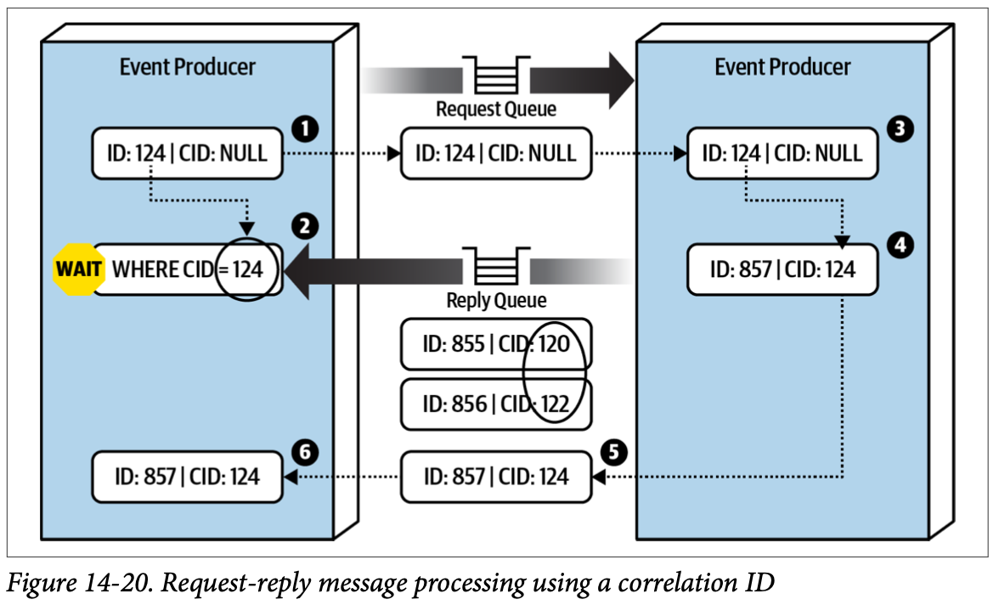
2. 暫存性佇列：佇列專門用於特定請求。請求出現時建立，請求結束時刪除。訊息量大可能減緩代理者速度。
   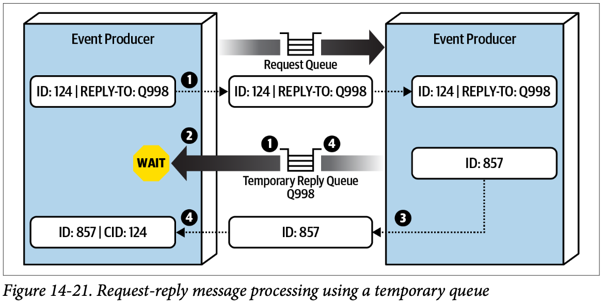

## 在請求式或事件式之間做出選擇

| 相較於請求式模型的優點       | 取捨                   |
| ---------------------------- | ---------------------- |
| 對動態使用者內容有更好的回應 | 只支援最終一致性       |
| 更好的可擴展性與彈性         | 對處理流程的控制度較低 |
| 更好的敏捷性與變動管理       | 事件流程的結果較難確定 |
| 更好的適應性與擴充性         | 不易測試與除錯         |
| 更好的回應性與效能           |                        |
| 更好的即時決策               |                        |
| 對態勢感知的反應更好         |                        |

## 混合事件驅動架構

1. 事件驅動架構通常與其他架構風格結合，形成混合架構。
2. 常見的混合架構包括微服務和空間基礎架構。
3. 將事件驅動架構添加到其他架構中，有助於消除瓶頸、提供回壓點(back pressure point)，並增加用戶回應能力。
4. 微服務和空間基礎架構都使用消息傳遞來進行數據交換，並利用事件驅動架構實現程式化擴展性。

## 架構特性的等級

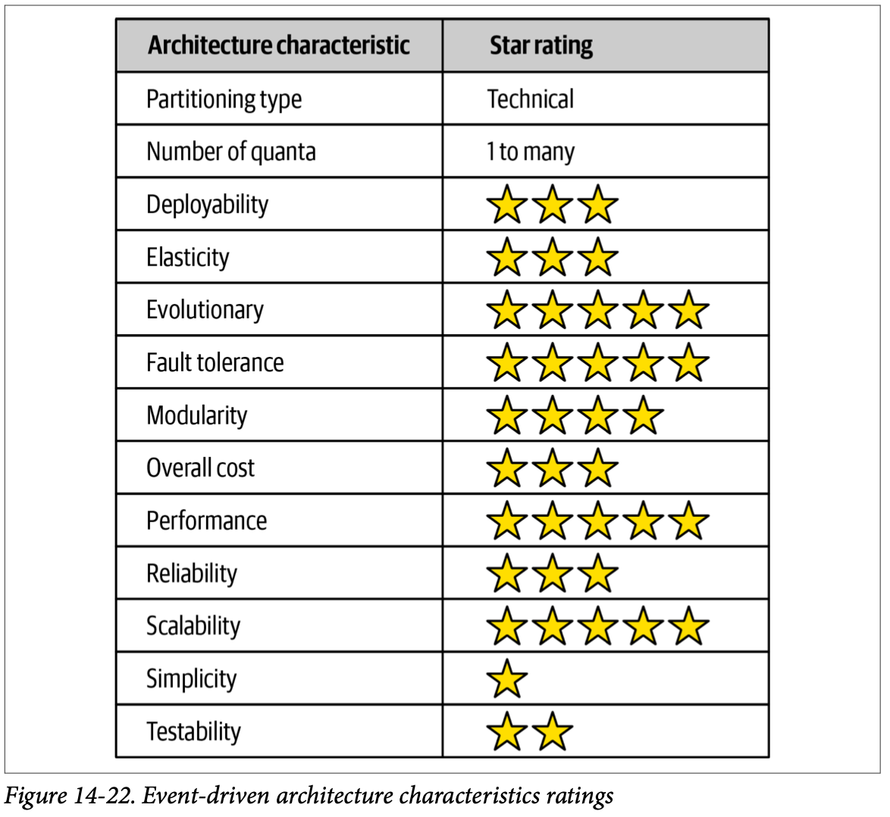

- 事件驅動架構主要是一種技術上的分區架構，不同領域分佈在多個事件處理器之間，透過調停者、佇列、主題連接。
- 事件驅動架構的優點是高性能、可擴展性和容錯性
  - 高效能：通過非同步通訊和平行處理實現。
  - 高可擴展性：事件處理器的程式化負載平衡（競爭消費者）實現。請求加重自動擴展事件處理器。
  - 容錯：高度去耦合、非同步事件處理器（達到最終一致性、事件工作流程最終處理）。
- 簡單性和可測試性方面得分相對較低，因為事件流動是非確定性且動態的。
- 事件驅動架構仍在高度演進中，新增功能相對容易，特別是在代理者拓撲。
