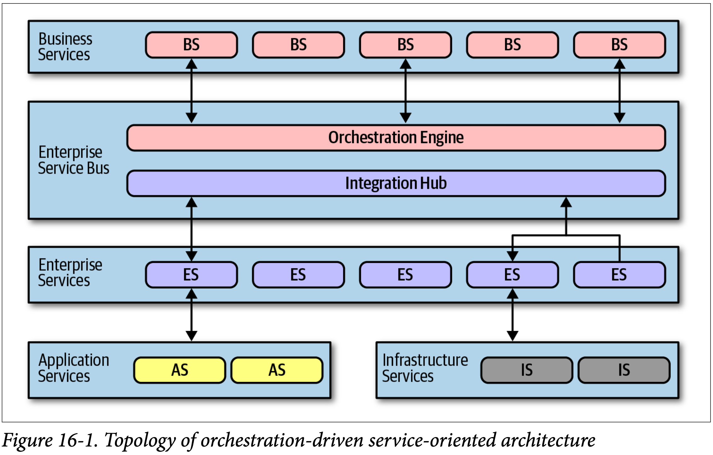
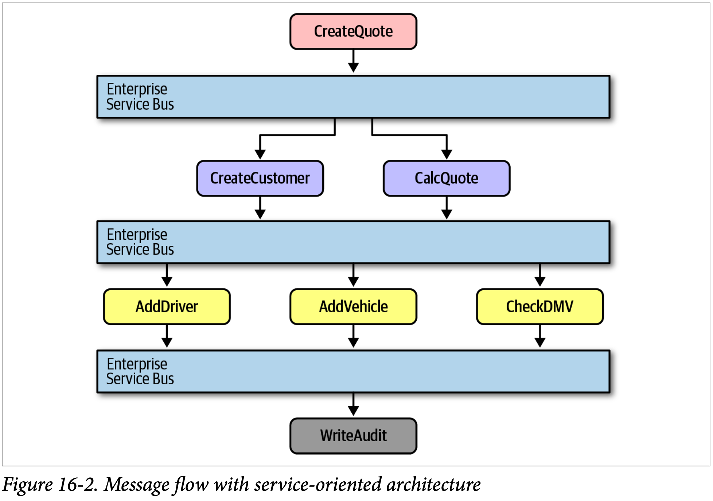
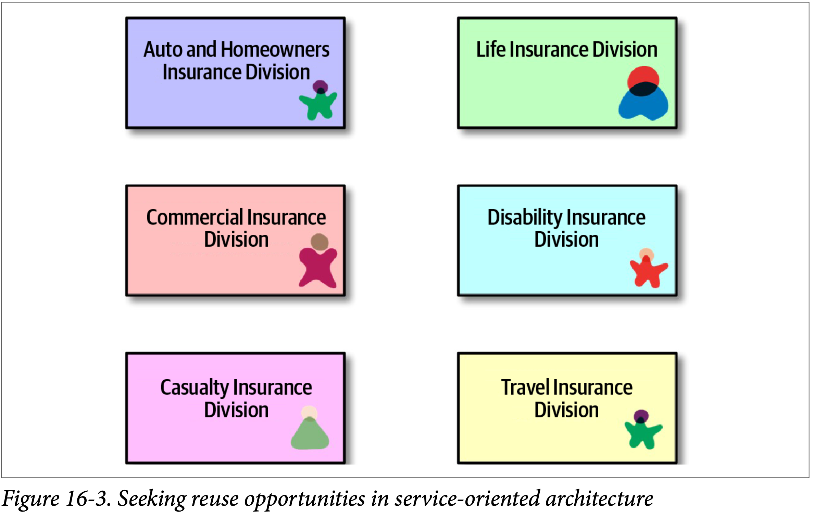
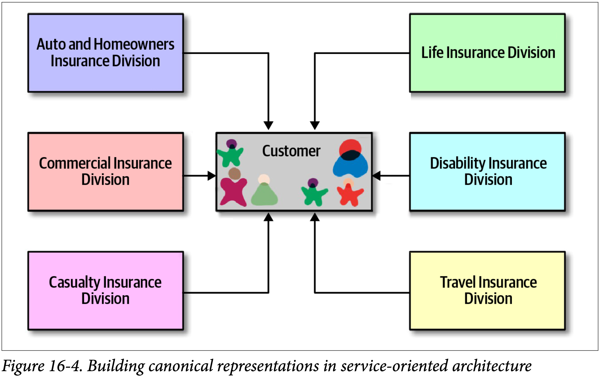
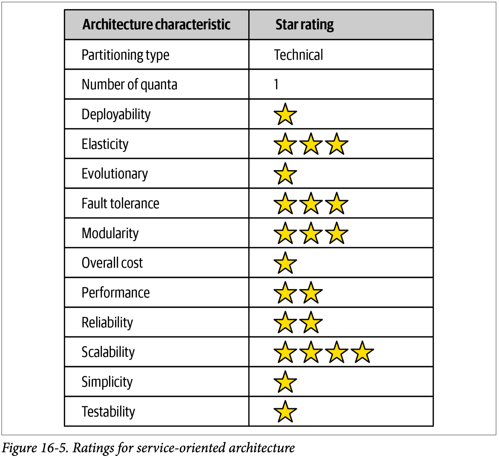

# 協作驅動的服務導向架構(Orchestration-Driven Service-Oriented Architecture)

## 前言

協作驅動的服務導向架構，這種架構風格的演進背景受到當時的時代環境和組織哲學的影響。該架構在 1990 年代末期的企業環境中應運而生，當時的企業正在迅速成長，需要應對多元化的 IT 需求，許多公司迫切需要可擴展性等特性。然後**計算資源有限，分散式計算剛剛崛起**。

這種架構的特性包括：

1. **外部因素驅動：** 外部壓力迫使架構師選擇分散式架構，以應對昂貴的操作系統和資料庫授權等問題。

2. **企業層次的重複使用：** 架構的主要目標是實現企業層次的重複使用，將業務行為分為不同層式，以促進重複使用。

3. **技術分割：** 該架構風格推動了技術分割的理念，但這也帶來了複雜性與耦合性的問題。

4. **協作引擎：** 協作引擎是這種架構的核心，用於協調業務服務的實現(重要邏輯都在這)，但這也可能成為組織中的政治力量和官僚貧頸(康威法則)。

5. **訊息流：** 所有請求都通過**協作引擎**進行，即使是內部調用也是如此。

這種架構在當時具有一定的優勢，但也存在許多缺點，包括複雜性、耦合性。

## 拓墣結構

## 分類

該架構的哲學，主要集中在**企業層級的復用**，以下分類中的每一層正是為了支援這一個目標

-   **業務服務：** 位於架構的最頂部，充當進入點，代表著**業務領域**的行為，例如執行交易，或是下訂單。這些服務通常由業務用戶定義，不包含實際的程式碼，只包含**輸入**、**輸出**，有時有綱要的資訊。

-   **企業服務：**

    -   包括細顆粒的、共享的一些實作，通常是打造特定業務領域最基礎行為的任務。例如創建客戶或計算報價。這些服務是構成粗顆粒度業務服務的基本元件，透過協作引擎進行協調。
    -   如果開發人員能夠以正確的顆粒度來打造細顆粒的企業服務，則企業就不需要再重寫那部分的程式碼，漸漸的，企業就能打造一組可複用的資產。
    -   現實的動態本質讓這些常識失敗。業務元件不像建築材料，解決方案可以數十年不變。市場、技術變化、工程實務、還有其他因素，讓想在軟體領域加入穩定性的各種嘗試變得更混亂。

-   **應用服務：** 並非所有服務都需要像企業服務一樣的細粒度和重複使用。應用服務是一次性的、單一實現的服務，通常由單一應用團隊擁有和管理。例如：可能有個應用需要地理位置，但組織不想花時間或力氣將其變成可服用的服務。

-   **基礎設施服務：** 提供操作性關注點，如監視、日誌記錄、認證和授權。這些服務通常是與共享的基礎設施團隊緊密合作

-   **協作引擎：** 協作引擎是此架構的核心，透過協作包括像是**交易協調**與**訊息轉換**，將業務服務的實作串起來。
    -   定義業務與企業服務關係，他們如何對應，以及交易的界限何在。
    -   充當整合中樞，讓架構師得以將客製化程式碼及套件、舊有軟體系統整合起來。
    -   因為是架構核心，又受到康威法則(Conway)影響。負責引擎的這群架構師形成組織內的政治力量，最終成為帶有官僚主義的瓶頸。
    -   把交易行為卸載到一個協作工具聽起來很好，但要找出交易的正確顆粒度卻越來越困難。雖然可以把幾個服務打包近一個分散式交易，但當開發人員必須搞清楚服務之間適當的交易邊界時，架構會變得更複雜。

不同的分層結構共同建構了協作驅動服務導向架構，但也帶來了一些挑戰：難以確定正確的事務顆粒度和元件之間的緊耦合。拓墣結構的理解對於理解這種架構風格及其**局限性**非常重要

### 訊息流

> 所有的請求都會通過**協作引擎** - 架構中處理邏輯的所在位置。因此即使是內部呼叫，訊息流還是會經過引擎。

圖(說明協作引擎)：
CreateQuote 業務層級的服務呼叫了服務匯流排 - 他定義了由針對 CreateCustomer 與 CalculateQuote 的呼叫所組成的工作流程，且其中每次的呼叫也都呼叫了另外的應用服務。此架構的匯流排是所有呼叫的整合中樞。

#### 舉例：

假設有一個電子商務公司，客戶想要下訂單。這個請求需要經過以下不同的分層，已完成整個訂單流程：

1. **業務服務：** 客戶的請求首先進入到位於架構頂部的業務服務。在這例子中，可能是一個叫做**CreateOrder**的業務服務。這個服務負責接收客戶的訂單訊息，例如商品、數量和送貨地址。

2. **企業服務：** 業務服務可能需要用到企業服務來執行不同的任務。例如，可能需要 call 一個**InventoryManagement** 企業服務來檢查庫存是否足夠，以確保訂單能夠履行。

3. **應用服務：** 在某些情況下，業務服務可能還需要特定應用服務。例如，如果客戶需要使用信用卡付款，役傅誒無物可能需要掉用一個**PaymentGateway**應用服務來處理付款事務。

4. **基礎設施服務：** 在整個訂單過程中，基礎設施服務可能用於監控、記錄訂單相關活動，或是進行用戶身份驗證。

5. **協作引擎：** 協作引擎充當所有服務之間的協調者和管理者，他確保訂單的不同服務按照正確順序來執行，還有負責將不同服務的輸入與輸出互相協調。

## 複用...與耦合

-   復用與耦合之間的平衡以及相關的挑戰

圖中展示了即使是不同的部門也都包含了“客戶”的概念。

為了實現重複使用，合適的策略將“客戶”部分提取出來，創建了一個可以重複使用的“客戶服務”，並允許其他服務引用這個“客戶服務”

這種設計也帶來了負面的權衡問題。例如元件之間大量的耦合性增加：

1. 對“客戶服務”的更改影響可能會擴散到所有其他服務，使得更新變得具有風險性。到最後即使是增量式改變都會費力氣。每一個小小的更新都可能潛在巨大的漣漪效應。然後導致後續部署、全面測試、及其他推類工程效率的事情發生。

2. 將所有行為集中到一個地方也會導致問題，如圖中範例，汽車與失能險，要支援單一的“客戶服務”，得把組織所知道有關客戶的一切都包含進來。汽車險需要駕照 - 這是人的財產，而不是汽車的。所以“客戶服務”需要包含駕照的細節，雖然失能保險部門根本不在乎。然而處理失能的團隊卻必須處理相關的額外複雜度。

要打造如此專注在**技術分割**的架構根本不切時際，雖然分隔與復用的觀點看起來有道理，但是實際上卻是個夢魘。

例如 CatalogCheckout 這樣的領域概念，非常細微的滲入到架構的每一個地方。開發人員常常做像是"新增一行地址到 CatalogCheckout"這樣的工作。在此架構中，這項工作可能會牽扯到位於不同層的好幾十個服務，甚至需要更改單一資料庫的 schema。而且如果一開始企業服務的交易顆粒度定義不正確，開發人員不是要叫改設計，就是要在打造全新幾乎一樣的服務，才能改變交易行為。復用到此結束。

## 架構特性的等級

-   **技術分割：** 文章指向，管弦式服務導向架構可能是迄今為止技術最嚴重的通用架構之一。這種過度的技術分區導致了一些問題，例如架構中的連接點分佈，不同關注點之間存在此外，良好的引擎承擔了一個巨大的連接點，限制了架構的靈活。

-   **部署性**和**可測試性**，在該架構中得分極低。這是因為該架構對這些目標的支持有限，而且這些目標在該架構興盛時並不重要(甚至沒想過)。

-   **彈性**和**可擴展性**：雖然實作上有些困難，但是仍然可以實現。
    彈性：透過應用伺服器上的應用議程複製以及其他技巧。
    可擴展性：工具開發商在系統的可擴展性上投注大筆心血...???????????

-   **效能：** 因為屬於分散式架構，效能不是此架構的亮點，甚至是糟透了。因為每一個業務請求都被拆散到架構的不同地方。

-   **簡單性**與**費用**具備反向的關係，這是大部分架構師喜歡的。(為什麼還是只有一顆星？？？？？)

此架構讓架構師了解真實世界的分散式交易有多困難以及技術分割的實際限制何在。
