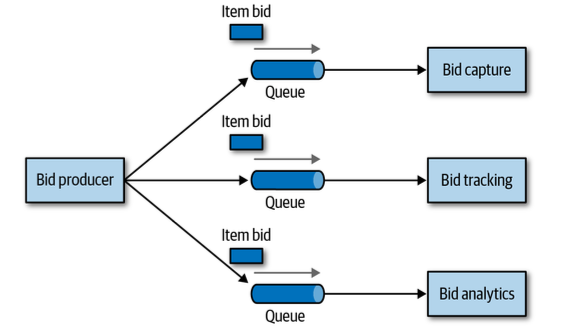

import { FontAwesomeIcon } from '@fortawesome/react-fontawesome'
import { faCoffee } from '@fortawesome/free-solid-svg-icons'

## 架構與設計

* 傳統上，架構師負責架構，開發人員負責寫程式
    * 架構師的決定不一定到得了開發團隊
    * 開發團隊的更動很少回饋給架構師
* 打破架構師與開發人員之間的障礙，架構才有可能可行

## 技術廣度

* 高度是你的技術深度；寬度是你的技術廣度
* 金字塔尖端
    * 有時效性 - 久沒用你會忘記
* 對架構師來說，廣度比深度重要
* 若架構師嘗試在很廣的範圍維持深度
    * 精疲力盡
    * 會有錯覺，對自己已知的東西抱有信心，但其實已經是過時的東西
    * 其中的平衡，是每個開發人員在職業生涯中都要認真考慮的

:::info
冰凍穴居人反模式 Forzen Casveman Anti-Pattern

因為過去的經驗遭遇過的問題，儘管該問題發生的機會很低，但卻一直無法釋懷。使得架構師做決定時特別小心。
要了解真實的樣貌與自己經驗或感覺得差異，避免受到這種心理因素影響
:::

## 分析取捨

### 佇列Queues與主題Topics

* 佇列Queue
    * 將Event送給需要的消費者
    * 生產者需要知道消費者是誰，將事件Event派進對應的Queue
    * AWS SQS, RabbitMQ, ActiveMQ

* 主題Topic
    * 發布/訂閱者模式
    * 生產者不一定知道消費者是誰
    * AWS Kinesis, Kafka/Redpanda, Pulsar

:::caution Question
如果要做一個拍賣網站，出價資料會被紀錄、追蹤、資料分析三個子系統拿去使用，該使用Queue或是Topic來架構這個系統？
:::

| __ 情境               __ | Queue                                                                                                         | Topic                                                                                                  |
| ------------------------ | ------------------------------------------------------------------------------------------------------------- | ------------------------------------------------------------------------------------------------------ |
| __ 加入新的Consumer   __ | 要建立新Queue，Producer也需要做修改                                                                           | <icon icon="fa fa-check" style={{color: '#09ff09'}} size="lg" /> 只需要建立新的Consumer訂閱需要的Topic |
| __ Producer受到的制約 __ | 較多，對於誰要消費資料要有認知，有耦合                                                                        | <icon icon="fa fa-check" style={{color: '#09ff09'}} size="lg" /> 較少，耦合低                          |
| __ 資料安全           __ | <icon icon="fa fa-check" style={{color: '#09ff09'}} size="lg" /> 較好，除了特定的接收者之外沒有人能看到資料   | 任何Consumer都能讀取資料                                                                               |
| __ 合約同質性         __ | <icon icon="fa fa-check" style={{color: '#09ff09'}} size="lg" /> Consumer可以有所需資料相關的自有合約                             |    只能支援同質合約                                                                |
| __ 監控Event __          | <icon icon="fa fa-check" style={{color: '#09ff09'}} size="lg" /> 每個Queue可以個別監控，因此可以設計自動scale | 不支援監控，無法自動Scale                                                                              |

## 平衡架構與實際程式編寫

1. 常做概念驗證(PoCs)
    * 架構師不只需要寫程式碼，有助於在考量實作的狀況下驗證架構決策
    * 寫出最好等級的程式碼作為參考、以及塑造團隊文化
2. 去處理應對技術債的問題
    * 讓開發團隊專心做關鍵的功能
    * 較無時效性，架構師不會成為團隊瓶頸
    * 修Bug也是幫助團隊的方式
3. 自動化日常工作以輔助開發團隊
4. 進行Code Review

## Recap

1. 描述架構的傳統做法與開發的異同，並解釋為何其不再奏效
2. 列出知識三角形的三個層次，並對每一個提供例子
3. 為什麼對架構師來說，專注在廣度比深度來的重要
4. 架構師維持技術深度、及保有實踐經驗可以使用哪些方法
