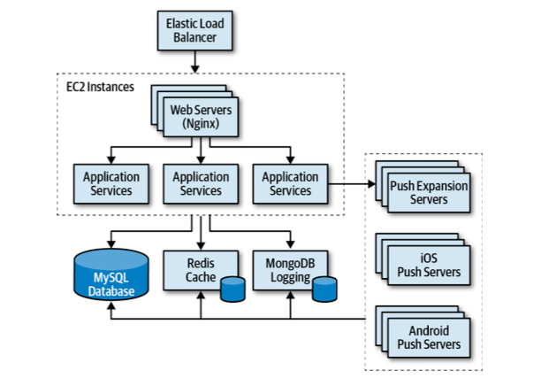
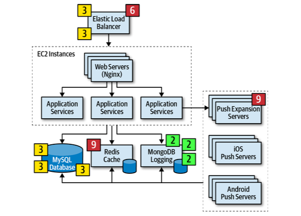
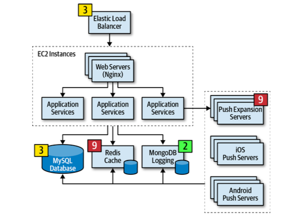
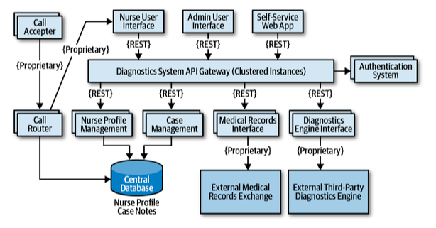
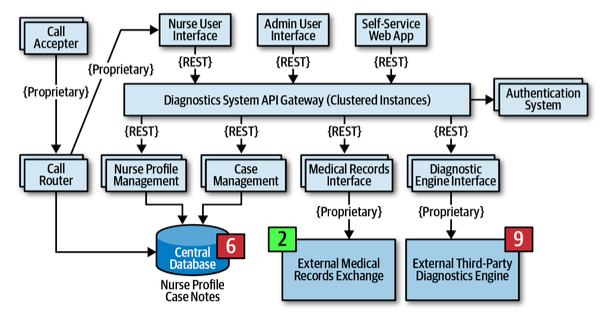
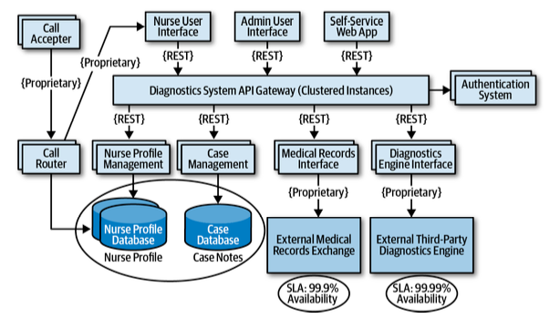
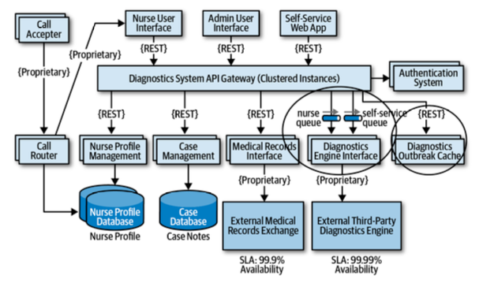
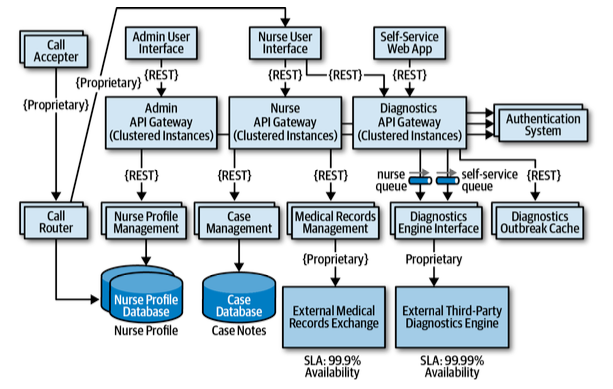

import Tabs from '@theme/Tabs';
import TabItem from '@theme/TabItem';

## 分析架構風險

### 風險矩陣與評估

* 將系統中的顧慮，依照風險發生的可能性及發生時的影響程度依序評估
    * 先考慮「影響」再考慮「可能性」
* 風險評估的作法差異很大
    * 有時很主觀

| 影響\可能性 | 低    | 中  | 高  |
| --------- | --- | --- | --- |
| 低         | 1🟢  | 2🟡 | 3🟠 |
| 中         | 2🟡  | 4🟠 | 6🔴 |
| 高         | 3🟠  | 6🔴 | 9🟣 |

### 風險矩陣範例

* 評估報告是時間上的一個「快照」
* 隨著系統演進，對整體的風險有視覺化的評估

<Tabs>
    <TabItem value="原始版" default>
        <table>
            <tr>
                <th> 影響\可能性 </th>
                <th> 客戶註冊 </th>
                <th> 前臺結帳 </th>
                <th> 訂單屢行 </th>
                <th> 訂單出貨 </th>
                <th> 風險總值 </th>
            </tr>
            <tr>
                <th>可擴展性</th>
                <td style={{textAlign: "center"}}>🟡</td>
                <td style={{textAlign: "center"}}>🔴</td>
                <td style={{textAlign: "center"}}>🟢</td>
                <td style={{textAlign: "center"}}>🟡</td>
                <th>11</th>
            </tr>
            <tr>
                <th>可用性</th>
                <td style={{textAlign: "center"}}>🟠</td>
                <td style={{textAlign: "center"}}>🟠</td>
                <td style={{textAlign: "center"}}>🟡</td>
                <td style={{textAlign: "center"}}>🟢</td>
                <th>10</th>
            </tr>
            <tr>
                <th>效能</th>
                <td style={{textAlign: "center"}}>🟠</td>
                <td style={{textAlign: "center"}}>🟡</td>
                <td style={{textAlign: "center"}}>🟠</td>
                <td style={{textAlign: "center"}}>🔴</td>
                <th>15</th>
            </tr>
            <tr>
                <th>安全性</th>
                <td style={{textAlign: "center"}}>🔴</td>
                <td style={{textAlign: "center"}}>🟠</td>
                <td style={{textAlign: "center"}}>🟢</td>
                <td style={{textAlign: "center"}}>🟢</td>
                <th>11</th>
            </tr>
            <tr>
                <th>資料完整性</th>
                <td style={{textAlign: "center"}}>🔴</td>
                <td style={{textAlign: "center"}}>🔴</td>
                <td style={{textAlign: "center"}}>🟢</td>
                <td style={{textAlign: "center"}}>🟢</td>
                <th> 17</th>
            </tr>
            <tr>
                <th>風險總值</th>
                <th>24</th>
                <th>21</th>
                <th>8</th>
                <th>11</th>
                <td></td>
            </tr>
        </table>
    </TabItem>
    <TabItem value="只留高風險">
        <table>
            <tr>
                <th> 影響\可能性 </th>
                <th> 客戶註冊 </th>
                <th> 前臺結帳 </th>
                <th> 訂單屢行 </th>
                <th> 訂單出貨 </th>
                <th> 風險總值 </th>
            </tr>
            <tr>
                <th>可擴展性</th>
                <td style={{textAlign: "center"}}></td>
                <td style={{textAlign: "center"}}>🔴</td>
                <td style={{textAlign: "center"}}></td>
                <td style={{textAlign: "center"}}></td>
                <th>6</th>
            </tr>
            <tr>
                <th>可用性</th>
                <td style={{textAlign: "center"}}></td>
                <td style={{textAlign: "center"}}></td>
                <td style={{textAlign: "center"}}></td>
                <td style={{textAlign: "center"}}></td>
                <th>0</th>
            </tr>
            <tr>
                <th>效能</th>
                <td style={{textAlign: "center"}}></td>
                <td style={{textAlign: "center"}}></td>
                <td style={{textAlign: "center"}}></td>
                <td style={{textAlign: "center"}}>🔴</td>
                <th>6</th>
            </tr>
            <tr>
                <th>安全性</th>
                <td style={{textAlign: "center"}}>🔴</td>
                <td style={{textAlign: "center"}}></td>
                <td style={{textAlign: "center"}}></td>
                <td style={{textAlign: "center"}}></td>
                <th>6</th>
            </tr>
            <tr>
                <th>資料完整性</th>
                <td style={{textAlign: "center"}}>🔴</td>
                <td style={{textAlign: "center"}}>🔴</td>
                <td style={{textAlign: "center"}}></td>
                <td style={{textAlign: "center"}}></td>
                <th>15</th>
            </tr>
            <tr>
                <th>風險總值</th>
                <th>15</th>
                <th>12</th>
                <th>0</th>
                <th>6</th>
                <td></td>
            </tr>
        </table>
    </TabItem>
    <TabItem value="加上走向">
        <table>
            <tr>
                <th> 影響\可能性 </th>
                <th> 客戶註冊 </th>
                <th> 前臺結帳 </th>
                <th> 訂單屢行 </th>
                <th> 訂單出貨 </th>
                <th> 風險總值 </th>
            </tr>
            <tr>
                <th>可擴展性</th>
                <td style={{textAlign: "center"}}>🟡</td>
                <td style={{textAlign: "center"}}>🔴➕</td>
                <td style={{textAlign: "center"}}>🟢</td>
                <td style={{textAlign: "center"}}>🟡</td>
                <th>11</th>
            </tr>
            <tr>
                <th>可用性</th>
                <td style={{textAlign: "center"}}>🟠</td>
                <td style={{textAlign: "center"}}>🟠</td>
                <td style={{textAlign: "center"}}>🟡➖</td>
                <td style={{textAlign: "center"}}>🟢</td>
                <th>10</th>
            </tr>
            <tr>
                <th>效能</th>
                <td style={{textAlign: "center"}}>🟠➖</td>
                <td style={{textAlign: "center"}}>🟡➕</td>
                <td style={{textAlign: "center"}}>🟠➖</td>
                <td style={{textAlign: "center"}}>🔴➕</td>
                <th>15</th>
            </tr>
            <tr>
                <th>安全性</th>
                <td style={{textAlign: "center"}}>🔴➖</td>
                <td style={{textAlign: "center"}}>🟠</td>
                <td style={{textAlign: "center"}}>🟢</td>
                <td style={{textAlign: "center"}}>🟢</td>
                <th>11</th>
            </tr>
            <tr>
                <th>資料完整性</th>
                <td style={{textAlign: "center"}}>🔴➕</td>
                <td style={{textAlign: "center"}}>🔴➖</td>
                <td style={{textAlign: "center"}}>🟢➖</td>
                <td style={{textAlign: "center"}}>🟢</td>
                <th>17</th>
            </tr>
            <tr>
                <th>風險總值</th>
                <th>24</th>
                <th>21</th>
                <th>8</th>
                <th>11</th>
                <td></td>
            </tr>
        </table>
    </TabItem>
    <TabItem value="走向+向量">
        <table>
            <tr>
                <th> 影響\可能性 </th>
                <th> 客戶註冊 </th>
                <th> 前臺結帳 </th>
                <th> 訂單屢行 </th>
                <th> 訂單出貨 </th>
                <th> 風險總值 </th>
            </tr>
            <tr>
                <th>可擴展性</th>
                <td style={{textAlign: "center"}}>🟡</td>
                <td style={{textAlign: "center"}}>🔴⤴️4</td>
                <td style={{textAlign: "center"}}>🟢</td>
                <td style={{textAlign: "center"}}>🟡</td>
                <th>11</th>
            </tr>
            <tr>
                <th>可用性</th>
                <td style={{textAlign: "center"}}>🟠</td>
                <td style={{textAlign: "center"}}>🟠</td>
                <td style={{textAlign: "center"}}>🟡⤵️3</td>
                <td style={{textAlign: "center"}}>🟢</td>
                <th>10</th>
            </tr>
            <tr>
                <th>效能</th>
                <td style={{textAlign: "center"}}>🟠⤵️6</td>
                <td style={{textAlign: "center"}}>🟡⤴️1</td>
                <td style={{textAlign: "center"}}>🟠⤵️4</td>
                <td style={{textAlign: "center"}}>🔴⤴️4</td>
                <th>15</th>
            </tr>
            <tr>
                <th>安全性</th>
                <td style={{textAlign: "center"}}>🔴⤵️9</td>
                <td style={{textAlign: "center"}}>🟠</td>
                <td style={{textAlign: "center"}}>🟢</td>
                <td style={{textAlign: "center"}}>🟢</td>
                <th>11</th>
            </tr>
            <tr>
                <th>資料完整性</th>
                <td style={{textAlign: "center"}}>🔴⤴️6</td>
                <td style={{textAlign: "center"}}>🔴⤵️9</td>
                <td style={{textAlign: "center"}}>🟢⤵️2</td>
                <td style={{textAlign: "center"}}>🟢</td>
                <th>17</th>
            </tr>
            <tr>
                <th>風險總值</th>
                <th>24</th>
                <th>21</th>
                <th>8</th>
                <th>11</th>
                <td></td>
            </tr>
        </table>
    </TabItem>
</Tabs>

## 風險激盪 (Risk Storming)

* 沒有架構師能單獨決定整體風險
    * 透過一群人合作激盪出架構的風險

* Storming：一群人一起合作激盪火花
    * Event Storming: 事件風暴，DDD的分析工具
    * Model Storming: Agile Modeling的Just-in-time塑模方法

* 是符合[Agile Modeling](https://agilemodeling.com/values.htm)的5項價值觀的作法
    * Communication 有效溝通
    * Simplicity 最小有價值解法(MVP)
    * Feedback 儘早取得回饋
    * Courage 嘗試的勇氣
    * Humility 謙卑地接受意見

### 1. 確認 Identification

* 會議前發出架構圖給所有與會者
* 參與者先各自(不一起合作)指定架構的風險值為1~10的何者
    * 避免彼此互相影響
* 將注意力從特定區域離開；但要盡可能在同一個維度上
    * 維度：效能、可擴展性...etc.
    * 區域：資料庫、附載平衡器、快取...etc.
    * ✅ 在可擴展性上進行風險風暴，尋找架構組件的可擴展性具有風險的區域
    * ⛔ 在網站伺服器上進行事件風暴，尋找網站伺服器具有風險的維度

### 2. 共識 Consensus

* 將大家的結果合起來，努力在風險區域上取得共識
    * 例如：給出最高風險跟最低風險的人，解釋自己的想法..etc.

### 3. 減緩 Mitigation

* 針對架構中，原本認為沒有問題的區域，進行修改或加強

## 風險激盪範例

### 可用性 Availability

<Tabs>
<TabItem value="原始架構" default>

</TabItem>
<TabItem value="可用性的確認" default>

</TabItem>
<TabItem value="可用性的架構修改" default>

</TabItem>

</Tabs>

### 彈性 Elasticity

<Tabs>
<TabItem value="原始架構" default>

</TabItem>
<TabItem value="針對彈性的架構修改" default>

* 將護士來的流量，與自助式來的流量分流 (Prioirty Queue)
* 針對突發的診斷需求製作新服務

</TabItem>

</Tabs>

### 安全性 Security

<Tabs>
<TabItem value="原始架構" default>

</TabItem>
<TabItem value="針對安全性的架構修改" default>

* 將API Gateway分開
    * 依照不同的Auth方法分開
    * 做出實體的隔離，避免因為閘道本身的實作缺失導致嚴重的資料洩漏風險

</TabItem>

</Tabs>