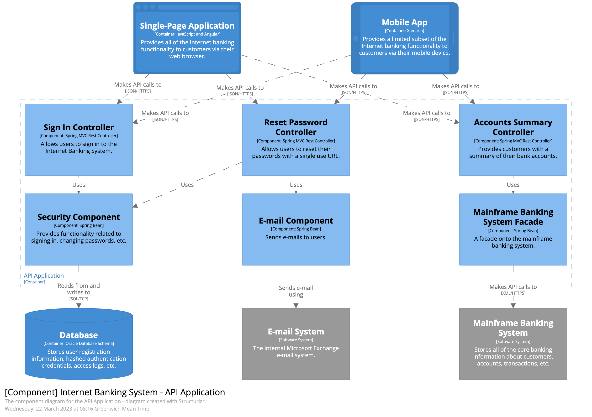

架構師傳遞技術架構上的構想：
1. 圖解
2. 簡報

## 圖解
將架構視覺化呈現在眾人面前，傳達其設計理念。

圖解架構涵蓋多種視野，描述架構的視角由「宏觀 → 微觀」。

案例：電商
- 宏觀：
  顯示整個系統的主要組成部分和其之間的關係。
- 微觀：
  微觀架構圖更詳細呈現微服務架構的內部結構。

> **注意「一致性」**
> 
> 維持架構圖的一致性有助於確保開發團隊和相關的閱讀者對軟體系統的結構有一致的理解，減少混淆和錯誤。

### 工具的選擇
幾個常見的基本要素
- **分層**：利用分層描繪架構示意圖，透過「增量」的方式，打造完整的架構圖
- **模板**：替組織內共同圖樣打造模板，同時能讓建構圖上建立一致性
- **磁鐵**：表達元件的關聯的線條，提供自動對齊和連接元件之間
- **匯出**：支援多種類型的格式 e.g. PDF

### 常見的繪圖標準
### UML
常見應用：類別圖 (Class Diagram)、時序圖 (Sequence Diagram)

### C4 model

「視野由高至低分為四個等級」
- Level 1: 系統上下文圖 (System **Context** Diagram)
- Level 2: 容器圖 (**Container** Diagram)
- Level 3: 元件圖(**Component** Diagram)
- Level 4: 程式(**Code**)

Figures are all from [the C4 model for visualising software architecture](https://c4model.com/#tooling).

例子：跟朋友出國玩
- 日本(Context)
- 東京(Container)
- 淺草(Component)
- 哪條路(Code)

Level 1 系統上下文圖(System Context Diagram)

將各種使用者/角色需要使用的功能畫出來

**TA**: 開發團隊內外的所有人，含技術人員和非技術人員

Level 2: 容器圖 (**Container** Diagram)

包含各個軟體系統，例子：網頁應用程式、桌面應用程式、App、資料庫

Level 3: 元件圖(**Component** Diagram)

L2 的放大版，針對個別應用程式內容更深入探討每個元件

Level 4: 程式(**Code**)

用在特別的決策圖

補充圖 https://c4model.com
- 系統景觀圖(System Landscape Diagram)
- 動態圖(Dynamic Diagram)
- 部署圖(Deployment Diagram)

### ArchiMate
The Open Group 面向企業架構的開放且獨立的建模語言。

Source: 
- [wiki](https://en.wikipedia.org/wiki/ArchiMate#:~:text=ArchiMate%20(%2F%CB%88%C9%91%CB%90rk%C9%AA,domains%20in%20an%20unambiguous%20way.))
- [visual-paradigm.com](https://www.visual-paradigm.com/guide/archimate/what-is-archimate/)

Core Framework

由「業務」、「應用程式」和「技術」定義的核心，不同**層(Layers)**搭配**面(Aspects)** 可以組織為九個單元的框架

- Layers: 
    - 業務層
    - 應用層
    - 技術層
- Aspects：
    - Passive: 執行行為的物件
    - Behavior: 某些實體的行為
    - Active Structure: 結構的概念 

### 準則
- 標題
- 線條
- 形狀
- 標籤
- 顏色
- 線索

## 簡報

### 掌握時間
在有限的時間內傳遞想法給受眾。

### 增量建構
聚焦在需要的資訊上，避免資訊過載。

反模式

增量建構的版本

### 資訊簡報 v.s. 簡報
主要差異：內容的完整度

### 投影片的雷區
- 避免過量的文字佔據版面
- 一個版面塞過量的資訊