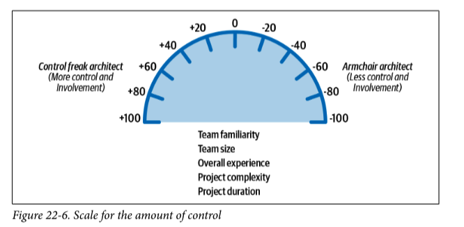
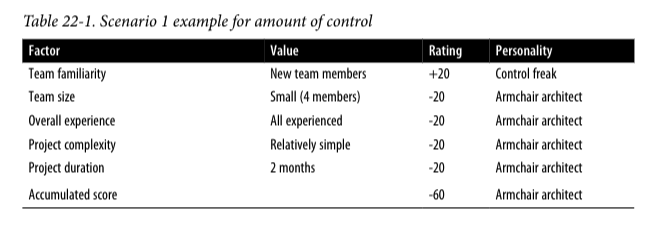
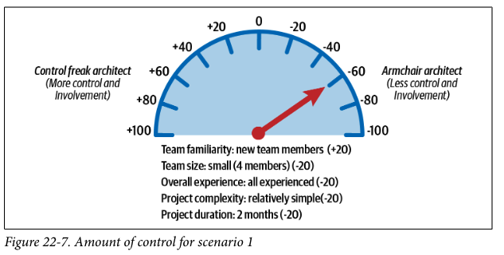
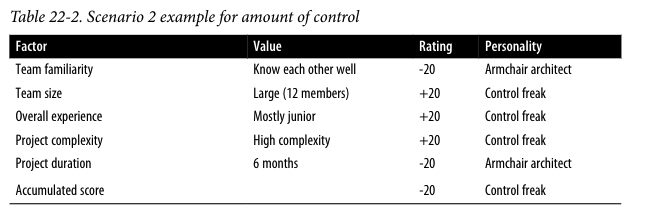
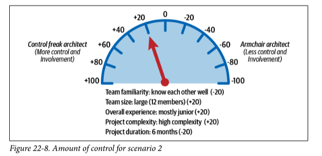
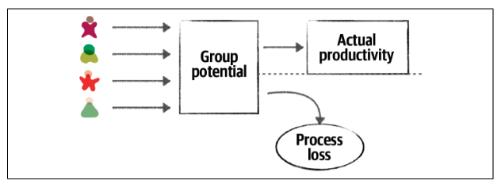
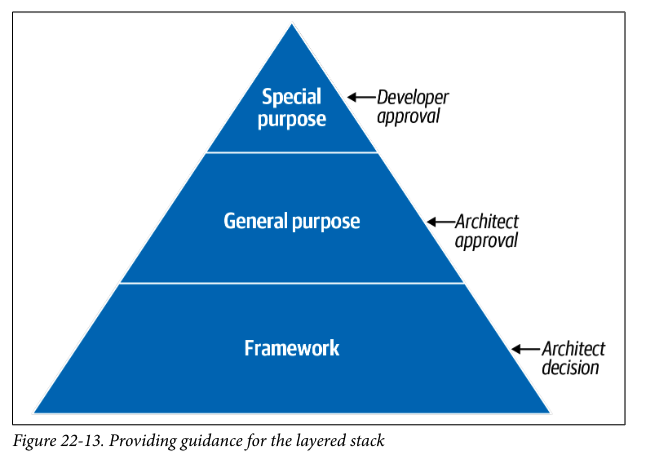

難題：缺乏適當的領導、對系統各種限制的正確認識
## 團隊界線
架構師的職責：創造、溝通各種限制

架構師劃分界線，讓團隊能在界線裡進行架構實作。

界線的嚴謹 & 鬆散如何拿捏？

## 架構師的人格特質
- 控制狂架構師
- 只會空談的架構師
- 有效的架構師

### 控制狂架構師
- 界線太緊
- 想控制每個細節(小至一行程式碼的命名？)
- 角色轉換

### 只會空談的架構師
- 界線太緊
- 無經驗 or 少許經驗
    - 技術實作
    - 涉及該領域的深度
- 未考慮架構實作的潛在影響

### 有效的架構師
- 設置適當的界線
- 跟團隊達到有效共識

## 控制力道該多大？
拿捏控制狂 & 空談的架構師的比例。

- 團隊熟悉度: 團隊成員彼此之間的熟悉度？是否曾經在同個專案共事過？
- 團隊大小: 團隊規模多大？
- 整體經驗: 資深人員在團隊裡的佔比？
- 專案複雜度: 專案涉及的複雜程度有多深？
- 專案長短: 專案的時長多久？

### 如何量化控制的程度？
評估各項指標，架構師決定控制力道的大小。

假設：
- 每項因素固定 20 點
- 控制狂架構師偏「正值」
- 空談的架構師偏「負值」

情況一：

情況二：

## 團隊警告信號
考慮最有效的團隊大小：
- 過程損失(Process Loss)
- 多數無知(Pluralistic Ignorance)
- 責任分散(Diffusion of responsibility)

架構師尋找以上三個訊號，並協助改善。

### 過程損失(Process Loss)
又作 Brook 法則。

> 團隊大小會影響實質生產力

**集體潛能**：團隊成員中所有人的努力的總和

例子：不同成員經常修改相同的程式碼

方法：找出團隊能夠平行工作的部分。

### 多數無知(Pluralistic Ignorance)
誤以為大多數人都同意某個觀點(~~可能都在背後訐譙~~)，因此不敢或不願意表達自己的真實觀點，導致集體錯誤。

例子：國王的新衣

### 責任分散(Diffusion of responsibility)
不清楚誰該為某件事負責、有些事無人看管 → 暗示團隊過大的訊號

## 利用檢查表
提供團隊一個參考依據，確認已經涵蓋及處理的每件事。

> 避免做的太過，讓每件事都變成檢查表，拖累團隊成效。

### 霍桑效應
當人發現自己成為被觀察的對象時，會傾向改變自己的言行舉止。

### 類型
- 程式碼完成度檢查表
- 單元及功能測試的檢查表
- 軟體發行的檢查表

### 延伸探討
- 檢查&確認工作每次會花團隊多少 effort?
    - 自動化工具： pre-commit, IDE plugin
    - 自動化測試： Unit Test, E2E Test
- 檢查表是否與時俱進？
- 是否每次都有「如實」按照檢查表進行

## 提供指引
提供指引，引導團隊成員檢視設計。

例子：決定程式庫
1. 程式庫是否與現行功能有重疊？
2. 選擇該程式庫的理由？

### 分層堆疊的指引

- 特殊目的
- 通用目的
- 框架

## 總結
打造有效團隊需集結豐富經驗、實務還有處理人際關係的技巧，根據團隊實際情況彈性調整，搭配檢查表及指引，讓團隊協作更順暢。
