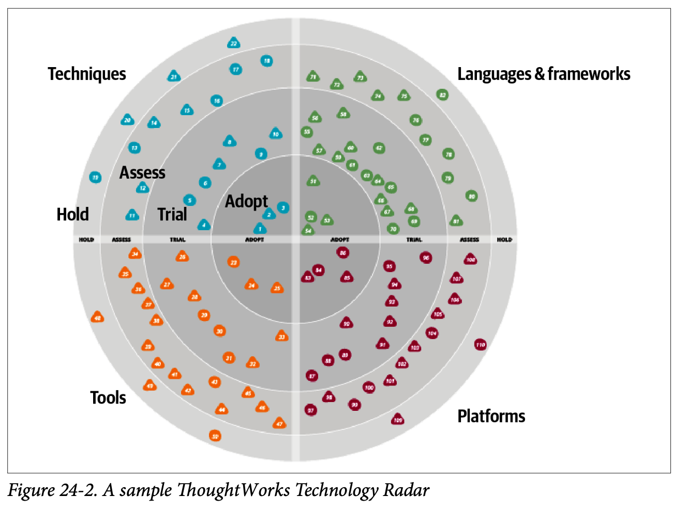
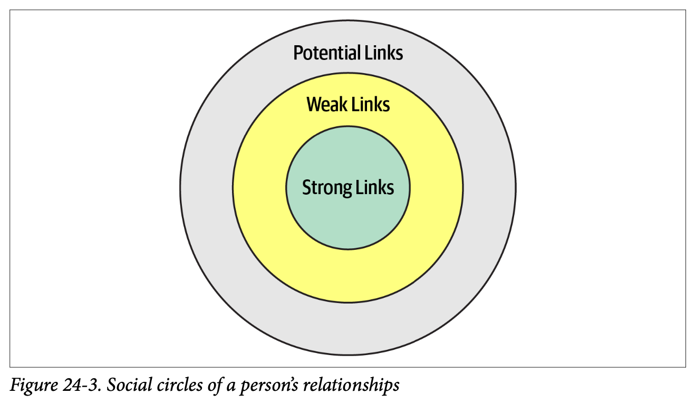

import Tabs from '@theme/Tabs';
import TabItem from '@theme/TabItem';

## 發展一條職涯路徑
- 架構師需要持續學習，保持知識的廣度(廣度 > 深度)
- 同時關注技術與業務的更新

### 20分鐘規則
- 每天至少花20分鐘深入特定主題或吸收新知識
  - InfoQ、DZone Refcardz 和 ThoughtWorks Technology Radar
- 最好在早上(書裡試錯之後的結論)

### 打造個人雷達

#### ThoughtWorks 雷達四象限
- 工具: IDE
- 語言和框架: language、library、framework
- 技巧: 軟件開發流程、工程實踐
- 平台: 數據庫、雲供應商和操作系統

#### ThoughtWorks 雷達四環
- 抓住(Hold): 暫時擱置，太新或還不成熟
- 評估(Assess): 一項技術值得探索，目的是了解它將如何影響組織
- 嘗試(Trial): 試點一個低風險項目
- 採納(Adopt): 認為業界應該採用這些項目

#### Open Source Visualization Bits
- ThoughtWorks 2016年產品，可以輸入google sheets，輸出html 5 page去顯示個人化的個人雷達

### 使用社交媒體

- 利用社交媒體提升知識廣度
- 也可能找到下一份工作(數據顯示大多來自薄弱連結)

## 成為好的架構師
- Always learn, always practice, and go do some architecture!
