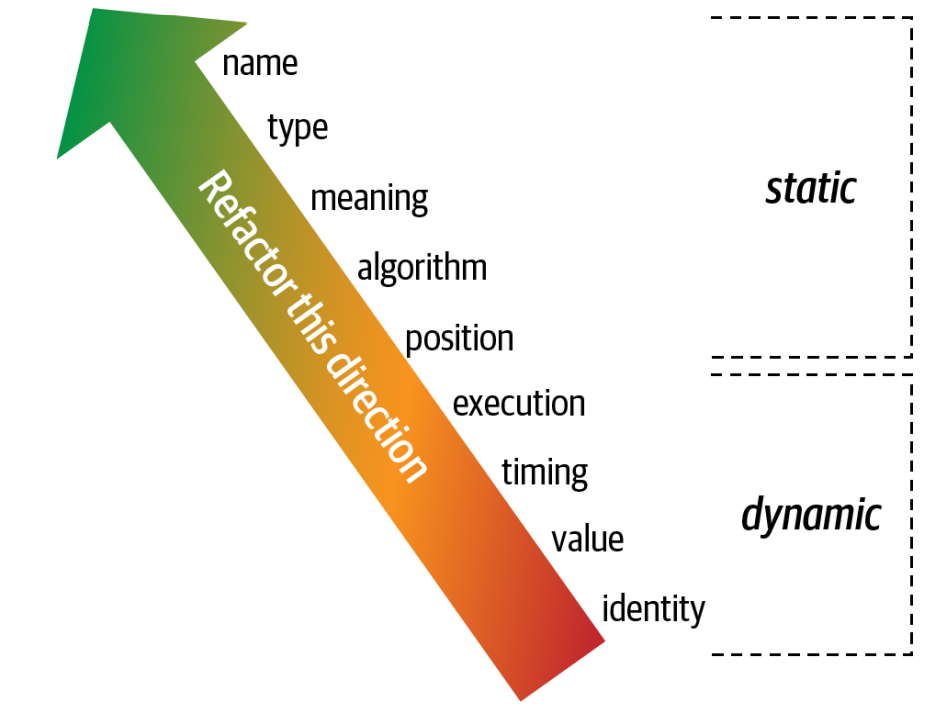

:::info
「95%有關軟體架構的討論都花在稱讚**模組化**的好處，但很少提及如何達成」 - [Glenford J. Myers (1978)](https://en.wikipedia.org/wiki/Glenford_Myers)
:::

不同平台對程式碼提供不同的復用機制，但卻都支援某種把相關程式碼集合成**模組**的方法。
雖然此概念在軟體架構上很普遍，但恰好也證明其難以定義。

## 定義

「一組標準化零件或獨立單元的每一項，可以用來建構更複雜的結構」

### 案例: 類別出現之前的模組化復用
```
1968年3月, Edsger Dijkstra發表了文章「Go To Statement Considered Harmful.」
這篇文章有助於引領模組化程式語言時代的到來，例如Pascal與C。
```

### 沒有命名衝突的語言: Java 1.0
```
Java 1.0利用檔案目錄的命名限制來避免套件的混淆。

但後來Java2引入了jar的機制, jar之間反而可能產生命名衝突了。
```

## 模組化測量 (Measuring Modularity)
三個主要概念: **內聚**、**耦合**、**共生性**
### 內聚 (Cohesion)

:::info
「嘗試分拆具有內聚性的模組只會導致模組間的耦合增加，並且降低其可讀性」 - [Larry Constantine](https://en.wikipedia.org/wiki/Larry_Constantine)
:::

如下依照最好到最壞的順序來分類不同的內聚
- 功能性內聚
    - 模組的每個部件都跟其他部份相關，而且模組擁有該功能所需要的每件東西。
- 循序內聚
    - 兩個模組間有交互作用 - 其中一個的輸出變成另一個的輸入
- 通信內聚
    - 兩模組形成一個依據資訊的通信鏈。例如:寫入資料庫的一筆資料，會用來產生一封電郵
- 程序內聚
    - 兩個模組必須以特定順序來執行
- 時間內聚
    - 模組間有時間上的相依性。例如: 很多不相干的模組必須在系統啟動時初始化
- 邏輯內聚
    - 模組內的資料，具備邏輯而非功能上的相關性。
      例如: StringUtils是一組作用在String上的靜態方法，除此之外方法間無其他關聯。
- 巧合內聚
    - 模組內的元素除了位於同一個原始檔案外，沒有其他關聯

#### 討論: 考慮這個模組定義
- 客戶維護
    - 增加客戶
    - 更新客戶
    - 獲得客戶
    - 通知客戶
    - 獲得客戶訂單
    - 取消客戶訂單

---

- 客戶維護
    - 增加客戶
    - 更新客戶
    - 獲得客戶
    - 通知客戶
- 訂單維護
    - 獲得客戶訂單
    - 取消客戶訂單

---

#### LCOM指標
- LCOM: Lack of Cohesion of Methods
    - 衡量類別內聚性的指標，較低的值內聚性高；較高的值內聚性低
- LCOM Equation
    - Equation-3.1
        - 
    - Equation-3.2
        - 
- Example:


### 耦合 (Coupling)

### 抽象性、不穩定性，主序列距離 (Abstractness, Instability, and Distance from the Main Sequence)

#### 抽象性 (Abstractness)
- 
    - ma: number of abstract elements
    - mc: number of concrete elements

- Ex:
    - 一個main()函式裡面寫了5000行code
        - ma: 1
        - mc: 5000

#### 不穩定性
- 
    - Ce: efferent coupling (outgoing coupling)
        - 這個模組依賴多少數量的其他模組
    - Ca: afferent coupling (incoming coupling)
        - 這個模組被多少數量的其他模組依賴
- [example](https://ithelp.ithome.com.tw/articles/10287471)

### 主序列距離 (Distance from the Main Sequence)
- 
- 
- 

### 共生性 (Connascence)

:::info
「系統的兩個元件，如果其中一個的變動使得另一個也須有所變動，才能維持整個系統的正確性，則這兩個元件即為共生」 - Meilir Page-Jones
:::

#### 靜態共生性 (Static connascence)

- 名字共生性 (CoN: Connascence of Name)
    - 多重元件必須在一個實體的名字上達成共識
    - ex: function name
- 型別共生性 (CoT: Connascence of Type)
    - 多重元件必須在一個實體的型別上達成共識
    - ex: limit variable or argument with specific type
- 含義共生性 (CoM: Connascence of Meaning)
    - 多重元件必須在特定值的含義上達成共識
    - ex: True is 1; False is 0
- 位置共生性 (CoP: Connascence of Position)
    - 多重元件必須在數值的順序上達成共識
    - ex: argument order is fixed
- 演算法共生性 (CoA: Connascence of Algorithm)
    - 多重元件必須在特定演算法上達成共識
    - ex: module handshake with specific hash method

#### 動態共生性

- 執行共生性 (CoE: Connascence of Execution)
    - 多重元件的執行順序很重要
- 時序共生性 (CoT: Connascence of Timing)
    - 多重元件的執行時序很重要
    - ex: concurrency rase condition
- 數值共生性 (CoV: Connascence of Values)
    - 發生在許多值彼此相關，且必須一起改變的時候
    - ex:矩形座標的移動，4個點的座標必須同時改變
- 同一共生性 (CoI: Connascence of Identity)
    - 多重元件必須參考到相同的實體

#### 共生性屬性 (Connascence properties)

- 強度 (Strength)
    - 對某類型耦合進行重構的難易程度，來判定共生性的**強度**
    - 靜態共生性比動態共生性更為可取，可以朝這個方向重構
        - 

- 局部性 (Locality)
    - 測量程式碼中模組之間有多接近。
    - 愈相鄰的程式碼，通常共生性更多、更高。

- 程度 (Degree)
    - 共生性**程度**與其影響之大小有關
    - 共生性程度愈小，對程式碼破壞愈小

#### Page-Jones提出利用共生性，改善系統模組化
- 把系統拆解成封裝元素，以減少整體的共生性
- 減少任何跨越邊界的殘餘共生性
- 最大化封裝邊界內的共生性

#### Jim Weirich提供兩個建議
- 程度規則: 將強共生性轉變成較弱形式的共生性
- 局部性規劃: 當軟體元素間的距離增加，則採用較弱形式的共生性

### 統整耦合及共生性指標 (Unifying Coupling and Connascence Metrics)


#### 1990年代的共生性問題
- 關注在低階細節，聚焦在程式碼品質健全，未必在架構的結構上
- 並未處理到許多基本決策 - ex: 分散式架構的微服務，該採取同步or非同步？
    - 每件事都是取捨

## 從模組到元件 (From Modules to Components)
- 本書使用**模組(Module)**一詞代表一群相關程式碼
- 大部份平台支援某種形式的**元件(Component)**

## Recap

- 共生性這個詞的意義為何？
- 靜態與動態共生性的差別何在？
- 型態共生性的意思是什麼？是靜態或是動態共生性？
- 最強形式的共生性是什麼？
- 最弱形式的共生性是什麼？
- 代碼庫更偏好哪一種 - 靜態或動態共生性？
