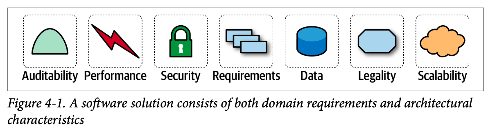
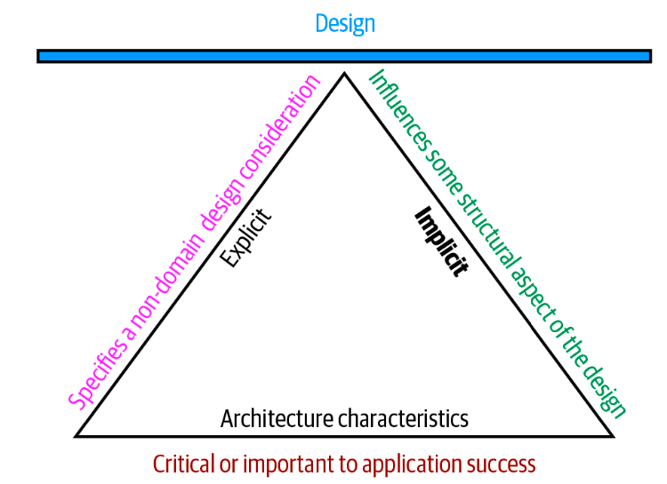
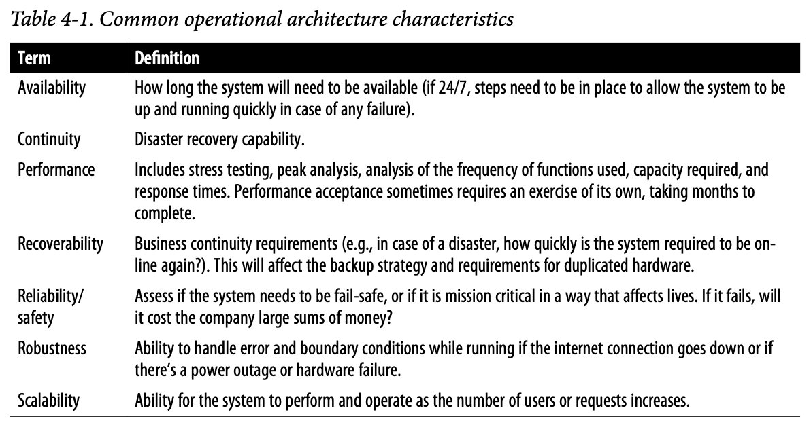
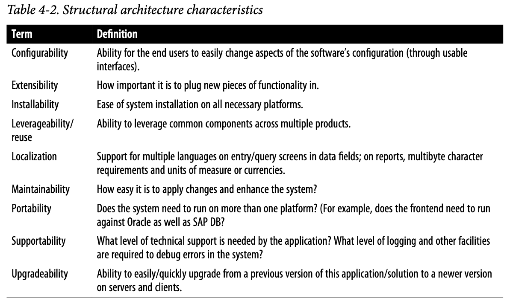
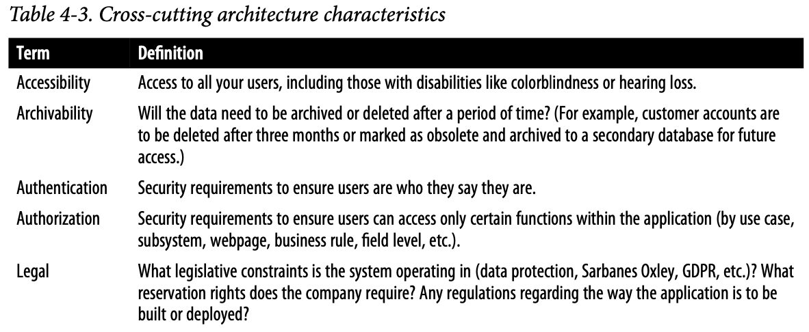
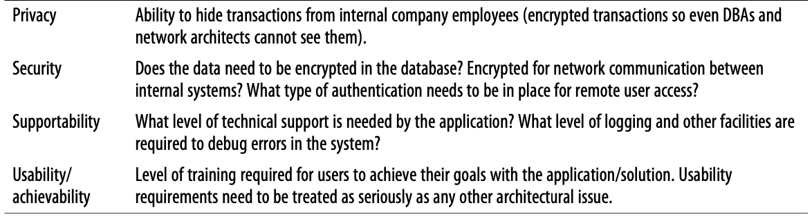

## 架構特性(Architectural Characteristics)

利用軟體解決問題，蒐集了需求表單。架構師必須定義、發現、或者分析軟體所必須完成的所有事情:就是**架構特性**
```
Terry的解讀: 把需求表單的內容，轉化成架構特性的項目來做考量
```

架構特性得滿足三項準則:
- 指定與領域無關的設計考量(Specifies a nondomain design consideration)
    - 不一定出現在需求書上，但卻對成功很重要的設計考量
        - ex: 避免技術債、效能
- 影響設計的某些結構面向(Influences some structural aspect of the design)
    - 如安全性；因應需求的不同，(採取第三方付款處理器 or 應用內付款的處理)，會影響設計
- 對應用程式的成功至為關鍵或重要(Is critical or important to application success)
    - 架構師要選擇最少的架構特性，去避免複雜度提升



## (部分)列示的架構特性 Architectural Characteristics (Partially) Listed

架構特性沒有真正普遍性的標準存在。每個機構對這些詞都有自己的解釋。
架構師常將架構特性進行廣泛分類。僅能提出部份來給出範例。

### 運維架構特性 (Operational Architecture Characteristics)
涵了蓋了像是效能、可擴展性、彈性、可用性、及可靠度等


### 結構上的架構特性 (Structural Architecture Characteristics)
考量程式碼的結構，例如優銀的模組化、元件間的耦合受到控制、可讀性高等內部品質


### 跨領域架構特性 (Cross-Cutting Architecture Characteristics)
其他範疇或難以歸類的架構特性



:::info
### 可義大利性(Italy-ility)
客戶對於「與義大利分部可能失聯十分在意」。未來架構都必需考慮這點，非達成不可的需求，被稱為**可義大利性**。
:::

### 來自ISO的清單

並沒有完整的標準清單存在，以下是來自ISO定義的清單
- 效能效率 Performance efficiency
- 相容性 Compatibility
- 易用性 Usability
- 可靠性 Reliability
- 安全性 Security
- 可維護性 Maintainability
- 可攜性 Portability

#### ISO提及但作者覺得不適合用在架構的項目
- 功能適應性 Functional suitability
    - 功能完整性 Functional completeness
    - 功能正確性 Functional correctness
    - 功能適當性 Functional appropriateness

## 取捨與別無選擇下的架構 (Trade-Offs and Least Worst Architecture)
通常應該程式只能支援其中一部分的架構特性，因為
- 每個支援特性都需要花費設計功夫，可能還需要結構上的支援
- 架構特性間可能互相影響，例如，提升安全性可能會降低效能

故很常遇到，決策是多方競爭考量之下的取捨
:::info
別總想瞄準最佳架構，而應該找尋別無選擇下的架構
:::

## Recap

- 一個屬性必須滿足哪三個準則，才能被視為一個架構特性？
- 隱性或外顯特性的差別為何？每一種給個例子
- 給一個運維特性的例子
- 給一個結構特性的例子
- 給一個跨領域特性的例子
- 哪種架構特性更重要 - 可用性或效能？
