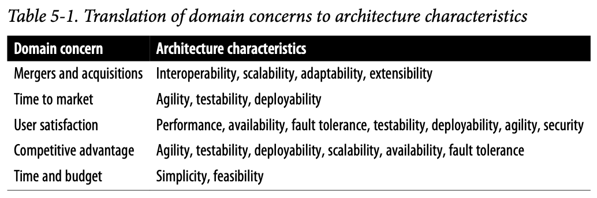

三種方法發堀架構特性
- 領域考量
- 需求
- 隱含的領域知識

## 從領域考量提取架構特性 (Extracting Architecture Characteristics from Domain Concerns)

了解關鍵的領域目標與狀況，將領域考量轉譯成「各種能力」

:::info
案例: Vasa
因為指定過多的架構特性，導致專案失敗的案例: Vasa - 瑞典戰艦。
同時滿足運兵船及破艦的特性、多一個甲板、大一倍的加農砲。
最後因頭重腳輕沉入海底
:::

## 從需求提取架構特性 (Extracting Architecture Characteristics from Requirements)

架構特性來自需求文件的明確要求
- 例: 明確的預期使用者數目與規模

:::info
### 架構套路的起源

Ted Neward提出**架構套路(katas)**
**套路**是一種個人的訓練練習，強調適當的形式與技巧

「如何培育偉大的設計師？當然囉，偉大的設計師一直在設計。」 - Fred Brooks

套路預先定義幾個段落
- **描述**
    - 系統嘗試解決的整個領域問題是什麼
- **使用者**
    - 預期中的系統使用者數目級或型態
- **需求**
    - 領域/領域層次的需求，來自於領域使用者/領域專家。
- **額外背景**
    - 未明白表達在需求中的架構，透過問題領域的隱性知識表達
:::

## 案例研究: Silicon Sandwiches
- 描述
    - 一家全國性的三明治商店想啟動線上訂購(現在已有電話訂購服務)
- 使用者
    - 幾千人，一天下來可能達百萬人
- 需求
    - 使用者下訂單，然後被通知一個取三明治的時間、以及前往店鋪的指引(須包含交通與地圖資訊)
    - 如果店鋪提供外送服務，派遣司機將三明治送給使用者
    - 可以透過行動裝置使用服務
    - 提供全國性的每日促銷/特餐
    - 提供當地的每日促銷/特餐
    - 接受線上、親自、以及外送貨到時的付款
- 額外背景
    - 三明治店鋪乃加盟經營，每家的經營者都不同
    - 母公司近期有擴展到海外的計畫
    - 公司目標是聘僱廉價勞力以最大化獲利
### 明確特性 (Explicit Characteristics)

明確的架構特性出現在需求規格書，以做為必需設計的一部分。

- 例:
    - 使用者數目:目前幾千個，有一天可能會到百萬個。
        - 可擴展性
            - 測量使用者同時上線的效能
        - 彈性
            - 承受使用者突發性增加

### 隱含特性 (Implicit Characteristics)

許多架構並未指定在需求文件，但卻構成了設計的重要面向。

- 例:
    - 可用性 Availability
        - 確保使用者可以使用三明治網站
    - 可靠性 Reliability
        - 確認網站在互動過程中保持正常
    - 安全性
        - 可依照危害程度來決定優先順序

#### 付款方式

#### 客製化能力 Customizability

「架構上沒有錯誤的答案，只有昂貴的答案。」 - Mark

:::info
#### 設計 vs 架構 與 取捨

在Silicon Sandwiches套路中，架構師可能將客製化能力認定為系統的一部分，但這個是屬於架構還是設計？

架構隱含了結構上的元件。而設計又存在於架構之內。

- 選擇
    - 架構: 微核心架構風格，從結構支援客製化
    - 設計: 使用其他的架構，但在設計實作上使用樣板的方法來支援客製化

- **取捨**
    - 有好的理由，放棄微核心架構的做法嗎？
    - 其他的架構特性，在設計實作上的困難度？
    - 每種設計vs模式底下，要支援所有架構特性的成本？

- 建議
架構師得跟開發人員、專案經理、運維團隊、以及軟體系統的共同建構者合作，認何架構決定應共同討論決定。
:::

## Recap

- 給個理由，說明為何限制架構應支援的特性數目(「各項能力」)是個好做法。
- 此敘述為真或假:大部分架構來自於業務需求及使用者故事。
- 如果有位業務利益相關方述說上市時間(盡快發行新功能或修正錯誤後的版本)是最重要的業務考量，那麼架構該支援哪個架構特性？
- 可擴展性與彈性的差異何在？
- 你發現公司將要進行好幾場主要的併購，來大幅增加客戶群。你該擔心哪些架構特性？