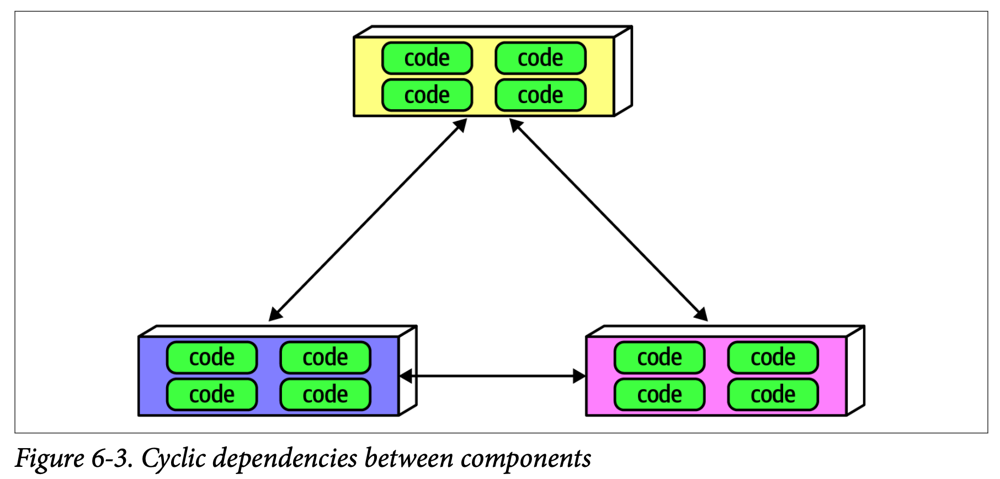

***本章專注在具體定義一些更為常見的架構特性，並建構其管理機制***

## 測量架構特性

---
### 測量架構特性的首要挑戰

***定義***

1. 特性定義差異大
   - 業界對於常見的術語有非常不同的視角
   - 例如效能，開發人員、架構與維運看的可能都不一樣
1. 高複合度特性
   - 許多合意的架構特性是由眾多更小尺度的特性構成
   - 例如敏捷性就可以被分解成模組化、可部署性、以及可測試性

:::info
Solution
- 對架構特性進行客觀的定義，讓具體定義在整個組織內獲得共識
- 拆解高複合度的架構特性
- 進而發覺能被客觀定義且可供測量的特徵
:::

### 運維測量

1. 具有可擴展性(scalability)、效能(performance)，這種較明顯能直接測量的架構特性
1. 即便如此，依據不同團隊的目標不同，在測量指標的定義與測量方法上還是會有所不同
   - 例如以 request performance 來看，單純測量某些 request 的平均回應時間 or 要測量離群值?

#### 效能測量

1. general performance: how long request and response cycles take for a web application
2. 效能預算 (performance budgets)
   - 架構師與DevOps工程師們一直以來都花了很多心力在建立效能預算上
   - 分配特定的效能預算給應用程式特定的部分
   - 例如，研究使用者行為發現使用者看到的第一個網頁要控制在 500ms 內呈現出來才能維持最佳的使用者體驗，所以這個就會是一個很重要必須要被持續追蹤的指標，不同組織也會有各自細緻的測量方法
     * 舉例 first contentful paint
     * first CPU idle
   - 部分指標對於應用程式的設計有額外的影響 (non-functional requirements)
     * 舉例 "K-weight budget": 在特定頁面上允許下載的最大位元組(包含library與framework)
     * 會需要套用這種效能預算，是基於網路高延遲區域的行動設備在網路傳輸上的位元組限制(物理限制)

#### 可擴展性測量

- 先測量規模一段時間並建立其統計模型，再利用統計分析的結果來監控測量目標，當發現有超出監控目標的狀況時會alert，
這個 alert 可能有兩種含義：模型不正確(團隊希望知道這一點) 或者應用程式存在問題(團隊也希望知道這一點)
- 現代的技巧 burn rate
  * 需要知道 SLO
  * 不需要先累積經驗知道指標的好壞
  * https://cloud.google.com/stackdriver/docs/solutions/slo-monitoring/alerting-on-budget-burn-rate#:~:text=A%20burn%2Drate%20alerting%20policy,over%20the%20alert%27s%20compliance%20period.
  * https://docs.datadoghq.com/service_management/service_level_objectives/burn_rate/

### 結構測量

1. 測量上沒有明顯的客觀方法
   - 以內部結構特性來說，何謂定義明確的模組化 ?
1. 沒有很全面的指標，但有些狹窄維度的工具跟指標可以測量結構的一些重要面向
1. 循環複雜度(CC, Cyclomatic Complexity)，程式碼層級的指標，測量程式碼複雜度

   - 如果團隊不注意逐漸程式碼增長的複雜度，最後程式碼會被複雜度控制
   - 循環複雜度的值怎樣才算好?
     * like all answers in software architecture: it depends!
     * It depends on the complexity of the problem domain.
     * 不考慮領域複雜度，10 以下的值可以接受
     * 作者認為要低於 5
   - TDD 恰巧會有改善 CC 的效果

### 程序測量

1. 與軟體開發程序有關的架構特性，e.g. 敏捷性
1. 敏捷性是複合型的架構特性，可拆解為可測試性、可部署性等
1. 可測試性
   - 有明顯可客觀測量的特性
   - code coverage tools
   - 100% code coverage yet poor assertions that don’t actually provide confidence in code correctness.
1. 可部署性
   - 有明顯可客觀測量的特性
   - 部署結果成功相較於失敗的比例
   - 部署花費的時間
   - 部署引發的問題
1. 軟體開發程序會影響架構上採用的結構，例如開發程序上若高度要求容易部署以及可測試性，那結構上就會更強調模組化與隔離
   - 由架構特性驅動結構決策的例子

## 管理架構特性

***一旦架構師建立架構特性並排定優先順序，如何確認團隊有遵守呢? 架構特性經常是重要但是不緊急***

---

1. 管理，意思是引導，是架構師的一項重要責任
1. 日益精進的方法幫助架構師解決管理問題
   - 極限編程(extreme programing)帶動的持續整合概念將自動化從開發推展到維運(DevOps)，並且繼續往架構管理前進
1. 接下來介紹一組可應用在自動化架構管理的 fitness functions (適應度函數)

:::info
架構師在導入適應度函式前，務必確認開發人員了解該適應度函式的目的
:::

### 架構適應度函數

***Architecture fitness function***

#### 適應度函數

_a fitness function: an object function used to assess how close the output comes to achieving the aim._
1. 一種可用來評估實際結果多接近預期目標的客觀函數
1. traveling salesperson problem，何謂最佳路徑? 最短路徑長度 or 最少花費 or 最少旅行時間
1. 基因演算法 ???? 不太懂作者講解這個 term 的目的，讀起來覺得不提到它對適應性函數也不會有什麼影響

#### 架構適應度函數

_任何可為架構特性提供客觀完整性評估的機制_
1. are not some new framework, just a new perspective on many existing tools
1. 適應度函數與許多現有的驗證機制重疊，e.g. metrics, monitors, unit testing libra‐ ries, chaos engineering
1. 依據不同的架構特性，可使用不同的工具來實作 fitness function
   
### 適應度函數舉例 - 模組化

***測試模組化的各種不同面向***

#### 循環依賴

- 無法只復用單一元件
- code review 作用在開發後期，幫助有限
- 使用指標工具 JDepend，檢查套件之間的依賴性，可以將此測試放在CI自動化檢查當中

#### 主序列距離

- 使用指標工具 JDepend
- 開發人員與架構師在適應度函數上合作的好範例(?)
- Architects must ensure that developers understand the purpose of the fitness function

#### 分層架構

- 架構師由於某些好的理由定義出各個分層
- 但開發人員可能會因為不了解模式的重要性、局部問題考量(例如效能)，沒有遵守分層規範傷害架構的長期健全性
- ArchUnit (提供多種是先定義好、被編寫為單元測試的管理規則，讓架構師可以用來實作適應度函式)

- NetArchTest (.NET)

### 適應度函數舉例 - Netflix 混亂猴

***Chaos Monkey***

#### Conformity Monkey - 合規猴

檢查架構師制定的管理規則在production是否被遵守，例如是否每個服務對RESTFul verbs都能有效回應

#### Security Monkey - 資安猴

檢查資安缺陷，例如是否啟動某些不應該啟動的 port，或者是有沒有相關的錯誤設定

#### Janitor Monkey - 看門猴

因為架構會持續演進，所以需要持續檢查是否有已經沒人在用的 instance，避免白花錢

### 管理架構適應度新視角 - Netflix 人猿軍團

#### Simian Army - 人猿軍團
- Netflix決定將維運搬到AWS的時候，架構師擔心他們失去對維運的掌控
- 利用原來的混亂猴創造出混沌工程 (Choas Engineering) 與人猿軍團
- 開始使用 Choas Monkey 模擬生產環境中常見的狀況，以檢視系統應付能力有多高
  * 模擬高延遲性的的 Latency Monkey
  * 模擬 Amazon data center failure 的 Chaos Kong (混亂金剛)

## Recap

1. 為什麼元件循環複雜性是架構上這麼重要的指標?
2. 架構適應度函數是什麼? 怎麼用它來評估架構?
3. 舉個例子 for 測量架構可擴展性的適應度函式
4. 為讓架構師與開發人員得以創造適應度函數，架構特性應滿足的最重要準則為何?
