## 元件 Component

- 模組的實體展現
- 模組的實體打包稱為元件
  * java: jar
  * .NET: dll
  * Ruby: gem

## 元件的範圍 Component Scope

- 元件提供一個與特定語言相關、將軟體工件集合的機制，透過嵌套常常能產生各種分層
- 最簡單的元件: library
  * wraps code at a higher level of modularity than classes
  * 它比較傾向於與呼叫它的程式在相同的記憶體位址執行
  * 透過語言的函數呼叫機制來進行通信
  * 通常具有編譯時期的依賴性，有些顯著的例外像是動態連結DLLs，禍害了視窗用戶好多年
- 元件也會以架構上的子系統或是分層的形式出現，就像許多事件處理器上的可部署工作單元
- 另一種元件的形式稱作服務 (a service)
  * 傾向於在自己的位址空間運行
  * 透過低階網路協定(e.g. TCP/IP)或較高階的格式(REST or message queue)
  * 成為像微服務之類架構上獨立可部署的單元
    + 簡單是其中一項架構原則
    + 一個服務的程式碼會包含足夠的程式碼或簡單到只是一小段程式碼  
      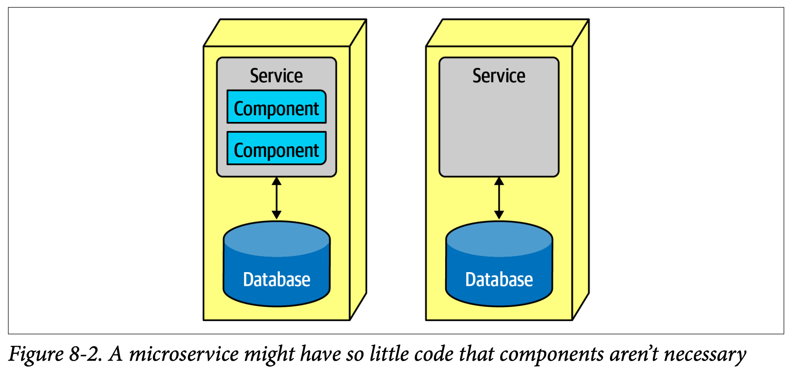

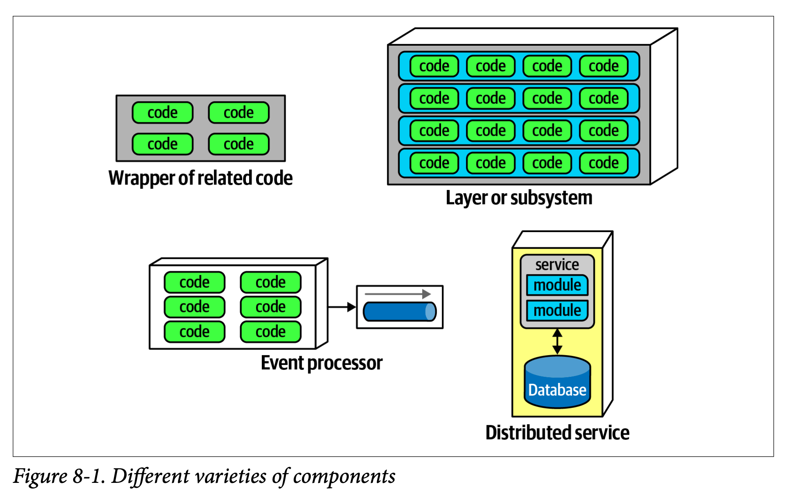

## 架構師的角色 Architect Role

- 通常架構師定義、改進、安排、管理架構中的元件
- 通常元件是架構師與軟體系統直接互動的最底層，除了第6章所討論影響整體代碼庫的眾多程式碼品質指標之外
- 元件由類別或函數構成，其設計由tech lead或開發人員負責
- 並不是說架構師不應介入類別設計(特別是在發掘或套用設計模式的時候)，而是他們應該避免微觀管理系統從上到下的每個決策
- 架構師在新專案的最初工作之一，就是辨認所需的元件，但在辨認元件之前，他們必須知道如何分割架構

## 架構分割 Architecture Partitioning

- 軟體架構第一法則說，軟體的每件事皆是***"取捨"***
- 有許多常見的樣式或風格存在，每一種都有各自不同的取捨，在第二部分會深入討論
- 這裡討論風格的一個重要面向，架構的頂層分割 (架構師特別感興趣，因其定義了基本的架構風格與程式碼的分割方法)
- 注意在每一種變形中，每個頂層元件都可能還內嵌其他元件

### 頂層分割 top-level architecture partitioning

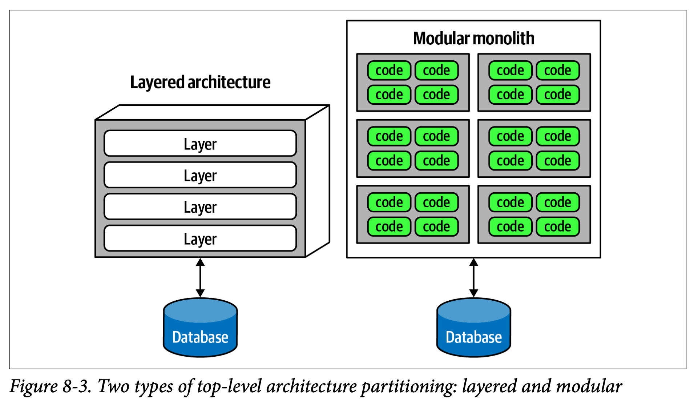
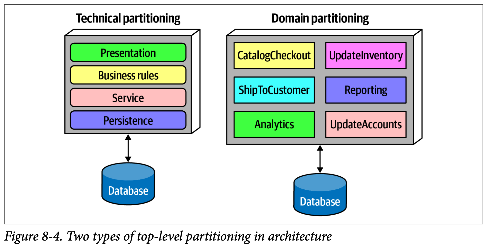

### 分層單體 layered monolith
  
  * 技術分割
  * 依技術能力來進行分割
  * 有個有趣的副作用，使用分層架構時，會影響專案成員的座位配置，讓所有的後端開發者待在一個部門，資料庫管理員在另一個，展示團隊又在另一個等等
  * 康威法則 Conway’s Law
    + Organizations which design systems ... are constrained to produce designs which are copies of the communication structures of these organizations.
      > 組織在設計系統時，會受限於他們之間的通訊結構，產出跟組織通訊結構相同的設計
    + 設計系統的組織...受到制約，以致於產出的設計正好複製了組織的通信結構
    + 此法則暗示了當一群人設計某種技術工件時，這群人之間的通信結構最終會在設計上複製
    + 組織常依照技術能力區分工作人員，單純從組織的觀點來看這是合理的，但卻因為人為阻隔了共同關切的事項，使合作的開展受到阻礙
    + 反向康威操縱 Inverse Conway Maneuver，建議團隊跟組織的結構要一起演進，以促成期望架構的實現
  * 架構原則就是分離技術考量
  * 接著可創造出有用的解耦合: 服務層只連接到底下的持久層與上面的業務規則層，那麼持久層的改變只可能影響這些層
  * 是一種解耦合的技巧，減低相依元件所遭受的漣漪副作用
  * 技術分割強加的隔離，讓開發人員得以快速找到特定分類的代碼庫
  * 但實際上大部分的軟體系統，需要橫跨技術的工作流程 (圖8-5，以CatalogCheckout的工作流程為例)

### 模組化單體 modular monolith

  * 領域分割
  * 依照領域而非技術能力來進行分割
  * 受到Eric Evan的書，領域驅動設計(DDD)所啟發
  * 在DDD，架構師得辨識出彼此獨立、互不影響的領域或工作流程
  * 微服務正式基於這種哲學(ch17)
  * 元件常嵌套至另一個元件，例如圖8-4中領域分割的每個元件(e.g. CatalogCheckout)可能使用一個持久性程式庫，並且有另一個分層處理業務規則，但其頂層分割仍然是圍繞著領域進行

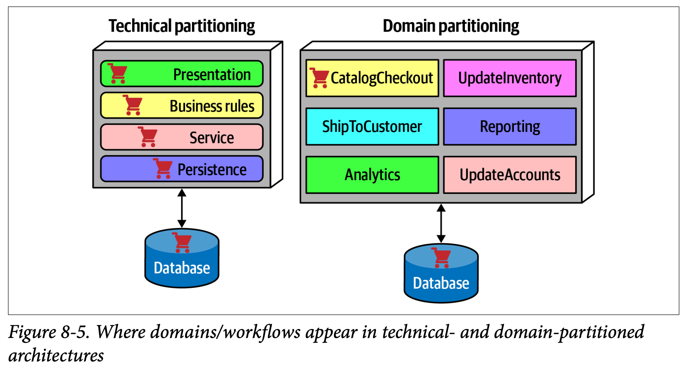

過去幾年觀察到在單體及分散式架構上(例如微服務)，有一個公認傾向於領域分割的業界趨勢

:::info
心得：你想要怎麼組織你的軟體(頂層分割)跟你希望你的組織怎麼運作有關係
:::

## 案例研究 Silicon Sandwiches Partitioning

Silicon Sandwiches

### 領域分割 Domain partitioning

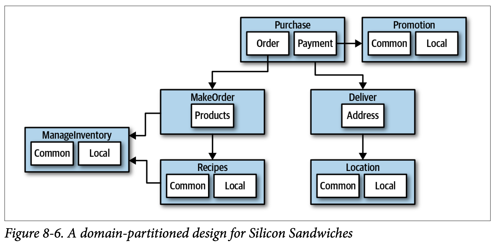

#### 優點

- 建模方式更接近商業運作，而非實作細節
- 比較容易利用反向Conway操縱，圍繞著領域來打造跨功能團隊
- 跟模組化單體及微服務架構風格更為一致
- 訊息流與問題領域匹配
- 容易將資料與元件遷移至分散式架構

#### 缺點

- 客製化程式碼出現在好幾個地方

### 技術分割 Technical partitioning
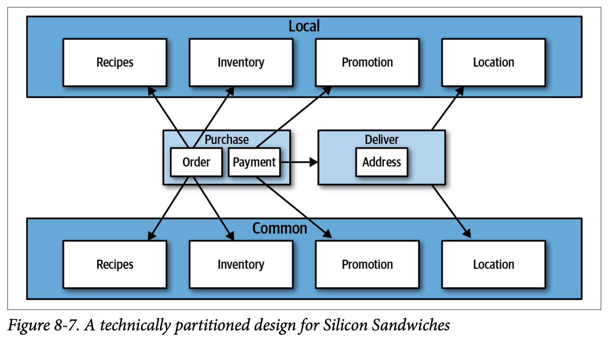

#### 優點

- 清楚地將客製化程式碼區分開來
- 跟分層架構模式更為一致

#### 缺點

- 全域耦合性較高。不管是更動Common或是Local元件都可能影響所有其他元件
- 開發人員可能得複製領域概念到common與local分層
- 一般來說在資料層級會有更高的耦合。在一個這樣的系統，應用與資料架構師可能合作打造單一資料庫，
裏面還包含了客製化與領域。這樣反而會在架構師稍後想把架構遷移到分散式架構時，在釐清資料個關係上造成困難

還有許多其他因素都會影響架構師如何決定為設計採用何種架構風格，這會在第二部分討論。

## 開發人員的角色 Developer Role

- 一般來說，類別與函數的設計是架構師、技術領導、開發人員的共同責任，但最大一部份是留給開發人員
- 開發人員不應該把架構師設計的元件視為定論，因為所有的軟體設計皆因迭代而獲得好處
- 應把初步設計視為第一版草稿，從實作中才能揭露更多細節與改進

## 元件確認流程 Component Identification Flow

***以迭代的方式進行元件識別的效果最佳***

此圖為最泛用的架構循環，某些特殊領域可將其他步驟加入這個循環中。例如有些必須在程序中進行資安或是稽核等步驟
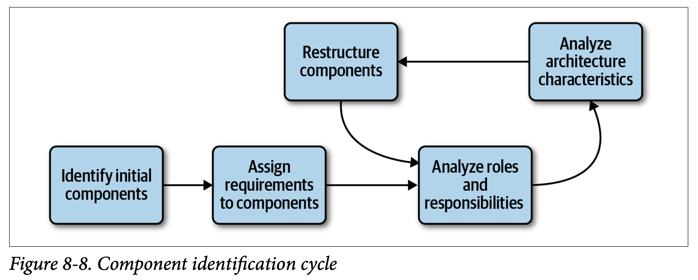

### 確認初始元件 Identifying Initial Components

- 軟體專案在出現任何程式碼以前，架構師多少得決定要從哪些頂層元件開始，要基於哪種頂層分割類型
- 除此之外，架構師可以自由決定要有哪些元件，要對應到哪些領域功能
- 聽起來似乎很隨意，但如果架構師從零開始設計系統，那麼要從更具體的事物開始是很困難的
- 想用最初期的元件來達成好的設計，其可能性幾乎微乎其微
- 這就是為什麼架構師必須迭代設計以改善元件

### 把需求指定給元件 Assign Requirements to Components

- 一旦架構師確定了初始元件，就可以開始把需求(或使用者故事)指定給元件，檢視是否合適
- 這可能牽涉到打造新元件、鞏固現有元件、或拆分元件使其免於背負太多責任
- 這種對應不必太精確，此時架構師還在嘗試找出一個夠好但粗略的基石，之後再與Tech lead或開發人員進一步設計與改進

### 分析角色與責任 Analyze Roles and Responsibilities

- 指定使用者故事給元件時，架構師也必須要關注在需求中闡述的相關角色與責任，確定顆粒度是否適當
- 藉由思考應用程式必須要支援的角色與行為，架構師能讓元件顆粒度與領域顆粒度更為一致
- 探索正確的元件粒度正是架構師最大的挑戰之一，促使這邊提到的迭代方法之應用

### 分析架構特性 Analyze Architecture Characteristics

- 指定需求給元件時，架構師應檢視早先發現的架構特性，以思索它們將如何影響元件的分割與顆粒度
- 例如在系統中有兩個部分需要處理使用者的輸入，需要同時處理幾百個使用者的跟只需要同時處理幾個使用者的，兩者的架構特性就不同
- 以純粹功能層面來看，可能只需要單一元件來處理所有的使用者輸入，但是透過分析架構特性有可能將元件做進一步的分割

### 重組元件 Restructure Components

- 回饋在軟體設計上至關重要
- 架構師必須持續以迭代方式與開發人員進行元件設計
- 軟體設計會遭遇各種預期外的困難，沒有人能預期在軟體專案過程中的所有未知問題，因此以迭代方式設計元件是個關鍵
- 首先，不可能考慮到所有終將出現的新發現與邊緣案例，這些會促使redesign
- 再者，一旦架構師與開發人員更深入到打造應用階段，他們對行為與角色的安排會有更細微的了解

## 元件的顆粒度 Component Granularity

***探索正確的元件粒度正是架構師最大的挑戰之一***

- 顆粒度太細的元件設計，導致元件間的通信過度頻繁才能得到結果
- 顆粒度太粗的元件設計，讓內部耦合過高，使得可部署性與可測試性遇到困難，以及在模組話方面產生副作用

## 元件設計 Component Design

元件設計沒有公認的正確方法，但有很多種技巧，每種都有各自的取捨

### 發現元件 Discovering Components

- 發現元件的目標是把一個問題空間分割成粗略團塊的初步設計，並且已經將不同的架構特性考慮在內
- 以下討論一些發現元件、以及該避開之陷阱的常用方法

### 實體陷阱 Entity trap

- 雖然沒有確認元件的唯一正確發法，但潛在上卻可能遇到一個反模式-實體陷阱
- 圖 8-9 不算是架構，只是一種ORM
- 這種反模式通常顯現出對應用程式的實際工作流程欠缺思考
- 在entity trap下打造的元件太過粗糙，以致無法在原始碼的打包與整體結構上，為團隊提供任何的指引

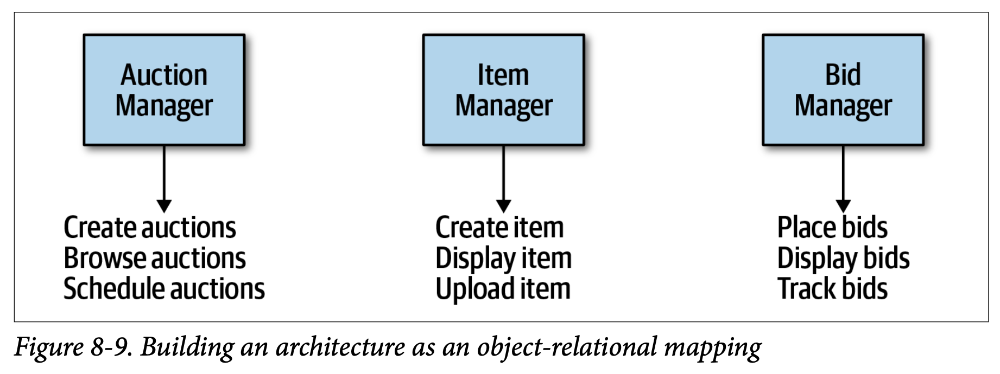

- 不過如果系統只需要簡單的資料庫CRUD操作，那麼架構師可以直接下載ORM框架，從資料庫建立使用者介面
- 裸物件 Naked Objects
  * 十多年前出現了一組框架，讓打造CRUD應用變得輕而易舉
  * Naked Objects 便是這種框架
    + a .NET version still called NakedObjects
    + a Java version that moved to the Apache open source foundation under the name Isis
    + Ruby on Rails
    + Oracle Forms
  * 這些框架即基於資料庫實體，來打造使用者介面的前端程式，例如在 NakedObjects 上，開發人員把框架指向資料庫表格，框架便會依據表格及被定義好的關係來建造使用者介面

### 行動者/行動方法 Actor/Actions approach

- 用來將需求映射到元件的一種常見方式
- 架構師識別會有哪些角色來使用應用程式，以及他們會在應用程式上面做什麼事
- 此方法可以找出應用程式的典型使用者與他們會做什麼事
- 偏好大量前期設計這類較正式的軟體開發程序讓此方法變得流行
- 這種元件分解的風格適用於所有類型的系統，無論是單體式還是分散式的

### 事件風暴 Event storming

- 來自於領域驅動設計(DDD)
- 跟深受領域驅動設計影響的微服務一樣受歡迎
- 此方法預設使用訊息、事件作為元件之間的通信機制
- 依據需求跟已確認的角色，嘗試去判斷系統會發生哪些事件，並且圍繞這些事件及訊息處理程式來打造所需的元件
- 這套方法在像是微服務這類的分散式架構運作良好，因為它幫助架構師定義最終系統中使用的訊息

:::info
心得：比較像是"事件激盪" - 專注於事件的腦力激盪
:::

### 工作流程方法 Workflow approach

- 一般性的方法
- 模擬工作流程周遭的元件，蠻像事件風暴的作法，但沒有必須建造以訊息為基礎之系統這樣的明顯限制
- 確認關鍵角色、判斷角色參與的工作流程種類、再以這些確認的活動來打造元件

:::info
心得：怎麼覺得跟"行動者/行動"方法很類似
:::

## 案例研究 - Going, Going, Gone

如果團隊沒有特殊限制，那行動者/行動這種通用的解決方案還蠻不錯，這邊就使用此方法來進行案例研究

**出價人**

- 觀看現場視訊串流
- 觀看現場出價串流
- 出價

**拍賣人**

- 將現場出價輸入系統
- 接收線上出價
- 把向目標是為已出售

**系統**

- 開始拍賣
- 付款
- 追蹤出價人的動態

依據這些動作，可以打造第一代初始元件，一組可能的方案如下圖

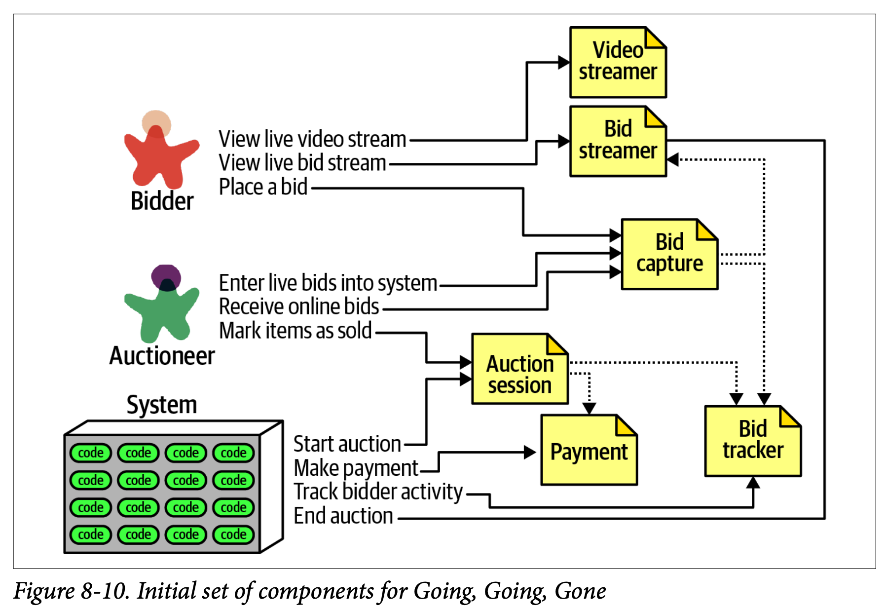

每個角色及動作都對應到一個元件，元件在資訊分享上彼此合作。在此解決方案中，我們確認以下這元件

**視訊串流**

- 將現場拍賣串流給使用者

**出價串流**

- 有出價時，將其串流給使用者。
- 視訊串流與出價串流讓出價人以唯讀方式觀賞拍賣過程

**出價紀錄**

- 此元件紀錄來自於拍賣人與出價人的出價

**出價追蹤**

- 追蹤出價並充當系統的紀錄

**拍賣期間**

- 開始與停止拍賣。
- 當出價人終結一項拍賣，則執行付款與結案步驟，包括通知出價人拍賣已經結束

**付款**

- 第三方信用卡付款處理程式

參考元件確認流程圖，在元件經過初步確認後，接著就要分析架構特性了，來決定是否得更改設計。  
就此系統而言，架構師一定可以找到不同組的架構特性。  
例如出價紀錄的元件，目前設計是讓出價人與拍賣人共享，從功能面來看是合理的，但如果考慮了架構特性呢?

- 拍賣人不需要像出價人那樣潛在有幾千個用戶、所以也不需要相同等級的可擴展性與彈性
- 拍賣人需要的可靠性、可用性比系統其他部分來的高。如果出價人無法登入或連線中斷雖然對業務有不好的影響，但遠不及於發生在拍賣人身上的嚴重性

因為架構特性不同，架構師決定把出價紀錄元件分成出價紀錄與拍賣人紀錄，以使其支援各自不同的架構特性

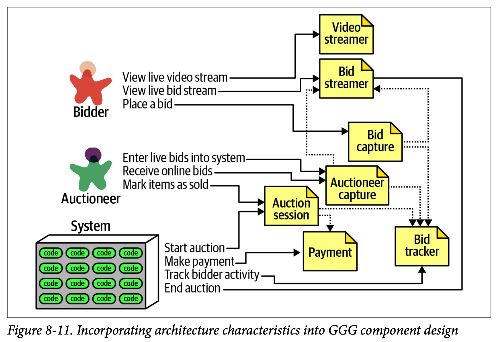

- 此設計也不會是最終設，還有更多需求等待發掘
- 此為其中一種元件設計樣貌，沒有絕對正確也不是唯一，很少軟體系統只有一種實作方法
- 身為架構師，不要執迷於找到一個所謂真理的設計，而是應該要比較不同設計方案之間的取捨，選擇具有最少劣勢的選項

### 還原架構量子:選擇單體或是分散式架構 Architecture Quantum Redux

基本決策得依據設計過程中，在架構上找到了多少量子而定。
- 如果系統只需要單一量子(也就是說，只有一個架構特性)，那麼單體架構可以提供很多好處
- 如果系統擁有不同的架構特性，那麼就需要能夠容納這些不同特性的分散式架構

利用架構量子來分析架構特性之範圍與耦合，幫助架構師在設計的早期就能具備決定架構基本設計特性的能力(單體式與分散式)

## Recap

1. 我們把元件定義為應用的組件，應用該做的某些事。元件通常由一組類別或原始檔組成。通常元件在應用或服務中是如何體現的?
2. 技術分割與領域分割的區別為何? 每一種都給例子
3. 領域分割的好處是什麼?
4. 什麼情況下技術分割會好過領域分割?
5. 實體陷阱是什麼? 為什麼他在元件確認上不是好作法?
6. 確認核心元件時，什麼情況你會選擇工作流程，而非行動者/動作的做法?