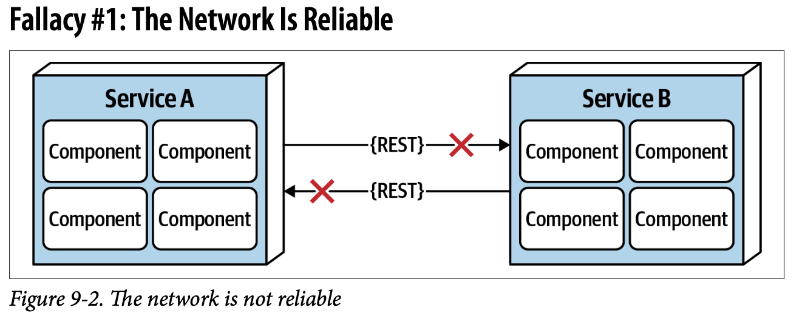

---
title: "Ch9: 基礎"
tsidebar_label: "Ch9: 基礎"
sidebar_position: 9
--- 

:::info
架構風格: 如何安排前端、後端原始碼跟資料庫互動的結構

架構模式: 較低層次的設計結構，有助於在某個架構風格下形成特定的解決方案

設計模式: 更本地化，對代碼庫的影響更小，它們影響到代碼庫的特定部分

- 架構風格是在最高抽象層次上的應用程式設計
- 架構模式是實現架構風格的一種方式
- 設計模式是解決局部問題的一種方法

https://kknews.cc/zh-tw/code/b3o6v36.html
:::

## 基本模式

### 大泥球(Big Ball of Mud)
太始之初有一團大泥球，裡面所有事件及函式都直接呼叫資料庫，程式沒有結構。

### 單一架構
軟體只跑在一台電腦上就可以發揮全部的功能 eg: 大富翁、洛克人...

### 主從式又或兩層式
 - 桌上型＋資料庫伺服器: 桌面軟體(前端)與資料庫伺服器互動(後端) eg: 即時通.. 
 - 瀏覽器＋網頁伺服器: 瀏覽器(前端)與網站伺服器(後端) eg: 小蕃薯..
 - 三層式: 資料庫層、應用層、顯示層，逐漸發展成一種架構模式 eg: MVC

## 單體架構 VS 分散式架構

### 單體架構
包含所有程式碼的單一部署元件
 - 分層式架構
 - 管道架構
 - 微核心架構

### 分散式架構
透過遠端存取協定連接的多個部件單元
 - 服務式架構
 - 事件驅動架構
 - 空間式架構
 - 服務導向架構
 - 微服務架構

### 分散式架構的謬誤
#### :x: 網路是可靠的
分散式架構需依賴網路來與服務之間來進行通訊，只要有一端遇到網路問題而無法連上，整個系統會嚴重到無法使用。

#### :x: 網路不會有延遲
服務內的溝通為t_local(奈秒或微秒)，分散式架構服務與服務之間的溝通為t_remote(毫秒)，t_remote通常比t_local還慢，
雖然看起來都很小，但如果串連10個服務，t_remote就會增加10倍，而且程序處理到後期遇到長尾的延遲，會拉低整個分散式系統的效能。

#### :x: 頻寬是無限的
一個任務進來使服務間來往的通信佔用大量頻寬，會使用網路延遲及不可靠。

#### :x: 網路是安全的
服務與服務間的跨服務通訊不一定是安全的，要確保每個端點以及不好的請求無法到達主要的服務。

#### :x: 網路拓墣絕對不會改變
服務間的網路環境、裝置可能會因為升級而導致整個服務掛掉。

#### :x: 只有一位管理員
要跟多位管理員溝通而不是只有一位，集思廣益。

#### :x: 傳輸成本為零
分散式架構需要額外的硬體、伺服器、閘道、防火牆....等。

#### :x: 網路為均質性的
硬體設備不一定都是穩定的，硬體間的零件互相組合不一定完全沒有問題，引發多種謬誤。

### 分散式的其他考量
#### 分散式登入
登入檔分散在各個服務，格式也不太一樣，難以追查以及組成。

#### 分散式交易
單體架構透過ACID來保障資料的一致性與完整性，而分散式架構依賴最終一致性來犧牲資料的一致性與完整性，換取可拓展性、效能、可用性。
另外分散式系統也有以下方法來管理分散式交易:
 - 交易傳奇(saga)
 - BASE
  
:::info ACID
指資料庫管理系統（DBMS）在寫入或更新資料的過程中，為保證transaction是正確可靠的，所必須具備的四個特性。
- **A**(Atomicity)原子性: transaction 裡面的操作要馬全部成功，要馬全部失敗。
- **C**(Consistency)一致性: 不同的數據都會有一些基本的約束，而這些約束在交易前跟交易後都必須要遵守，如果沒辦法遵守交易就必須失敗，ex: 1.帳戶雙方的錢都不能小於0 2.雙方錢的總和不能改變 上面兩個限制在交易前跟交易後都必須要遵守，這就是一致性。
- **I**(Isolation)隔離性: 多個 transaction 不會互相干擾，不能修改到同一個值。
- **D**(Durability)持久性: transaction處理結束後，對數據的修改就是永久的，即便系統故障也不會丟失。
:::

:::info 最終一致性 & 强一致性

最終一致性

强一致性

> [利用 Datastore 在强一致性和最终一致性之间取得平衡](https://cloud.google.com/datastore/docs/articles/balancing-strong-and-eventual-consistency-with-google-cloud-datastore?hl=zh-cn)
:::

:::info saga & BASE
#### saga
 - Choreography-Based Saga Pattern - 編排模式
 - Orchestrator-Based Saga Pattern - 编制模式

> [O'reilly](https://microservices.io/patterns/data/saga.html)
> [對岸解釋](https://learnku.com/articles/76208)

#### [BASE](https://hackmd.io/@AmdAc990TDm3EkP4EmImTA/Hkg62nmND)
 - **BA**(Basically Available) 
 - **S**(Soft-state)
 - **E**(Eventually Consistent)
:::
#### 合約維護與版本控制
服務依據由客戶同意的合約而產生的行為及資料，因為服務可能由不同團隊及部門擁有，所以如果各部門服務更新，服務間的通訊會變得困難。

## Recap
1. 列出分散式計算的8種謬誤？
2. 列舉分散式會遇到，但單體架構不會遇到的三種挑戰？
3. 標記耦合是什麼？
4. 處理標記耦合有哪些方法？

