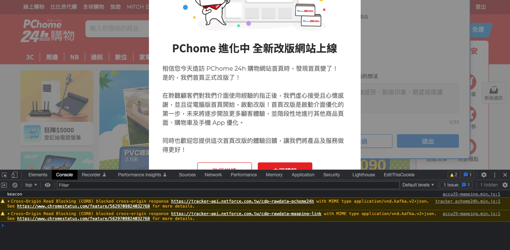

## 4.1 使用 HTTP 協議規範的意義

    - RFC (Request For Comments)


Image From:[The TCP/IP Guide](http://www.tcpipguide.com/free/t_HTTPGenericMessageFormat.htm)

## 4.2 正確使用狀態碼

### HTTP 狀態碼可區分為五大類：

- 1xx 消息
- 2xx 成功
- 3xx 重新導向
- 4xx 客戶端錯誤
- 5xx 伺服器錯誤

**主要的狀態碼**

| Status code | Nmae                   | Description                          |
| ----------- | ---------------------- | ------------------------------------ |
| 200         | OK                     | 請求成功                             |
| 201         | Created                | 請求已被接受，新的資源已創建         |
| 202         | Accepted               | 請求成功                             |
| 204         | No Content             | 沒有內容                             |
| 300         | Multiple Choices       | 返回多條重定向供選擇                 |
| 301         | Moved Permanently      | 永久重定向                           |
| 302         | Found                  | 臨时重定向                           |
| 303         | See Other              | 當前請求的資源在其它地址             |
| 304         | Not Modified           | 請求資源與本地緩存相同，未修改       |
| 307         | Temporary Redirect     | 臨時重定向，同 302                   |
| 400         | Bad Request            | 請求錯誤，通常是訪問的域名未綁定引起 |
| 401         | Unauthorized           | 需要身份认证验证                     |
| 403         | Forbidden              | 禁止訪問                             |
| 404         | Not Found              | 請求的內容未找到或已刪除             |
| 405         | Method Not Allowed     | 不允许的请求方法                     |
| 406         | Not Acceptable         | 無法響應，因資源無法滿足客戶端條件   |
| 408         | Request Timeout        | 請求超時                             |
| 409         | Conflict               | 存在衝突                             |
| 410         | Gone                   | 資源已經不存在(過去存在)             |
| 413         | Payload Too Large      | 請求的 URI 過長                      |
| 414         | Request-URI Too Long   | 請求資源與本地緩存相同，未修改       |
| 415         | Unsupported Media Type | 無法處理的媒體格式                   |
| 429         | Too Many Requests      | 並發請求過多                         |
| 500         | Internal Server Error  | 服務器端程序錯誤                     |
| 503         | Service Unavailable    | 服務器端臨時錯誤                     |

```
HTTP/1.1 200 OK
Content-Type: application/json

{
    "head": {
        "errorCode": 1001,
        "errorMessage": "Invalid parameter"
    },
    "body": {
        :
    }
}
```

## 4.3 Cache 與 HTTP

- 減少服務器的連線數量，可以提升用戶訪問速度
- 在網路連線斷開的狀態下也可以在某種程度提供服務
- 客戶端將資料暫存

:::info Discussion
反向代理服務器 Reverse Proxy
:::

### 4.3.1 過期模型(Expiration Model)

- 緩存可用狀態 fresh(新鮮)
- 緩存不可用狀態 stale(不新鮮)

:::info Discussion
你有用過 Expires, Cache-Control 的經驗嗎？
:::

> HTTP 時間格式, 只能用 GMT 時區

### 4.3.2 驗證模型(Validation Model)

最後更新會填在 Last-Modified, ETag

```
Last-Modified: Tue, 01 Jul 2014 00:00:00 GMT
ETag: "ff39b31e285573ee373af0d492aca581"
```

    - MD5, SHA1

強校驗和弱校驗

```
"123456789" -- 一個強ETag驗證符
W/"123456789" -- 一個弱ETag驗證符
```

:::info Discussion
你有做過驗證模型的相關功能嗎？
:::

### 4.3.3 啟發式過期(Heuristic Expiration)

client 端根據 server 端的更新頻率,具體狀態等訊息，自行決定緩存時間。

### 4.3.4 不希望實施緩存的情況

```
Cache-Control: no-cache
```

### 4.3.5 使用 Vary 來指定緩存單位

服務器驅動的內容協商(Server Driven Content Negotiation)

```
Accept-Language: ja
Vary: Accept-Language
```

## 4.4 Content-Type 的指定

Content-Type 是一個的 HTTP Header，用來告訴對方自己所傳送的這包 payload 是什麼樣的類型

```
Content-Type: type/subtype [;options]

# Example
Content-Type: text/html; charset=utf-8
```

### 與 Content-Type 有關的情境

#### Request 標明 Server 的處理方式

- 例如，AWS API Gateway 對於不同的 request Content-Type 有一套預設的[處理方式](https://docs.aws.amazon.com/apigateway/latest/developerguide/api-gateway-payload-encodings-workflow.html)

#### Response 控制瀏覽器的行為

- Github 用`text/plain`傳送的 JS Source code 內容，讓瀏覽器直接檢視 source code 而不會被意外執行
  https://raw.githubusercontent.com/NoobTechNote/NoobTechNote.github.io/main/sidebars.js

如果在 HTML 內使用`<script>`Tag 存取上面的 js link，會得到錯誤

```
Refused to execute script from 'https://raw.githubusercontent.com/NoobTechNote/NoobTechNote.github.io/main/sidebars.js'
because its MIME type ('application/json') is not executable, and strict MIME type checking is enabled.
```

:::info Notice
一個常見的錯誤其實是使用Content-Type: text/html傳送Javascript內容給前端。如果你都遇過這類問題，是因為你用的Backend Framework有在幫你處理Response的Content-Type

例如 PHP 的 [Symfony Response](https://github.com/symfony/symfony/blob/6.2/src/Symfony/Component/HttpFoundation/Response.php#L259)
:::

:::caution
瀏覽器其實不總是會聽 Content-Type 的意思，有時會依照內容猜測，該用什麼行為處理這個 HTTP response

X-Content-Type-Options: nosniff 可以協助你阻止瀏覽器猜測 response 內容導致非預期的行為
:::

### Response 的 Content Type

#### 常見的 Content-Type

| Content-Type           | 含義                                                                                                           |
| ---------------------- | -------------------------------------------------------------------------------------------------------------- |
| text/plain             | 純文字 [(註 1)](#anchor1)                                                                                      |
| text/html              | HTML 文件 [(註 1)](#anchor1)                                                                                   |
| application/xml        | XML 文件                                                                                                       |
| application/rss+xml    | RSS XML 文件                                                                                                   |
| application/json       | JSON 文件                                                                                                      |
| text/css               | CSS 文件                                                                                                       |
| application/javascript | Javascript 程式，舊稱 text/javascript，但在[RFC4329](https://datatracker.ietf.org/doc/html/rfc4329#page-9)廢除 |
| multipart/form-data    | 表單資料，常用在 Form POST Request                                                                             |
|                        |                                                                                                                |

<p id='anchor1'>
  <strong>註1</strong>： 語意上其實該屬於<code>application/</code>
  ，但因為歷史因素維持<code>text/</code>分類
</p>

#### X- 開頭的 Content Type

`x-`開頭的 Content Type 代表沒有在 IANA 註冊，通常具備特殊用途，或是自定義的 Content Type 會使用`x-`開頭去定義，例如

| Content Type          |                                                 |
| --------------------- | ----------------------------------------------- |
| application/x-msgpack | MessagePack                                     |
| application/x-yaml    | YAML 文件                                       |
| application/x-plist   | Mac 的 property list，常見於下載 iOS App 的引導 |

但，因為歷史因素，有些`x-`開頭的 Content Type 是有在 IANA 註冊的

| Content Type             |                              |
| ------------------------ | ---------------------------- |
| application/x-javascript | Javascript 程式              |
| application/x-json       | JSON 文件                    |
| image/x-png              | PNG 圖片                     |
| x-www-form-urlencoded    | HTML Form [(註 2)](#anchor2) |

<p id='anchor2'>
  <strong>註2</strong>
  ：用`x-www-form-urlencoded`傳送的資料，即使你用POST傳送，但實際上會被做URL Encode放在URL上。因為URL無法加密，如果帶有敏感訊息很容易會被各種log或中間人攔截
</p>

#### 自定義的 Content Type

[RFC6838](https://datatracker.ietf.org/doc/html/rfc6838#section-3)有規定一組，如果你需要自己定義 Content Type 時的參考

- Standard Tree: 無前綴，標準中有定義的 content-type，屬於被保留的一群
- Vendor Tree: `vnd`，有被 IANA 認證過的公司使用。通常會被大範圍使用，但由特定公司管理
  - application/vnd.ms-excel
  - application/vnd.github.v3+json
- Personal Tree: `prs.`，個人使用，或實驗性用途，只在非公開的狀況下被使用
  - appliccation/prs.mech.v1+json
- Unregistered Tree: `x.`，僅私有使用，不能被註冊

:::caution
注意`x.`跟`x-`是不同的，後者是有可能被註冊成標準的一部份
:::

:::info Discussion
你有用過非標準的Content Type嗎？好用嗎？在以下例子中，Github的API為什麼這麼回應？

```
HTTP/1.1 200 OK
Server: Github.com
Content-Type: application/json; charset=utf-8
X-GitHub-Media-Type: github.v3
```

:::

### Request 的 Content Type

Accept: 我能夠吃怎樣的Response格式
Content-Type: 宣告目前傳送的payload是怎樣的格式

#### Accept Header

- `q`可以指定優先級，數字越大優先權越高，預設是最高`1`
- 所有回應格式都吃的話，使用`*/*`

翻譯：_我吃 html, xhtml，但如果都沒有的話，也可以給我 xml，再沒有可以給我 webp，真的沒辦法就隨便吧_

```
Accept: text/html,application/xhtml+xml,application/xml;q=0.9;image/webp,*/*;q=0.8
```

翻譯：_我吃 json，但沒辦法的話 xml 也可以_

```
Accept: application/json,application/xml;q=0.9
```

#### Vary: Accept

在有 API Gateway, Reversed Proxy 存在請求端與伺服端的中間時，Accept Header 有可能會被改變。

此時需要加上`Vary: Accept` Header 要求 Gateway 轉交 Accept Header 或做進一步處理

## 4.5 Same Origin Policy 與 CORS

主要是安全考量，瀏覽器只允許從相同的來源(Origin)讀取資料

| URL                                             | Outcome	Reason                                         |
| ----------------------------------------------- | ------------------------------------------------------ |
| http://store.company.com/dir2/other.html        | Same origin	Only the path differs                      |
| http://store.company.com/dir/inner/another.html | Same origin	Only the path differs                      |
| https://store.company.com/page.html             | Failure Different protocol                             |
| http://store.company.com:81/dir/page.html       | Failure	Different port (http:// is port 80 by default) |
| http://news.company.com/dir/page.html           | Failure	Different host                                 |

(表格來自[MDN](https://developer.mozilla.org/en-US/docs/Web/Security/Same-origin_policy))


### CORS跨域請求

如果要突破Origin的限制，會需要一些額外的作法。一般來說沒辦法前端自己做，需要server配合

:::info
簡單來說，要達成CORS你需要設定讓**被存取的數據**允許前端過來存取。也就是說，如果你不是數據或API的提供方或沒有權限更動其行為，你沒辦法辦到CORS
:::

* Server response的[Access-Control-Allow-Origin](https://developer.mozilla.org/en-US/docs/Web/HTTP/Headers/Access-Control-Allow-Origin)系列Headers
  * Access-Control-Allow-Credentials
  * Access-Control-Allow-Headers
  * Access-Control-Allow-Methods
  * Access-Control-Allow-Origin
  * Access-Control-Expose-Headers
  * Access-Control-Max-Age
  * Access-Control-Request-Headers
  * Access-Control-Request-Method

另外，[JSONP](https://zh.m.wikipedia.org/zh-tw/JSONP)也是一種方式，但依然需要Server配合

### CORS的Pre-flight Request

在送出真的CORS資料請求之前，Browser會預先發起一個`OPTION`請求，探索對方是否允許CORS

瀏覽器會發起Pre-flight Request的條件

* Request Method不是HEAD/GET/POST
* Request Header沒有帶有這些headers
  * Accept
  * Accept-Language
  * Content-Language
  * Content-Type
* Content-Type header不是這些類型
  * application/x-www-form-urlencoded
  * multipart/form-data
  * text/plain


Pre-flight的請求與回應會長得像這樣，下列範例來自[MDN](https://developer.mozilla.org/en-US/docs/Glossary/Preflight_request)


```bash
OPTIONS /resource/foo
Access-Control-Request-Method: DELETE # 我可以打DELETE嗎？
Access-Control-Request-Headers: origin, x-requested-with
Origin: https://foo.bar.org # 透過這個Origin來打
```

```bash
HTTP/1.1 204 No Content
Connection: keep-alive
Access-Control-Allow-Origin: https://foo.bar.org # 透過這個Origin
Access-Control-Allow-Methods: POST, GET, OPTIONS, DELETE # 你可以打POST, GET, OPTIONS, DELETE喔
Access-Control-Max-Age: 86400
```

### 案例：PCHome24購物改版

最近正紅的PCHome24首頁改版，有個console error



:::info Discussion
問題是出在哪裡呢？
:::

Request
```
Request URL: https://tracker-api.netforce.com.tw/cdp-rawdata-pchome24h
Request Method: POST
Status Code: 200
Remote Address: [2606:4700:3037::6815:a4f]:443
Referrer Policy: strict-origin-when-cross-origin
```

Response
```
alt-svc: h3=":443"; ma=86400, h3-29=":443"; ma=86400
cf-cache-status: DYNAMIC
cf-ray: 72c472df0a92969a-SJC
content-type: application/vnd.kafka.v2+json
date: Sun, 17 Jul 2022 16:45:34 GMT
expect-ct: max-age=604800, report-uri="https://report-uri.cloudflare.com/cdn-cgi/beacon/expect-ct"
nel: {"success_fraction":0,"report_to":"cf-nel","max_age":604800}
report-to: {"endpoints":[{"url":"https:\/\/a.nel.cloudflare.com\/report\/v3?s=EZifM3cYBLYijrHeUK7pUWwnKJEUJIjNIzo5mU7asCrGl7PPkWbQarf5AvRCrX0JIsneDPEKhEz%2BGi5%2Bjto1zvadqJ8rXZIDMEUYiYC9ScTAGj%2FrBX5AZ5g2Ucaw2hvaC3E8ntIamQn4k%2B2mZyIS07cq%2FriFuoqqPK8%3D"}],"group":"cf-nel","max_age":604800}
server: cloudflare
vary: Accept-Encoding, User-Agent
via: 1.1 22d43bf299ac98b08849f5a01a8af246.cloudfront.net (CloudFront)
x-amz-apigw-id: Va5rOHz7tjMFYgQ=
x-amz-cf-id: 9gowKMyAERvJZore7__TUIe8vr1I5FUWH_BxiPvV59xbbRvzDDhRmg==
x-amz-cf-pop: SFO5-P2
x-amzn-remapped-date: Sun, 17 Jul 2022 16:45:34 GMT
x-amzn-requestid: 2dc54a16-6928-4a7a-b195-dda519176780
x-cache: Miss from cloudfront
```

### 參考資料

關於Same Origin Policy很不錯的參考資料

* [Hannah - 簡單弄懂同源政策 (Same Origin Policy) 與跨網域 (CORS)](https://medium.com/starbugs/%E5%BC%84%E6%87%82%E5%90%8C%E6%BA%90%E6%94%BF%E7%AD%96-same-origin-policy-%E8%88%87%E8%B7%A8%E7%B6%B2%E5%9F%9F-cors-e2e5c1a53a19)
* [Jayden - 網站安全🔒 Same Origin Policy 同源政策 ! 一切安全的基礎](https://medium.com/%E7%A8%8B%E5%BC%8F%E7%8C%BF%E5%90%83%E9%A6%99%E8%95%89/same-origin-policy-%E5%90%8C%E6%BA%90%E6%94%BF%E7%AD%96-%E4%B8%80%E5%88%87%E5%AE%89%E5%85%A8%E7%9A%84%E5%9F%BA%E7%A4%8E-36432565a226)


## 4.6 定義私有的 HTTP Header

要定義私有用途的HTTP Header請使用`X-`開頭，不能說是一種硬性規定，但是比較容易被識別

* X-Github-Request-Id

也有不少慣例，或是IANA規定的Header是`X-`開頭，需要定義私有Header時還是要避開。例如：

* X-Forwarded-For
* X-Forwarded-Host
* X-Forwarded-Proto
* X-Frame-Options
* X-XSS-Protection
* X-Content-Type-Options
* X-DNS-Prefetch-Control

### HTTP Header的豆知識

#### 1. 放在header的資訊，為了相容性，總和不要超過8KB
  * Apache 2.4 [Http Header Limit](https://httpd.apache.org/docs/2.4/mod/core.html#limitrequestfieldsize)是8KB
    * 違背的話會return HTTP 413 Entity Too Large

  * Set-Cookie也是一種header，所以也不要在Cookie內設定太多東西
    * 真的有需要更大的空間，在JS Runtime用LocalStorage, WebSQL, IndexedDB

#### 2. Header Name是case-insensitive的

#### 3. Header的順序不重要(嗎？)
  * 參考[RFC2616 4.2 Message Headers](https://www.rfc-editor.org/rfc/rfc2616#section-4.2)
  * 但如果你有多個同名的Header，會有覆蓋問題
  * 因為效率問題，有CDN會在你改變重要Header的順序時有不同的結果
    * [Why ordering HTTP headers is important](https://sansec.io/research/http-header-order-is-important)
    * 這篇文章有在2017上[Hacker News](https://news.ycombinator.com/item?id=14245577)

