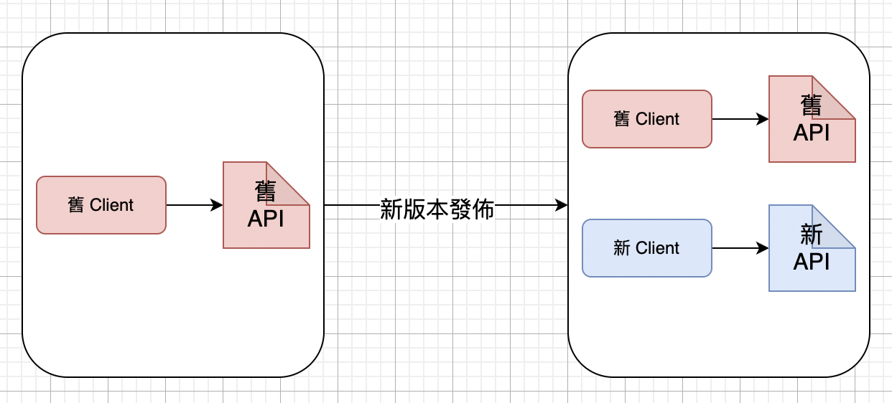

:::tip
真正的挑戰是 API 發布後的後續維護工作 
:::

## 5.1 方便更改設計的重要性
隨時間遷移，API 應用會隨著使用情況有所調整，不斷地發生變更 e.g. 強化某項功能、修 bug 等。
### 5.1.1 公開發佈的 API
著名的公開 API： Facebook, Google

若無法保證使用者能很好地應對 API 變更帶來的結果，會導致使用該 API 的線上服務發生各種問題，讓人不得不去處理。
:::tip
沒人想去用突然變更設計規範，讓人覺得不可靠的 API。
:::

### 5.1.2 面向手機應用的 API
屬於 SSKD(Small Set of Known Developers)，API 變更造成的影響相對較小。

更新取決於用戶端，若用戶不主動更新，手機端的版本始終處於舊版的狀態。 
:::tip
可能會遇到用戶端的手機應用還維持舊的版本，API 變更可能造成版本相容的問題。
:::

### 5.1.3 Web 服務使用 API
:::tip
留意快取資料在瀏覽器、手機端上的更新
:::

## 5.2 透過版本訊息來管理 API

同時提供多個版本的 API，讓新舊版本的 API 共存。

### 5.2.1 URI 中嵌入版本號
```
https://api.example.com/v2
https://example.com/api/v2

---
Twitter
https://api.twitter.com/1
https://api.twitter.com/1.1
```

:::tip
加上 `v` 用於表示版本在語意上更容易讓人理解 
:::

### 5.2.2 如何添加版本號
軟體版本規範 - **語意化版本控制(Semantic Versioning)**：

範例：
```bash
1.2.3
```

由 `.` 連接三個數字組成，分別表示不同層級的版本號：
- 主版本號：不向下相容
- 次版本號：向下相容的變更 or 移除某個功能
- 修補版本號：只有修正部分 bug

用日期來描述版本號

案例：樂天
```
service/api/IchiBaItem/Search/20130805
```

### 5.2.3 在查詢字串裡加版本號
範例：Netflix
```
/catalog/titles/series/700023522?v=1.5
```

:::info Discussion
有遇過什麼特殊的版本號設計嗎？
:::

### 5.2.4 透過媒體類型指定版本訊息
透過**媒體類型**指定 API 版本訊息，要求 Client 端發送請求時在 HTTP header 的 `Accept` 裡包含版本訊息。
```
Accept: application/vnd.example.com.v2.json 
```

Server 端接收到請求後會回傳包含 Content-Type & Vary 的 HTTP header
```
Content-Type: application/vnd.example.com.v2.json 
Vary: Accept
```

### 5.2.5 應該採用何種方式
考量到**普及性**、**易理解程度**，一般會採用將版本號放在 URI 路徑的方法。

## 5.3 版本變更的方針
- 盡可能做到不頻繁更新 API
- 盡可能向下相容(只增加次版本號)，不得已才更新 API 主版本

針對**小幅度**的修改，不去升級 API 版本的情況： 修改回應的資料格式

範例：用於表示性別的資料 - `gender`

直接將 `gender` 內容由數值 `1`, `2` 調整為字串 `male`,`female` (Bad)。

替 `male`, `female` 的內容新增名為 `genderStr` 的欄位，同時保留原數值的 `gender` 及更新 API 文件內容，註明 `gender` 將於未來新的主版本號移除 (Good)。

:::info Discussion
升級版本號的時機點 & 發布週期
:::

## 5.4 終止提供 API
- 維護多版本的 API 成本高昂，需適時終止舊版本的 API。
- 終止前須發布公告，並保留一段時間緩衝給用戶。

### 5.4.1 案例： Twitter
持續發布通知及多次進行 Blackout Test

### 5.4.2 預先備好終止服務的規範
- Server 端回傳 410 的狀態碼
- Server 端回傳提示細節內容
- 於 API 文件註明 410 狀態碼的意涵

特殊情況：手機端的 OS 版本變化
> 錯開 OS 版本升級 & API 版本升級的時機

### 5.4.3 在使用條款載明支援的期限
於使用條款裡載明會支援舊版 API 多長的時間。

## 5.5 編排層

## 5.6 小結
:::tip GOOD
- 盡可能減少 API 版本的更新頻率，同時注意向下相容問題
- 於 URI 中嵌入 API 主版本號
- 停止提供 API 不可以立刻終止，要留緩衝時間，至少持續公開約 6 個月
:::